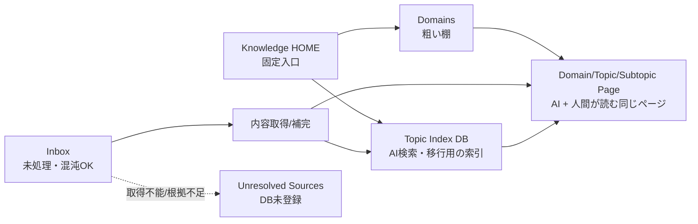

# Notion 知識整理スキル

採用パターン：Orchestrator-Subagent + Generator-Verifier。

Notion を作業場・閲覧 UI・入力口として使いながら、後で Markdown export や自前 RAG に逃がせる本文を残す形へ知識ページを整理する。主な運用は、ユーザーが `Bookmark` や `Inbox` のようなメモ置き場へ記事・メモ・リンクを放り込み、スキルが内容を読み足して、適切な Domain / Topic / Subtopic へ分類し、処理できたページを `Topic Index` DB に登録する流れ。`Inbox` は混沌としてよい capture queue だが、処理済みページの検索先にはしない。構造化レイヤーの固定入口は `Knowledge HOME` とし、その配下に `Topic Index` DB、粗い棚としての `Domains`、取得不能ページ用の `Unresolved Sources` を置く。物理階層は原則 `Domains/{Domain}/{Topic}/{Subtopic}` に寄せ、`Domains` と並列の `Topics` ルートは作らない。DB は軽い索引とし、AI と人間が参照する canonical content は同じ Topic / Subtopic 配下のページにする。判断不能なページは DB に入れず `Unresolved Sources` へ移し、重複試走を避けるために完了報告で明示する。ページ階層は人間が辿りやすい閲覧 UI として扱う。`Knowledge INDEX` は不要な派生ナビなので、新規作成・更新・正本扱いをしない。Topic / Subtopic ページの Summary は「そのページの運用説明」ではなく、対象技術・概念そのもののサマリにする。SKILL.md は進行管理だけを担い、Notion の読み取り・分類・更新・検証は `agents/` の各 Sub-agent が担当する。分類基準と DB スキーマは `references/knowledge-model.md`、エージェント間の入出力契約は `schemas/agent-contracts.md` を正とする。

## 全体フロー

## Notion MCP tool 露出の必須条件

Notion MCP の tool は初期表示に出ていないことがある。初期 tool 一覧に無いだけで「作成できない」「移動できない」「option 追加できない」「削除できない」と判断してはいけない。必要な操作がある場合は、まず `tool_search` で該当 tool を露出させ、露出後は下記の実 tool 名を使う。

- ページ/DB 作成: `tool_search` で `notion create pages database page parent` を検索し、`mcp__notion.notion_create_pages` を使う。
- ページ移動: `tool_search` で `notion move pages move page parent` を検索し、`mcp__notion.notion_move_pages` を使う。
- DB schema / select / multi_select option / 列の追加・削除・リネーム: `tool_search` で `notion update data source schema alter column select multi_select` を検索し、`mcp__notion.notion_update_data_source` を使う。
- view 表示順・表示列などの更新: `tool_search` で `notion update view show hide columns` を検索し、`mcp__notion.notion_update_view` を使う。
- 重複ページの削除/アーカイブ/trash: ユーザーが削除を許可している場合、`tool_search` で `notion delete archive trash page` を検索し、専用の削除/アーカイブ/trash tool が露出した場合だけ使う。露出しない場合は削除した扱いにせず `tool_unavailable_after_search` とする。

上記の検索をしても tool が露出しない場合だけ、`tool_unavailable_after_search` として完了報告に出す。検索せずに unavailable と報告したり、値を省略したり、代替としてリンク追記だけで済ませたりしてはいけない。

## Notion 移動ツールの必須条件

処理済みページや取得不能ページを Inbox から出すときは、必ず Notion MCP の `mcp__notion.notion_move_pages` を使う。初期表示のツール一覧に無い場合でも unavailable と判断せず、`tool_search` で `notion move pages move page parent` を検索して `mcp__notion.notion_move_pages` を露出させてから実行する。

`notion-update-page`、`replace_content`、`insert_content`、`<page>` / `<mention-page>` ブロック、ページ URL の追記、DB の `Notion Page` 更新はページ移動の代替にしてはいけない。これらはリンクや本文更新であり、親ページを変えないため、完了報告の「移動済み」に数えない。

移動は destination parent ごとにまとめ、`notion_move_pages` の `page_ids` に対象ページ ID を渡す。実行後は `notion-fetch` で移動済みページを確認し、ancestor path の直近 parent が期待する Domain / Topic / Subtopic または `Unresolved Sources` になっており、Inbox が ancestor に残っていないことを検証する。検証できないページは `moved` に数えず、`update-verifier` で `status: revise` にする。

### 概念図



成功パスでは、処理済みページを `Topic Index` に登録し、同じページを `Domains/{Domain}/{Topic}/{Subtopic}` 配下へ移動する。AI 向け情報も人間向け情報もそのページに残す。判断不能・取得失敗のページは `Topic Index` に登録せず、Inbox に放置せず、`Knowledge HOME` 配下の `Unresolved Sources` へ移して完了報告でユーザーへ伝える。ただし URL-only、タイトルだけ、埋め込みだけのページは、判断不能にする前に必ず `url-reader` で取得を試す。`url-reader` でタイトル、metadata、本文断片、画像、投稿種別、失敗理由のいずれかが取れた場合は、その根拠で通常の分類処理に乗せる。`url-reader` を実行できなかった URL は、分類不能ではなく「実行漏れ」として扱い、page-triager へ進めない。

同一 source URL、同一 normalized URL、または同一 Notion capture が複数ある場合は、代表ページを1件だけ残す。代表ページだけを Topic Index DB に登録し、重複ページは DB に登録しない。ユーザーが削除を許可している場合、重複ページは要約追記や移動ではなく削除/アーカイブを優先する。Notion MCP に削除・アーカイブ・trash 用ツールが露出していない場合は、削除した扱いにせず、`duplicate_delete_unavailable` として完了報告へ出す。重複ページを `Duplicate` の DB 行として増やさない。

1ページが複数 Topic にまたがる場合は、物理配置先として最も関連度の高い Domain / Topic / Subtopic を1つ選ぶ。横断的な関連は `Topic Index` の `Tags`、`Related Topics` 相当のプロパティ、移動後ページ本文の `Related Topics` に残し、検索・AI取得・Markdown/RAG export で拾えるようにする。

### 実行フロー

```
ユーザーの依頼
  │
  ▼
agents/input-resolver
  │  対象範囲・Notion MCP 利用可否・処理上限・確認要否を整理
  │
  ▼
agents/index-maintainer
  │  Knowledge HOME / Topic Index DB / Unresolved Sources / Domains 階層を検索し、無ければ作成する/作成案を返す
  │
  ▼
agents/content-enricher
  │  メモ本文・URL・埋め込み・クリップから根拠付きの内容補完を行う。URL-only メモは url-reader で読める範囲を補完する
  │
  ▼
agents/page-triager
  │  補完済み内容から Domain/Topic/Subtopic 候補・移動/登録方針を作る
  │
  ├──────────────┐
  ▼              ▼
agents/page-normalizer   agents/duplicate-reviewer
  │  DB登録後に Domains 配下の Topic/Subtopic へ移動し、同じページに AI/人間向け情報を残す   既存トピックとの重複・古さを検証
  │
  └──────────────┘
          │
          ▼
agents/update-verifier
          │  更新結果と判断不能項目を検証し、最後に記述漏れゲートを通す
          ▼
司令塔が完了報告
```

## 実行手順

### Step 1: input-resolver を呼ぶ

`agents/input-resolver.md` を Read し、ユーザー依頼全文、現在分かっている Notion workspace 情報、希望件数を渡す。対象範囲が空、または Notion MCP が使えない場合はここで止め、足りない情報だけをユーザーに聞く。

処理件数は既定 50 件までにする。ユーザーが件数を明示した場合は 100 件まで許可する。大量ページを一度に更新すると Notion 側の状態把握が難しくなるため、残件数を報告して次回に続ける。

### Step 2: index-maintainer を呼ぶ

`agents/index-maintainer.md` を Read し、Step 1 の scope と `references/knowledge-model.md` を渡す。`Knowledge HOME`、`Topic Index` DB、`Unresolved Sources` ページ、既存の `Domains/{Domain}/{Topic}/{Subtopic}` 階層を探す。無い場合、ユーザーが「DB 追加もやって」「作ってよい」「整理して」と明示していれば、`Inbox` 配下ではなく安定した `Knowledge HOME` 配下または workspace private に作成する。明示がない場合は作成案を返し、司令塔が確認する。

Domain / Topic / Subtopic 階層は「最小限だけ作る」方針にしない。処理対象から明確な分類が取れており、既存階層に自然な受け皿が無い場合は、人間が後から辿りやすい標準的な階層を積極的に作る。例: 料理は `Life / Cooking / Recipes`、健康運動は `Life / Health / Fitness`、住まいの手入れは `Life / Home / Maintenance`、技術研修は `Programming / Engineering Education / New Graduate Training` のように、Domain 直下へ雑に溜めず Topic と Subtopic まで作ってよい。ただし同義・近義の棚を乱立させないため、作成前に既存ページを検索し、近い既存階層がある場合はそこへ寄せる。

`Knowledge HOME` は構造化知識レイヤーの固定入口であり、雑多な既存ページを単に `knowledge` という名前だけで正本ルート扱いしない。既存の `knowledge` / `メモ` / `Bookmark` などに混在ページがある場合は capture queue または既存置き場として扱い、中核 DB と整理済みページ階層は `Knowledge HOME` にまとめる。

`Knowledge INDEX` は不要な派生ナビなので、新規作成・更新・分類情報の保存先にしない。既存ページがあっても互換のために読む必要はなく、必要になった場合だけユーザー指示で別途追加する。`Unresolved Sources` は取得不能・根拠不足ページの退避キューであり、処理済み検索先ではない。`Domains` は粗い棚であり、例として `Programming -> iOS -> The Composable Architecture (TCA)` のように辿れる物理階層にする。`Topics` を `Domains` と並列に作ると二重管理になりやすいため、原則作らない。

既存 DB がある場合はスキーマを軽い索引へ保つ。足りないプロパティは追加候補として扱い、不要な legacy プロパティはユーザーの許可がある場合に削除する。一方で、既存の `select` / `multi_select` プロパティに不足 option があるだけなら、低リスクなスキーマ保守として Notion MCP の `update_data_source` で追加してよい。`update_data_source` が初期 tool 一覧に無い場合は、`tool_search` で `notion update data source schema alter column select multi_select` を検索して露出させてから実行する。特に `Type`、`Source Type`、`Tags`、`Related Topics`、`Domain` は、後続の DB 登録前に今回使う値が存在するか確認し、存在しない値は既存 option を消さずに追記する。`Extraction Status` は処理ログであり Topic Index の DB 列にはしない。既存 DB に残っていてユーザーが削除を許可している場合は削除する。

### Step 3: content-enricher を呼ぶ

`agents/content-enricher.md` を Read し、メモ置き場の対象ページ一覧を渡す。各ページについて、Notion 本文、URL、埋め込み、既存 Notion クリップ、添付テキストから取れる内容を補完する。取得できない外部本文は推測せず、内部フィールド `extraction_status` を `Partial` / `Failed` にし、理由を reader audit やページ本文の `Open Questions` / `Source` に残す。`Needs Manual Review` は自動処理で安易に使わず、ユーザー確認が不可欠な明示的理由がある場合だけ使う。

URL だけ、タイトルだけ、または埋め込みだけのページでは、`$url-reader` の `scripts/read_url.py` を必ず使って公開 URL の本文・metadata・画像リンク・失敗理由を補完する。取得結果の `reader_status`、`reader_backend`、`status_reason`、`attempts`、`warnings` は content-enricher の根拠として残す。URL-only / embed-only ページの content-enricher 出力に `reader.status` または `reader.status_reason` が無い場合、司令塔は page-triager へ進めず content-enricher を差し戻す。

司令塔は Step 3 の完了前に、以下の URL enrichment gate を満たすことを確認する。

- `url_reader_required_count` が 0 より大きい場合、`url_reader_attempted_count` は同じ件数でなければならない。
- 各 URL-required ページは `reader.required: true`、`reader.attempted: true`、`reader.status` または `reader.status_reason` を持つ。
- X/Twitter URL は `url-reader` の正規化結果として `normalized_url` を持つ。`twitter.com` のまま読めなかった、という理由だけで Inbox 残留にしない。
- `reader.attempted: false` のページが1件でもある場合、処理を止めて content-enricher をやり直す。完了報告で Inbox 残留に数えない。

ページに既存タイトルがある場合も、全件をタイトル解決ステップに通す。既存タイトルが URL、サービス名だけ、保存時の省略タイトル、本文とずれたタイトル、分類に弱い曖昧なタイトルなら、取得済み本文・Notion 本文・URL パス・source metadata から `resolved_title` を付ける。外部 metadata のタイトルが本文と一致していてより自然なら `title_source: url_reader`、URL パス由来なら `url_path`、本文/URL から生成した短い名詞句なら `generated` にする。既存タイトルが十分なら `title_source: notion` とし、`resolved_title` は同じ値または `null` でよい。生成タイトルは事実を足さず、8〜40文字程度の名詞句にし、根拠を必ず残す。外部本文も Notion 本文も弱い場合はタイトルを無理に作らず、内部 `extraction_status` を `Failed` または `Partial` として Inbox 残留候補にする。

### Step 4: page-triager を呼ぶ

`agents/page-triager.md` を Read し、補完済みページ一覧、Topic Index data source ID、分類基準を渡す。各ページについて、タイトル・本文・URL・補完済み内容から Domain / Topic / Subtopic 候補と整理方針を判定させる。

page-triager へ渡す前に URL enrichment gate を再確認する。URL-only / embed-only / 弱いタイトルのページで `reader.required: true` かつ `reader.attempted: false` のもの、または `reader.status` と `reader.status_reason` が両方空のものがあれば、分類せず content-enricher へ差し戻す。

`Source Type` は「Inbox に bookmark block として入っていたか」ではなく、取得できた source の実体で決める。通常の Web ページや記事なら `Web Article`、動画なら `Video`、コードリポジトリや gist なら `Code`、Notion 内メモだけなら `Notion Note`、URL はあるが種別が判定できない一時的なものだけ `Bookmark` または `Unknown` にする。分類・要約に使える外部本文が取れているページを `Bookmark` のままにしない。

- Domain 名
- Topic 名
- Subtopic 名（分類が明確なら積極的に付ける）
- 既存 Topic ページ/DB 行候補または新規作成候補
- 推奨アクション: `register_and_move_to_topic_page` / `keep_in_inbox`
- `Type`
- `Summary`
- `Resolved Title`
- `Title Source`
- `Source URL`
- `Source Type`
- `Published At`
- `Tags`
- `Related Topics` 候補
- 判断不能な項目と理由

事実が足りない項目は空欄または `Unknown` にする。AI が推測で著者、日付、出典、結論を埋めると後の検索品質が悪くなるため、根拠が取れない項目は埋めない。

### Step 5: page-normalizer と duplicate-reviewer を呼ぶ

Step 4 の結果をもとに、独立して実行できる場合は同一ターンで並列に呼ぶ。

- `agents/page-normalizer.md`: 処理できたページの Topic Index DB 行を作る。DB 登録前に、今回登録する `select` / `multi_select` 値が既存 option にあるか確認し、無ければ既存 option を保ったまま追加する。処理済みページは Inbox から `Domains/{Domain}/{Topic}/{Subtopic}` 配下へ移す。対象ページ本文には AI と人間の両方が読む `Summary`、`Context`、`Source`、`Decision`、`Related Topics`、必要なら `Open Questions` を必ず残す。URL-only / embed-only 由来で url-reader が本文や metadata を取得できた場合は、その要約と取得元 URL、公開日が取れた場合の `Published At`、reader backend/status、取得本文断片をページ本文へ追記し、Notion ページ側だけ見ても内容が分かるようにする。本文追記が未完了のページは DB 登録済み・移動済みでも処理完了に数えない。Topic / Subtopic ページを作る場合、その Summary は「整理済みページを集める場所」ではなく、対象トピック自体の説明・主要概念・採用/回避条件・未解決論点を書く。分類が明確で既存階層が無い場合は、最小限の受け皿で済ませず、将来同種ページが増えても使える自然な Topic / Subtopic 階層を作る。`keep_in_inbox` は原則 Inbox に残さず、`Unresolved Sources` へ移して取得失敗理由を本文に追記する。ユーザーが一括整理を許可している場合だけ Notion に適用する。
- `agents/duplicate-reviewer.md`: 類似ページ、古いメモ、正式ページ候補を検出し、代表ページと削除対象を決める。重複ページは原則 Topic Index DB に登録しない。ユーザーが削除を許可している場合は削除/アーカイブ可能な MCP ツールを使って重複ページを削除する。削除ツールが無い場合は削除不能として報告し、重複ページを成功パスへ混ぜない。

不可逆な本文置換、既存 DB スキーマの破壊的変更は行わない。重複削除はユーザーが明示的に許可した場合だけ行う。処理済みページは Inbox から `Domains/{Domain}/{Topic}/{Subtopic}` 配下へ出す。判断が弱いページは DB 登録せず `Unresolved Sources` へ移し、完了報告の `Unresolved Sources移動` に理由付きで必ず含める。Inbox 残留ページを Topic Index DB に入れると再実行時に重複試走しやすいため、取得不能・根拠不足のページは Inbox から分離する。

### Step 6: update-verifier を呼ぶ

`agents/update-verifier.md` を Read し、更新結果、重複レビュー、判断不能項目を渡す。検証結果が `status: revise` の場合は page-normalizer に1回だけ差し戻す。2回目も失敗する場合は、失敗理由と対象ページをユーザーへ提示して止める。

update-verifier には、対象件数、URL enrichment gate の件数、本文追記済み件数、重複削除/削除不能リスト、Unresolved Sources 移動リスト、`notion_move_pages` の実行ログ、移動後 fetch で確認した ancestor path を渡す。URL-required 件数と url-reader 実行済み件数が一致しない場合、処理対象ページに `Summary`、`Source`、`Decision` の追記検証が欠けている場合、または移動対象で `notion_move_pages` 実行・ancestor 検証が欠けている場合、検証結果は必ず `status: revise` とし、完了報告へ進まない。

司令塔は Step 7 の完了報告前に、update-verifier の結果を使って最後の記述漏れゲートを必ず確認する。このゲートは件数が多い場合でも省略しない。

- DB 登録済みページは DB 行に `Title`、`Summary`、`Notion Page`、`Domain`、`Topic`、`Type`、`Source Type`、`Tags` が入っている。`Subtopic`、`Source URL`、`Related Topics`、`Published At` は根拠がある場合だけ入れるが、空欄の場合は本文の `Open Questions` または verifier findings に理由が残っている。
- 移動済みページ本文に `Summary`、`Context`、`Source`、`Decision`、`Related Topics` がある。必要な場合は `Open Questions` もある。見出しだけで中身が空、リンクだけ、短い分類メモだけの場合は記述漏れとして扱う。
- URL-only / embed-only / 弱いタイトル由来のページは、本文に source URL、reader backend/status、取得結果の短い要約または取得失敗理由がある。
- `Published At` が空の場合は、Notion created/updated で代用していないことを確認する。公開日が不明なだけなら空欄でよい。
- Unresolved Sources へ移したページは、本文に `Unresolved Reason`、source URL、reader backend/status または取得不能理由、次に人間が確認すべき点がある。
- 代表ページ以外の重複は DB 登録されていない。削除できなかった重複は `duplicate_delete_unavailable` に理由付きで残っている。
- `content_audit`、`move_audit`、`url_reader_audit` のいずれかが対象ページ数と突き合わない場合、またはページごとの確認結果が無い場合は、司令塔の実行漏れとして Step 5 または Step 6 へ差し戻す。

このゲートで1件でも欠けがある場合、完了報告の `処理`、`DB登録済み`、`移動済み` には含めない。直せる欠けは page-normalizer に差し戻して補完し、直せない欠けは `Unresolved Sources` へ移して理由を残す。完了報告では「記述漏れで差し戻し/未完了」として対象ページ名を出す。

### Step 7: 完了報告

司令塔は以下を短く報告する。

```text
Notion知識整理完了:
- 処理: {N}件
- DB登録済み: {A}件
- 移動済み: {M}件
- Unresolved Sources移動（取得不能/根拠不足）: {I}件
- 重複削除済み: {X}件
- 重複削除不能: {Y}件
- 重複/古い可能性: {D}件
- 判断不能: {U}件
- 未処理: {R}件
- 次に人間が見るべきページ: {titles}
```

## 入出力

入力：ユーザーの Notion 整理依頼、対象ページ名または Bookmark / Inbox / Domain / Topic Index DB 名、必要なら処理件数。

出力：Notion 上の Topic Index DB、Domain / Topic / Subtopic ページ、Topic Index に登録済みで Inbox から移動/処理済みになったメモページ、または更新前のレビュー用変更案。完了報告には処理件数、DB登録件数、作成/更新した Domain / Topic / Subtopic、移動件数、Inbox に残った要確認件数、未確定項目、次の確認対象を含める。

## 境界

- Notion は RAG エンジンそのものではなく、知識 UI と MCP 経由の検索・文脈取得の場として扱う。
- 自前 RAG が必要な場合は、このスキルで整えたページ本文、`Summary`、`Source URL`、`Source Type`、`Published At`、`Domain`、`Topic`、`Subtopic`、`Tags` を使って、別 workflow で Markdown/JSON export へつなぐ。
- 単一リンクの要約だけならこのスキルではなく通常の要約タスクとして扱う。
