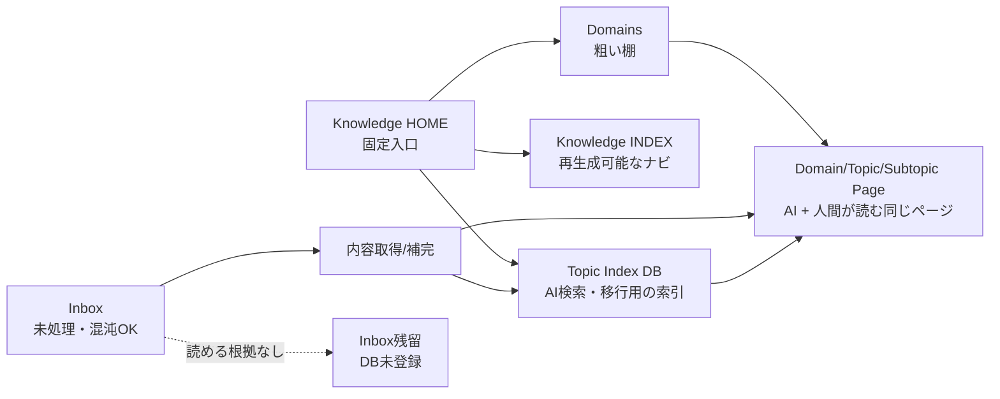

# Notion 知識整理スキル

採用パターン：Orchestrator-Subagent + Generator-Verifier。

Notion を作業場・閲覧 UI・入力口として使いながら、将来 Markdown export や自前 RAG に逃がせる形へ知識ページを整理する。主な運用は、ユーザーが `Bookmark` や `Inbox` のようなメモ置き場へ記事・メモ・リンクを放り込み、スキルが内容を読み足して、適切な Domain / Topic / Subtopic へ分類し、処理できたページを `Topic Index` DB に登録する流れ。`Inbox` は混沌としてよい capture queue だが、処理済みページの検索先にはしない。構造化レイヤーの固定入口は `Knowledge HOME` とし、その配下に `Topic Index` DB、`Knowledge INDEX`、粗い棚としての `Domains` を置く。物理階層は原則 `Domains/{Domain}/{Topic}/{Subtopic}` に寄せ、`Domains` と並列の `Topics` ルートは作らない。DB を AI が読む構造化された索引とし、AI と人間が参照する canonical content は同じ Topic / Subtopic 配下のページにする。判断不能なページは DB に入れず Inbox に残し、重複試走を避けるために完了報告で明示する。ページ階層や `Knowledge INDEX` は人間が辿りやすい閲覧 UI として扱う。Topic / Subtopic ページの Summary は「そのページの運用説明」ではなく、対象技術・概念そのもののサマリにする。SKILL.md は進行管理だけを担い、Notion の読み取り・分類・更新・検証は `agents/` の各 Sub-agent が担当する。分類基準と DB スキーマは `references/knowledge-model.md`、エージェント間の入出力契約は `schemas/agent-contracts.md` を正とする。

## 全体フロー

### 概念図



成功パスでは、処理済みページを `Topic Index` に登録し、同じページを `Domains/{Domain}/{Topic}/{Subtopic}` 配下へ移動する。AI 向け情報も人間向け情報もそのページに残す。判断不能・取得失敗のページは `Topic Index` に登録せず、Inbox に残して完了報告でユーザーへ伝える。ただし URL-only、タイトルだけ、埋め込みだけのページは、判断不能にする前に必ず `url-reader` で取得を試す。`url-reader` でタイトル、metadata、本文断片、画像、投稿種別、失敗理由のいずれかが取れた場合は、その根拠で通常の分類処理に乗せる。`url-reader` を実行できなかった URL は、分類不能ではなく「実行漏れ」として扱い、page-triager へ進めない。

1ページが複数 Topic にまたがる場合は、物理配置先として最も関連度の高い Domain / Topic / Subtopic を1つ選ぶ。横断的な関連は `Topic Index` の `Tags`、`Related Topics` 相当のプロパティ、移動後ページ本文の `Related Topics` に残し、検索・AI取得・Markdown/RAG export で拾えるようにする。

### 実行フロー

```
ユーザーの依頼
  │
  ▼
agents/input-resolver
  │  対象範囲・Notion MCP 利用可否・処理上限・確認要否を整理
  │
  ▼
agents/index-maintainer
  │  Knowledge HOME / Topic Index DB / Knowledge INDEX / Domains 階層を検索し、無ければ作成する/作成案を返す
  │
  ▼
agents/content-enricher
  │  メモ本文・URL・埋め込み・クリップから根拠付きの内容補完を行う。URL-only メモは url-reader で読める範囲を補完する
  │
  ▼
agents/page-triager
  │  補完済み内容から Domain/Topic/Subtopic 候補・移動/登録方針を作る
  │
  ├──────────────┐
  ▼              ▼
agents/page-normalizer   agents/duplicate-reviewer
  │  DB登録後に Domains 配下の Topic/Subtopic へ移動し、同じページに AI/人間向け情報を残す   既存トピックとの重複・古さを検証
  │
  └──────────────┘
          │
          ▼
agents/update-verifier
          │  更新結果と判断不能項目を検証
          ▼
司令塔が完了報告
```

## 実行手順

### Step 1: input-resolver を呼ぶ

`agents/input-resolver.md` を Read し、ユーザー依頼全文、現在分かっている Notion workspace 情報、希望件数を渡す。対象範囲が空、または Notion MCP が使えない場合はここで止め、足りない情報だけをユーザーに聞く。

処理件数は既定 50 件までにする。ユーザーが件数を明示した場合は 100 件まで許可する。大量ページを一度に更新すると Notion 側の状態把握が難しくなるため、残件数を報告して次回に続ける。

### Step 2: index-maintainer を呼ぶ

`agents/index-maintainer.md` を Read し、Step 1 の scope と `references/knowledge-model.md` を渡す。`Knowledge HOME`、`Topic Index` DB、`Knowledge INDEX` ページ、既存の `Domains/{Domain}/{Topic}/{Subtopic}` 階層を探す。無い場合、ユーザーが「DB 追加もやって」「作ってよい」「整理して」と明示していれば、`Inbox` 配下ではなく安定した `Knowledge HOME` 配下または workspace private に作成する。明示がない場合は作成案を返し、司令塔が確認する。

Domain / Topic / Subtopic 階層は「最小限だけ作る」方針にしない。処理対象から明確な分類が取れており、既存階層に自然な受け皿が無い場合は、人間が後から辿りやすい標準的な階層を積極的に作る。例: 料理は `Life / Cooking / Recipes`、健康運動は `Life / Health / Fitness`、住まいの手入れは `Life / Home / Maintenance`、技術研修は `Programming / Engineering Education / New Graduate Training` のように、Domain 直下へ雑に溜めず Topic と Subtopic まで作ってよい。ただし同義・近義の棚を乱立させないため、作成前に既存ページを検索し、近い既存階層がある場合はそこへ寄せる。

`Knowledge HOME` は構造化知識レイヤーの固定入口であり、雑多な既存ページを単に `knowledge` という名前だけで正本ルート扱いしない。既存の `knowledge` / `メモ` / `Bookmark` などに混在ページがある場合は capture queue または既存置き場として扱い、中核 DB/INDEX は `Knowledge HOME` にまとめる。

`Knowledge INDEX` は人間と AI の入口だが、正本ではなく `Topic Index` DB から再生成できるナビゲーションキャッシュとして扱う。Domain 一覧、Topic / Subtopic 一覧、未分類/要確認メモ、最近整理したページを持つ。`Domains` は粗い棚であり、例として `Programming -> iOS -> The Composable Architecture (TCA)` のように辿れる物理階層にする。`Topics` を `Domains` と並列に作ると二重管理になりやすいため、原則作らない。

既存 DB がある場合は破壊的変更をしない。足りないプロパティは追加候補として扱い、既存プロパティ名の変更や削除は確認してから行う。一方で、既存の `select` / `multi_select` プロパティに不足 option があるだけなら、低リスクなスキーマ保守として Notion MCP の `update_data_source` で追加してよい。特に `Type`、`Status`、`Action`、`Source Type`、`Extraction Status`、`Tags`、`Related Topics`、`Canonical Role` は、後続の DB 登録前に今回使う値が存在するか確認し、存在しない値は既存 option を消さずに追記する。

### Step 3: content-enricher を呼ぶ

`agents/content-enricher.md` を Read し、メモ置き場の対象ページ一覧を渡す。各ページについて、Notion 本文、URL、埋め込み、既存 Notion クリップ、添付テキストから取れる内容を補完する。取得できない外部本文は推測せず、`Extraction Status` を `Partial` / `Failed` にする。`Needs Manual Review` は自動処理で安易に使わず、ユーザー確認が不可欠な明示的理由がある場合だけ使う。

URL だけ、タイトルだけ、または埋め込みだけのページでは、`$url-reader` の `scripts/read_url.py` を必ず使って公開 URL の本文・metadata・画像リンク・失敗理由を補完する。取得結果の `reader_status`、`reader_backend`、`status_reason`、`attempts`、`warnings` は content-enricher の根拠として残す。URL-only / embed-only ページの content-enricher 出力に `reader.status` または `reader.status_reason` が無い場合、司令塔は page-triager へ進めず content-enricher を差し戻す。

司令塔は Step 3 の完了前に、以下の URL enrichment gate を満たすことを確認する。

- `url_reader_required_count` が 0 より大きい場合、`url_reader_attempted_count` は同じ件数でなければならない。
- 各 URL-required ページは `reader.required: true`、`reader.attempted: true`、`reader.status` または `reader.status_reason` を持つ。
- X/Twitter URL は `url-reader` の正規化結果として `normalized_url` を持つ。`twitter.com` のまま読めなかった、という理由だけで Inbox 残留にしない。
- `reader.attempted: false` のページが1件でもある場合、処理を止めて content-enricher をやり直す。完了報告で Inbox 残留に数えない。

ページに既存タイトルがある場合も、全件をタイトル解決ステップに通す。既存タイトルが URL、サービス名だけ、保存時の省略タイトル、本文とずれたタイトル、分類に弱い曖昧なタイトルなら、取得済み本文・Notion 本文・URL パス・source metadata から `resolved_title` を付ける。外部 metadata のタイトルが本文と一致していてより自然なら `title_source: url_reader`、URL パス由来なら `url_path`、本文/URL から生成した短い名詞句なら `generated` にする。既存タイトルが十分なら `title_source: notion` とし、`resolved_title` は同じ値または `null` でよい。生成タイトルは事実を足さず、8〜40文字程度の名詞句にし、根拠を必ず残す。外部本文も Notion 本文も弱い場合はタイトルを無理に作らず、`Extraction Status: Failed` または `Partial` として Inbox 残留候補にする。

### Step 4: page-triager を呼ぶ

`agents/page-triager.md` を Read し、補完済みページ一覧、Topic Index data source ID、INDEX ページ ID、分類基準を渡す。各ページについて、タイトル・本文・URL・補完済み内容から Domain / Topic / Subtopic 候補と整理方針を判定させる。

page-triager へ渡す前に URL enrichment gate を再確認する。URL-only / embed-only / 弱いタイトルのページで `reader.required: true` かつ `reader.attempted: false` のもの、または `reader.status` と `reader.status_reason` が両方空のものがあれば、分類せず content-enricher へ差し戻す。

`Source Type` は「Inbox に bookmark block として入っていたか」ではなく、取得できた source の実体で決める。通常の Web ページや記事なら `Web Article`、動画なら `Video`、コードリポジトリや gist なら `Code`、Notion 内メモだけなら `Notion Note`、URL はあるが種別が判定できない一時的なものだけ `Bookmark` または `Unknown` にする。分類・要約に使える外部本文が取れているページを `Bookmark` のままにしない。

- Domain 名
- Domain Slug
- Topic 名
- Topic Slug
- Subtopic 名（分類が明確なら積極的に付ける）
- Subtopic Slug（分類が明確なら積極的に付ける）
- 既存 Topic ページ/DB 行候補または新規作成候補
- 推奨アクション: `register_and_move_to_topic_page` / `keep_in_inbox`
- `Type`
- `Status`
- `Summary`
- `Resolved Title`
- `Title Source`
- `Source URL`
- `Source Type`
- `Extraction Status`
- `Tags`
- `Related Topics` 候補
- `Canonical Role` 候補
- `Exportable` 候補
- `Export Path` 候補
- 判断不能な項目と理由

事実が足りない項目は空欄または `Unknown` にする。AI が推測で著者、日付、出典、結論を埋めると後の検索品質が悪くなるため、根拠が取れない項目は埋めない。

### Step 5: page-normalizer と duplicate-reviewer を呼ぶ

Step 4 の結果をもとに、独立して実行できる場合は同一ターンで並列に呼ぶ。

- `agents/page-normalizer.md`: 処理できたページの Topic Index DB 行を作る。DB 登録前に、今回登録する `select` / `multi_select` 値が既存 option にあるか確認し、無ければ既存 option を保ったまま追加する。処理済みページは Inbox から `Domains/{Domain}/{Topic}/{Subtopic}` 配下へ移す。対象ページ本文には AI と人間の両方が読む `Summary`、`Source`、`Decision`、`Open Questions` を残す。URL-only / embed-only 由来で url-reader が本文や metadata を取得できた場合は、その要約と取得元 URL、reader status をページ本文へ追記し、Notion ページ側だけ見ても内容が分かるようにする。Topic / Subtopic ページを作る場合、その Summary は「整理済みページを集める場所」ではなく、対象トピック自体の説明・主要概念・採用/回避条件・未解決論点を書く。分類が明確で既存階層が無い場合は、最小限の受け皿で済ませず、将来同種ページが増えても使える自然な Topic / Subtopic 階層を作る。ユーザーが一括整理を許可している場合だけ Notion に適用する。
- `agents/duplicate-reviewer.md`: 類似ページ、古いメモ、正式ページ候補を検出し、Canonical Role / Duplicate / Stale の扱いを提案する。

削除、不可逆な本文置換、既存 DB スキーマの破壊的変更は行わない。処理済みページは Inbox から `Domains/{Domain}/{Topic}/{Subtopic}` 配下へ出す。判断が弱いページは DB 登録せずメモ置き場に残し、完了報告の `Inbox残留` に理由付きで必ず含める。Inbox 残留ページを Topic Index DB に入れると再実行時に重複試走しやすいため、未処理キューとして Inbox に残す。

### Step 6: update-verifier を呼ぶ

`agents/update-verifier.md` を Read し、更新結果、重複レビュー、判断不能項目を渡す。検証結果が `status: revise` の場合は page-normalizer に1回だけ差し戻す。2回目も失敗する場合は、失敗理由と対象ページをユーザーへ提示して止める。

update-verifier には、対象件数、URL enrichment gate の件数、Inbox 残留リストを渡す。URL-required 件数と url-reader 実行済み件数が一致しない場合、検証結果は必ず `status: revise` とし、完了報告へ進まない。

### Step 7: 完了報告

司令塔は以下を短く報告する。

```text
Notion知識整理完了:
- 処理: {N}件
- DB登録済み: {A}件
- 移動済み: {M}件
- Inbox残留（要確認）: {I}件
- Canonical Role設定/候補: {C}件
- 重複/古い可能性: {D}件
- Export ready: {E}件
- 判断不能: {U}件
- 未処理: {R}件
- 次に人間が見るべきページ: {titles}
```

## 入出力

入力：ユーザーの Notion 整理依頼、対象ページ名または Bookmark / Inbox / Domain / Topic Index DB 名、必要なら処理件数。

出力：Notion 上の Topic Index DB、Knowledge INDEX ページ、Domain / Topic / Subtopic ページ、Topic Index に登録済みで Inbox から移動/処理済みになったメモページ、または更新前のレビュー用変更案。完了報告には処理件数、DB登録件数、作成/更新した Domain / Topic / Subtopic、移動件数、Inbox に残った要確認件数、未確定項目、次の確認対象を含める。

## 境界

- Notion は RAG エンジンそのものではなく、知識 UI と MCP 経由の検索・文脈取得の場として扱う。
- 自前 RAG が必要な場合は、このスキルで整えた `Summary`、`Source URL`、`Source Type`、`Extraction Status`、`Canonical Role`、`Export Path`、`Exportable` を使って Markdown/JSON export へつなぐ。
- 単一リンクの要約だけならこのスキルではなく通常の要約タスクとして扱う。
