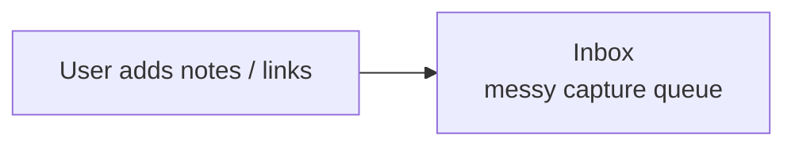
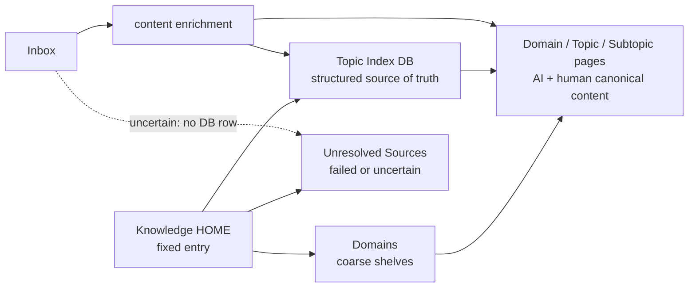

# Knowledge Model

## 目次

- [Workspace Shape](#workspace-shape)
- [Knowledge HOME](#knowledge-home)
- [Processing Shape](#processing-shape)
- [Design Principles](#design-principles)
- [Memo Inbox To Topic Workflow](#memo-inbox-to-topic-workflow)
- [Topic Index Schema](#topic-index-schema)
- [Required Semantics](#required-semantics)
- [Topic Tree](#topic-tree)
- [Page Body Template](#page-body-template)
- [Duplicate Handling](#duplicate-handling)
- [Stable Names And Export Paths](#stable-names-and-export-paths)
- [Markdown/RAG Readiness](#markdownrag-readiness)

## Workspace Shape

Use databases as structured truth for AI retrieval and pages as human navigation surfaces.

```text
Workspace
- Inbox
- Knowledge HOME
  - Topic Index
  - Unresolved Sources
  - Domains
    - Programming
      - iOS
        - The Composable Architecture (TCA)
        - SwiftUI
        - Swift Concurrency
      - Backend
      - Tooling
    - AI
      - RAG
      - Agent Memory
      - Prompting
    - Investing
    - Life
    - Work
  - Decisions
  - Projects
```

`Inbox` is a capture queue. It is allowed to be messy before processing because its job is to accept incomplete notes, raw clips, broken titles, copied snippets, and mixed topics. After processing, pages should not remain in `Inbox` as the search target. They should be registered in `Topic Index` and moved under the matching Topic or Subtopic page.

`Knowledge HOME` is the stable organized layer's fixed entry point. `Topic Index` is the structured index for AI retrieval and migration. `Domains` is the human-readable physical hierarchy. `Unresolved Sources` holds pages that could not be confidently enriched or classified. Topic/Subtopic pages under each Domain hold the canonical content that both AI and humans read. Do not create or update `Knowledge INDEX`; it is an unnecessary derived navigation cache unless the user explicitly reintroduces it later.

Do not treat a page as the root only because it is named `knowledge`, `Knowledge`, `メモ`, or `Bookmark`. If that page contains mixed or legacy content, keep it as an existing content area and create or use a clean `Knowledge HOME` for the structured layer.

## Knowledge HOME

`Knowledge HOME` is the fixed landing page for the structured knowledge layer. It should be sparse and durable:

```markdown
## Summary
One paragraph explaining that Inbox is capture, Topic Index is structured truth, Unresolved Sources is the failed/uncertain queue, and Topic/Subtopic pages are where canonical content lives.

## Core
- Topic Index: structured DB for AI retrieval and migration.
- Domains: human-readable hierarchy for organized canonical pages.
- Unresolved Sources: pages not registered in Topic Index because extraction or evidence was insufficient.

## Workflow
1. Capture in Inbox.
2. Enrich content.
3. Infer Domain / Topic / Subtopic.
4. Register confident pages in Topic Index and move them under Topic/Subtopic pages.
5. Leave uncertain pages in Inbox and report them.

## Structure
- Inbox
- Topic Index
- Domains / Domain / Topic / Subtopic pages
- Unresolved Sources
```

`Knowledge HOME` is not the source of truth for classification. Keep durable classification in `Topic Index`; keep durable topic summaries in Topic/Subtopic pages.

## Processing Shape

Before processing:



After processing:



Steady state:

```text
Inbox
- unprocessed pages
- Needs Review pages only

Knowledge HOME
- Topic Index DB
- Unresolved Sources
- Domains
  - Domain pages
    - Topic pages
      - Subtopic pages
```

## Design Principles

- Keep capture and organization separate. `Inbox` stores raw input before processing; `Topic Index` stores structured index rows after processing.
- A page counts as organized only after it is registered in `Topic Index`, moved out of `Inbox`, and normalized so AI and humans can read the same canonical page.
- Prefer DB registration over page hierarchy. A page can belong to multiple topics through DB properties and tags, while a page hierarchy has only one parent.
- Treat page movement as physical cleanup and human navigation. The searchable classification lives in `Topic Index`; the canonical content lives in the moved Topic/Subtopic page.
- Keep `Knowledge HOME`, `Topic Index`, `Domains`, and `Unresolved Sources` out of `Inbox`. Inbox is not a parent for organized infrastructure.
- Do not create or update `Knowledge INDEX`. Use `Topic Index` DB views and the `Domains` hierarchy instead. If a navigation cache becomes useful later, add it only after explicit user direction.
- Prefer one physical hierarchy under `Domains`: `Domains/{Domain}/{Topic}/{Subtopic}`. Do not create a parallel top-level `Topics` tree unless the user explicitly wants that view; it usually duplicates the Domain tree.
- Keep `Domain` broad. `Programming`, `AI`, `Investing`, `Life`, and `Work` are good shelves. `iOS`, `RAG`, or `Agent Memory` are usually Topics under a Domain, not Domains themselves.
- Do not under-create the hierarchy. When a confident page does not fit an existing shelf, create a reusable Topic/Subtopic path instead of dropping it directly under a broad Domain. Good examples are `Life / Health / Fitness`, `Life / Home / Maintenance`, `Life / Digital Creation / VTuber Tools`, and `Programming / Engineering Education / New Graduate Training`. Avoid one-off shelves named after a single captured page unless that name is already a durable concept.
- When a page spans multiple topics, move it under the single most relevant Topic/Subtopic page. Preserve cross-topic discoverability with `Tags`, `Related Topics`, and a `Related Topics` section in the page body.
- Preserve raw captured pages. Normalize by adding summaries, links, and DB rows; do not overwrite clips destructively.
- Make export deterministic with stable slugs and `Export Path`, independent of current Notion page parents.

## Memo Inbox To Topic Workflow

When the source is a broad bookmark or inbox page, treat it as a capture queue, not as the final knowledge hierarchy. The intended workflow is:

1. User drops pages, article links, notes, or copied snippets into `Bookmark` / `Inbox`.
2. Read each captured page and, when possible, enrich it from URL, embed, existing Notion clip, attachment text, or page body.
3. Infer the best `Domain`, `Topic`, and `Subtopic` when the evidence supports it.
4. If classification is confident enough, register the captured page in `Topic Index` with Domain / Topic / Subtopic fields.
5. Move the captured page out of `Inbox` and under the matching `Domains/{Domain}/{Topic}/{Subtopic}` page.
6. Normalize that same moved page with AI-readable and human-readable information: summary, source URL, source notes, decision notes, open questions, and related links.
7. If confidence is low, do not register a Topic Index row. Move the page to `Unresolved Sources` with the failed extraction or weak-evidence reason and report it to the user.

The memo inbox may remain chaotic before processing, but processed pages should leave it. `Topic Index` is the structured index. Topic pages contain the canonical content. `Unresolved Sources` keeps failed or weak-evidence items separate from both Inbox and Topic Index.

## Topic Index Schema

Recommended properties:

```text
Title: title
Resolved Title: rich_text
Title Source: select
Type: select
Domain: select
Domain Slug: rich_text
Topic: rich_text
Topic Slug: rich_text
Subtopic: rich_text
Subtopic Slug: rich_text
Status: select
Summary: rich_text
Source URL: url
Source Type: select
Extraction Status: select
Tags: multi_select
Related Topics: multi_select
Topic Page: url
Captured Page: url
Action: select
Export Path: rich_text
Canonical Role: select
Canonical URL: url
Created: created_time
Updated: last_edited_time
Ingested At: date
Last Verified: date
Exportable: checkbox
Canonical: checkbox
```

Recommended `Type` values:

```text
Note, Article, HowTo, Decision, Source, Log, Project, Book, Video, Reference, Topic, Code
```

Recommended `Status` values:

```text
Inbox, Processing, Organized, Evergreen, Archived, Stale, Duplicate
```

Recommended `Action` values:

```text
Register and Move to Topic Page, Keep in Inbox, Needs Human Review
```

Recommended `Source Type` values:

```text
Notion Note, Web Article, Bookmark, PDF, Video, Book, Code, Chat, Unknown
```

Recommended `Title Source` values:

```text
notion, url_reader, url_path, generated, unknown
```

Run title resolution for every processed page, including pages that already have a Notion title. Use `Resolved Title` when the captured title is empty, a raw URL, `Untitled`, a service-only label, a truncated save title, mismatched with the body, or otherwise weak for classification. If the existing title is already descriptive and accurate, keep `Title Source: notion` and leave `Resolved Title` null or equal to the existing title. Generated titles must be short labels derived only from extracted public content, existing Notion text, or URL path evidence. Do not infer authors, dates, conclusions, or named entities not present in the evidence.

Recommended `Extraction Status` values:

```text
Not Started, Extracted, Partial, Failed, Needs Manual Review
```

Recommended `Canonical Role` values:

```text
Canonical, Supporting, Duplicate, Stale, Unknown
```

Recommended starter `Domain` values:

```text
Programming, AI, Stock, Investing, Tax, Life, Work, Knowledge Management
```

Treat select and multi-select lists as open, but avoid near-duplicates such as `Investment` and `Investing` unless the user already distinguishes them. When a run needs a missing option such as `Code`, `Organized`, a new `Tag`, or a new `Related Topics` value, add that option to the existing property without deleting or renaming existing options before creating or updating rows. Do not silently omit a value because the option is missing.

`Area` is a legacy synonym for broad category. Prefer `Domain` for new data. If an existing database already has `Area`, read it as a compatibility signal, but do not create a new `Area` property unless the user explicitly wants it.

Use `Source Type` for the actual source, not the capture mechanism. A normal web page saved as a Notion bookmark is still `Web Article` when article/page content or metadata is available. Use `Bookmark` only when the item is just a saved link and the underlying source type cannot be determined.

Use `Action: Register and Move to Topic Page` for the successful path where the DB row becomes searchable and the captured page becomes the canonical content under a Topic/Subtopic page. Use `Keep in Inbox` only when the page needs human review or content extraction failed. Do not create a Topic Index row for `Keep in Inbox` items; report them to the user instead so the next run can try them once, not duplicate an uncertain DB record. `Extraction Status: Failed` rows should not be added to Topic Index unless there is another strong source of evidence that makes the classification reliable. When a page is confident enough for registration but no matching Topic/Subtopic exists, create or propose the reusable path instead of weakening the classification.

## Topic Tree

Domain pages are broad shelves. Topic pages live under Domain pages, and Subtopic pages live under Topic pages. Topic/Subtopic pages should be stable navigation pages whose top Summary summarizes the domain, topic, technology, or concept itself, not merely describes the page as a container. Moved pages under them are the canonical content that both AI and humans read.

Recommended physical path:

```text
Knowledge HOME
- Domains
  - Programming
    - iOS
      - The Composable Architecture (TCA)
        - captured article pages
```

Mapping example:

```text
Domain: Programming
Topic: iOS
Subtopic: The Composable Architecture (TCA)
```

```markdown
## Summary
What this topic is, why it matters, and the main tradeoffs or mental model.

## Key Concepts
Definitions, primitives, mechanisms, or core ideas for the topic.

## When To Consider
Situations where this topic, technique, or tool is relevant.

## When To Avoid Or Defer
Situations where it is probably unnecessary, risky, stale, or too costly.

## Topics
Links to Topic pages or filtered DB views.

## Subtopics
Links to subtopic pages or filtered DB views.

## Pages
Moved canonical pages, backlinks, or a filtered view of Topic Index. AI and humans should be able to open the same page and see the essential summary, source, decision state, and open questions.

## Decisions
Personal conclusions or adopted direction. Leave blank when no decision exists.

## Open Questions
Unknowns, stale claims, or follow-up checks.

## Related Topics
Links to other topic pages.
```

For capture-only pages, keep `Decisions` empty. Do not invent conclusions that are not supported by the page body or linked article.

## Required Semantics

`Type` describes the page role.

- `HowTo`: reusable procedure or implementation recipe
- `Decision`: chosen direction, conclusion, or investment/technical judgment
- `Source`: raw external material or clipped article
- `Article`: article notes with added interpretation
- `Log`: dated work journal or progress record
- `Project`: active outcome with tasks or milestones
- `Reference`: stable factual material to look up later
- `Topic`: Domain, Topic, or Subtopic page used as a container/navigation unit

`Status` describes lifecycle.

- `Inbox`: captured but not processed
- `Processing`: partly classified or needs human review
- `Evergreen`: useful, current, and worth retrieving later
- `Archived`: no longer active but kept
- `Stale`: possibly outdated
- `Duplicate`: overlaps with a better canonical page

`Canonical Role` describes how this page should be treated during retrieval and export. Use `Canonical` for the preferred page in a cluster, `Supporting` for useful context, `Duplicate` for overlap, and `Stale` for outdated material.

`Canonical` is a compatibility checkbox for quick filtering. Treat `Canonical Role` as the richer source of truth when both exist.

`Exportable` means the page can be exported to Markdown/JSON without losing important context.

## Page Body Template

Normalize pages toward this shape:

```markdown
## Summary
What this page is about and the current conclusion.

## Context
Why it was captured or researched, including relevant assumptions.

## Notes
Main notes, excerpts, implementation steps, facts, or observations.

## Decision
Personal judgment, chosen approach, rejected options, or investment stance. Leave blank when there is no decision.

## Links
Original source URLs and related Notion pages.

## Related Topics
Other topics that should retrieve this page even though they are not its physical parent.

## Next
Open questions, follow-up tasks, or verification needed.
```

For source-only clips, keep `Decision` empty and make `Source URL` explicit. For decision pages, include links to sources used.

## Duplicate Handling

When duplicates are detected:

1. Pick the clearer, more complete, or more recent page as the canonical candidate.
2. Mark that page `Canonical Role: Canonical` and, if the compatibility checkbox exists, `Canonical: true`.
3. Mark weaker overlaps `Canonical Role: Duplicate` or `Canonical Role: Stale`, and set `Status` to `Duplicate` or `Stale`.
4. Add `Canonical URL` or a link from duplicate/stale pages to the canonical page when possible.
5. Do not merge or delete without explicit user approval.

## Stable Names And Export Paths

AI retrieval and migration work best when human labels are paired with stable machine names.

- Generate `Domain Slug`, `Topic Slug`, and `Subtopic Slug` as lowercase ASCII kebab-case.
- Keep slugs stable. Do not rename slugs only because the display label was polished.
- Prefer one canonical spelling per concept. Use tags for aliases and related terms.
- Set `Export Path` when enough classification exists.
- Do not derive `Export Path` from the Notion parent page. Derive it from stable slugs and title/source identity.

Recommended export path format:

```text
domains/{domain-slug}/{topic-slug}/{subtopic-slug?}/{title-slug}.md
```

If classification is uncertain, leave slug fields blank and use `Extraction Status: Partial` or `Failed` with explicit unknowns rather than inventing a stable path. Use `Needs Manual Review` only when a human decision is explicitly required, not as the default for blocked URL extraction.

## Markdown/RAG Readiness

A page is ready for future Markdown or RAG export when:

- The title is descriptive without relying on parent hierarchy.
- `Summary` states the conclusion or page role.
- `Source URL` is set for external material.
- `Source Type` and `Extraction Status` describe how content was captured.
- `Decision` is separated from external source notes.
- Related pages are linked in `Links`.
- `Domain Slug`, `Topic Slug`, and `Export Path` are stable when classification is confident.
- `Canonical Role` is set appropriately.
- `Exportable` is true only after the above conditions are met.

Do not build a vector DB inside this skill. This skill prepares clean Notion content that can later be exported to Markdown/JSON and embedded by a separate RAG pipeline.
