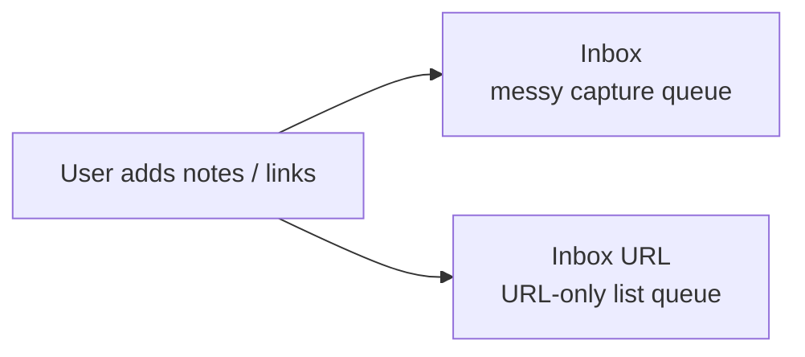
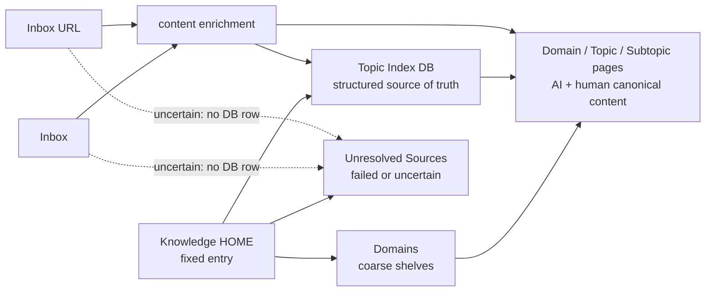

# Knowledge Model

## 目次

- [Workspace Shape](#workspace-shape)
- [Knowledge HOME](#knowledge-home)
- [Processing Shape](#processing-shape)
- [Design Principles](#design-principles)
- [Memo Inbox To Topic Workflow](#memo-inbox-to-topic-workflow)
- [Topic Index Schema](#topic-index-schema)
- [Required Semantics](#required-semantics)
- [Topic Tree](#topic-tree)
- [Page Body Template](#page-body-template)
- [Duplicate Handling](#duplicate-handling)
- [Stable Names](#stable-names)
- [Markdown/RAG Readiness](#markdownrag-readiness)

## Workspace Shape

Use databases as structured truth for AI retrieval and pages as human navigation surfaces.

```text
Workspace
- Inbox
- Inbox URL
- Knowledge HOME
  - Topic Index
  - Unresolved Sources
  - Domains
    - Programming
      - iOS
        - The Composable Architecture (TCA)
        - SwiftUI
        - Swift Concurrency
      - Backend
      - Tooling
    - AI
      - RAG
      - Agent Memory
      - Prompting
    - Investing
    - Life
    - Work
  - Decisions
  - Projects
```

`Inbox` is a capture queue. It is allowed to be messy before processing because its job is to accept incomplete notes, raw clips, broken titles, copied snippets, and mixed topics. `Inbox URL` or any URL-only list page is also a capture queue: the parent page is just the source list, and each URL line is the processing item. After processing, pages should not remain in `Inbox` or URL-only list queues as the search target. They should be registered in `Topic Index` and moved under the matching Topic or Subtopic page.

`Knowledge HOME` is the stable organized layer's fixed entry point. `Topic Index` is the structured index for AI retrieval and migration. `Domains` is the human-readable physical hierarchy. `Unresolved Sources` holds pages that could not be confidently enriched or classified. Topic/Subtopic pages under each Domain hold the canonical content that both AI and humans read. Do not create or update `Knowledge INDEX`; it is an unnecessary derived navigation cache unless the user explicitly reintroduces it later.

Do not treat a page as the root only because it is named `knowledge`, `Knowledge`, `メモ`, or `Bookmark`. If that page contains mixed or legacy content, keep it as an existing content area and create or use a clean `Knowledge HOME` for the structured layer.

## Knowledge HOME

`Knowledge HOME` is the fixed landing page for the structured knowledge layer. It should be sparse and durable:

```markdown
## Summary
One paragraph explaining that Inbox is capture, Topic Index is structured truth, Unresolved Sources is the failed/uncertain queue, and Topic/Subtopic pages are where canonical content lives.

## Core
- Topic Index: structured DB for AI retrieval and migration.
- Domains: human-readable hierarchy for organized canonical pages.
- Unresolved Sources: pages not registered in Topic Index because extraction or evidence was insufficient.

## Workflow
1. Capture in Inbox or a URL-only list page.
2. Enrich content.
3. Infer Domain / Topic / Subtopic.
4. Register confident pages in Topic Index and move them under Topic/Subtopic pages.
5. Move uncertain pages or URL items to Unresolved Sources and report them.

## Structure
- Inbox
- Inbox URL
- Topic Index
- Domains / Domain / Topic / Subtopic pages
- Unresolved Sources
```

`Knowledge HOME` is not the source of truth for classification. Keep durable classification in `Topic Index`; keep durable topic summaries in Topic/Subtopic pages.

## Processing Shape

Before processing:



After processing:



Steady state:

```text
Inbox
- unprocessed pages
- Needs Review pages only

Inbox URL
- unprocessed URL list pages
- source queues only, not organized knowledge pages

Knowledge HOME
- Topic Index DB
- Unresolved Sources
- Domains
  - Domain pages
    - Topic pages
      - Subtopic pages
```

## Design Principles

- Keep capture and organization separate. `Inbox` stores raw input before processing; `Topic Index` stores structured index rows after processing.
- Treat URL-only list pages such as `Inbox URL` as capture queues. Do not classify or register the parent list page as knowledge unless the user explicitly asks to organize that page itself. Extract each URL as an independent item, run url-reader, then create or update an organized Notion page for that URL item.
- After a URL-only list item has been converted into a canonical page or an unresolved page and moved out of the queue, delete only that processed URL line from the source list. Leaving processed URL lines in `Inbox URL` causes duplicate retries; deleting unprocessed URLs or surrounding notes is not allowed.
- A page counts as organized only after it is registered in `Topic Index`, moved out of `Inbox`, and normalized so AI and humans can read the same canonical page.
- Prefer DB registration over page hierarchy. A page can belong to multiple topics through DB properties and tags, while a page hierarchy has only one parent.
- Treat page movement as physical cleanup and human navigation. The searchable classification lives in `Topic Index`; the canonical content lives in the moved Topic/Subtopic page.
- Keep `Knowledge HOME`, `Topic Index`, `Domains`, and `Unresolved Sources` out of `Inbox`. Inbox is not a parent for organized infrastructure.
- Do not create or update `Knowledge INDEX`. Use `Topic Index` DB views and the `Domains` hierarchy instead. If a navigation cache becomes useful later, add it only after explicit user direction.
- Prefer one physical hierarchy under `Domains`: `Domains/{Domain}/{Topic}/{Subtopic}`. Do not create a parallel top-level `Topics` tree unless the user explicitly wants that view; it usually duplicates the Domain tree.
- Keep `Domain` broad. `Programming`, `AI`, `Investing`, `Life`, and `Work` are good shelves. `iOS`, `RAG`, or `Agent Memory` are usually Topics under a Domain, not Domains themselves.
- Do not under-create the hierarchy. When a confident page does not fit an existing shelf, create a reusable Topic/Subtopic path instead of dropping it directly under a broad Domain. Good examples are `Life / Health / Fitness`, `Life / Home / Maintenance`, `Life / Digital Creation / VTuber Tools`, and `Programming / Engineering Education / New Graduate Training`. Avoid one-off shelves named after a single captured page unless that name is already a durable concept.
- When a page spans multiple topics, move it under the single most relevant Topic/Subtopic page. Preserve cross-topic discoverability with `Tags`, `Related Topics`, and a `Related Topics` section in the page body.
- Preserve raw captured pages. Normalize by adding summaries, links, and DB rows; do not overwrite clips destructively.
- Keep stable human labels in `Domain`, `Topic`, and `Subtopic`. Do not maintain duplicate slug/export columns unless the user explicitly reintroduces export automation.

## Memo Inbox To Topic Workflow

When the source is a broad bookmark page, inbox page, or URL-only list page, treat it as a capture queue, not as the final knowledge hierarchy. The intended workflow is:

1. User drops pages, article links, notes, copied snippets, or URL-only lines into `Bookmark` / `Inbox` / `Inbox URL`.
2. Read each captured page. For URL-only list pages, extract URL lines top-to-bottom up to the batch limit and treat each URL as its own item.
3. Enrich each item from URL, embed, existing Notion clip, attachment text, or page body. URL-only items must run url-reader before classification.
4. Infer the best `Domain`, `Topic`, and `Subtopic` when the evidence supports it.
5. If classification is confident enough, register the captured page or URL item page in `Topic Index` with Domain / Topic / Subtopic fields.
6. Move the captured page or URL item page out of the capture queue and under the matching `Domains/{Domain}/{Topic}/{Subtopic}` page. If a URL-only item has no Notion page yet, create one before DB registration and movement.
7. Normalize that same moved page with AI-readable and human-readable information: summary, source URL, source notes, decision notes, open questions, related links, and the source queue page when it came from a URL list.
8. For URL-only list items, remove the processed URL line from the source list after the canonical page or unresolved page exists and its destination has been verified.
9. If confidence is low, do not register a Topic Index row. Create or use a page for the unresolved URL item, move it to `Unresolved Sources` with the failed extraction or weak-evidence reason, remove that URL line from the source list, and report it to the user.

The memo inbox may remain chaotic before processing, but processed pages should leave it. `Topic Index` is the structured index. Topic pages contain the canonical content. `Unresolved Sources` keeps failed or weak-evidence items separate from both Inbox and Topic Index.

## Topic Index Schema

Recommended properties:

```text
Title: title
Summary: rich_text
Notion Page: url
Domain: select
Topic: rich_text
Subtopic: rich_text
Type: select
Source Type: select
Source URL: url
Tags: multi_select
Related Topics: multi_select
Published At: date
```

Recommended table view order:

```text
Title, Summary, Notion Page, Domain, Topic, Subtopic, Type, Source Type, Source URL, Tags, Related Topics, Published At
```

Recommended `Type` values:

```text
Note, Article, HowTo, Decision, Source, Log, Project, Book, Video, Reference, Topic, Code
```

Recommended `Source Type` values:

```text
Notion Note, Web Article, Bookmark, PDF, Video, Book, Code, Chat, Unknown
```

Recommended `Title Source` values:

```text
notion, url_reader, url_path, generated, unknown
```

Run title resolution for every processed page, including pages that already have a Notion title. Use `Resolved Title` when the captured title is empty, a raw URL, `Untitled`, a service-only label, a truncated save title, mismatched with the body, or otherwise weak for classification. If the existing title is already descriptive and accurate, keep `Title Source: notion` and leave `Resolved Title` null or equal to the existing title. Generated titles must be short labels derived only from extracted public content, existing Notion text, or URL path evidence. Do not infer authors, dates, conclusions, or named entities not present in the evidence.

Recommended starter `Domain` values:

```text
Programming, AI, Stock, Investing, Tax, Life, Work, Knowledge Management
```

Treat select and multi-select lists as open, but avoid near-duplicates such as `Investment` and `Investing` unless the user already distinguishes them. When a run needs a missing option such as `Code`, a new `Tag`, or a new `Related Topics` value, add that option to the existing property without deleting or renaming existing options before creating or updating rows. Preserve existing option names and colors exactly; Notion rejects attempts to recolor existing select options. Use `mcp__notion.notion_update_data_source` for option additions. If that tool is not initially available, use `tool_search` to expose it before deciding the option cannot be added. Do not silently omit a value because the option is missing.

`Area` is removed. Use `Domain` as the only broad category field. Do not create, populate, read as authoritative, or backfill `Area`. If an existing Topic Index DB still has `Area`, remove the property during schema maintenance after confirming `Domain` exists.

Use `Source Type` for the actual source, not the capture mechanism. A normal web page saved as a Notion bookmark is still `Web Article` when article/page content or metadata is available. Use `Bookmark` only when the item is just a saved link and the underlying source type cannot be determined.

Use `Published At` for the date the source information was originally published or released. Prefer dates extracted from URL metadata, reader output, visible page text, video metadata, repository release/tag metadata, or the user's own note when explicitly stated. Do not fill `Published At` from Notion page created time or last edited time. If the published date is unknown, leave it empty rather than inventing recency.

Do not create or rely on `Created`, `Updated`, `Created at`, `Updated at`, `Ingested At`, or `Source Checked At` properties for this workflow. These are operational bookkeeping fields and the user does not need them in the knowledge index. Use `Published At` only for the source's public date when available.

Use `Notion Page` only for the organized Notion page itself. Store the stable canonical Notion page URL derived from the page ID after movement, not the original capture URL, not an `app.notion.com` UI URL copied from the browser, and not the external `Source URL`. Source links belong in `Source URL`.

The Topic Index contains only successfully organized pages. Do not use `Action`, `Status`, or `Extraction Status` columns to represent workflow state in the DB. Pages that cannot be organized should not get a Topic Index row; move them to `Unresolved Sources` with a reason instead. Keep extraction results in the internal `extraction_status` field and the organized page body when they matter. When a page is confident enough for registration but no matching Topic/Subtopic exists, create or propose the reusable path instead of weakening the classification.

## Topic Tree

Domain pages are broad shelves. Topic pages live under Domain pages, and Subtopic pages live under Topic pages. Topic/Subtopic pages should be stable navigation pages whose top Summary summarizes the domain, topic, technology, or concept itself, not merely describes the page as a container. Moved pages under them are the canonical content that both AI and humans read.

Recommended physical path:

```text
Knowledge HOME
- Domains
  - Programming
    - iOS
      - The Composable Architecture (TCA)
        - captured article pages
```

Mapping example:

```text
Domain: Programming
Topic: iOS
Subtopic: The Composable Architecture (TCA)
```

```markdown
## Summary
What this topic is, why it matters, and the main tradeoffs or mental model.

## Key Concepts
Definitions, primitives, mechanisms, or core ideas for the topic.

## When To Consider
Situations where this topic, technique, or tool is relevant.

## When To Avoid Or Defer
Situations where it is probably unnecessary, risky, stale, or too costly.

## Topics
Links to Topic pages or filtered DB views.

## Subtopics
Links to subtopic pages or filtered DB views.

## Pages
Moved canonical pages, backlinks, or a filtered view of Topic Index. AI and humans should be able to open the same page and see the essential summary, source, decision state, and open questions.

## Decisions
Personal conclusions or adopted direction. Leave blank when no decision exists.

## Open Questions
Unknowns, stale claims, or follow-up checks.

## Related Topics
Links to other topic pages.
```

For capture-only pages, keep `Decisions` empty. Do not invent conclusions that are not supported by the page body or linked article.

## Required Semantics

`Type` describes the page role.

- `HowTo`: reusable procedure or implementation recipe
- `Decision`: chosen direction, conclusion, or investment/technical judgment
- `Source`: raw external material or clipped article
- `Article`: article notes with added interpretation
- `Log`: dated work journal or progress record
- `Project`: active outcome with tasks or milestones
- `Reference`: stable factual material to look up later
- `Topic`: Domain, Topic, or Subtopic page used as a container/navigation unit

`Status`, `Action`, `Canonical Role`, `Canonical`, `Canonical URL`, `Exportable`, `Export Path`, `Topic Page`, and slug columns are removed from the active schema. They made the DB look like a migration/export control plane, but the current workflow only needs a lightweight index for organized pages. Duplicate handling should delete/archive duplicate captures when allowed or report them as unresolved; do not create extra duplicate rows just to express canonical state.

## Page Body Template

Normalize pages toward this shape:

```markdown
## Summary
What this page is about and the current conclusion.

## Context
Why it was captured or researched, including relevant assumptions.

## Notes
Main notes, excerpts, implementation steps, facts, or observations.

## Decision
Personal judgment, chosen approach, rejected options, or investment stance. Leave blank when there is no decision.

## Links
Original source URLs and related Notion pages.

## Related Topics
Other topics that should retrieve this page even though they are not its physical parent.

## Next
Open questions, follow-up tasks, or verification needed.
```

For source-only clips, keep `Decision` empty and make `Source URL` explicit. For decision pages, include links to sources used.

## Duplicate Handling

When duplicates are detected:

1. Pick the clearer, more complete, or more recent page as the retained page.
2. Register only the retained page in Topic Index.
3. If the user has allowed deletion, delete/archive weaker duplicate captures when the tool is available.
4. If deletion is unavailable, report the duplicate as `duplicate_delete_unavailable`; do not add a duplicate Topic Index row.
5. Do not use `Canonical Role`, `Canonical`, or `Canonical URL` columns.

## Stable Names

AI retrieval works best when human labels are consistent.

- Keep one canonical display spelling for each `Domain`, `Topic`, and `Subtopic`.
- Prefer one canonical spelling per concept. Use tags for aliases and related terms.
- Do not generate or backfill slug columns unless export automation is explicitly requested later.
- If classification is uncertain, do not create a Topic Index row. Move the page to `Unresolved Sources` with explicit unknowns. Use `Needs Manual Review` only when a human decision is explicitly required, not as the default for blocked URL extraction.

## Markdown/RAG Readiness

A page is ready for future Markdown or RAG export when:

- The title is descriptive without relying on parent hierarchy.
- `Summary` states the conclusion or page role.
- `Source URL` is set for external material.
- `Published At` is set when the source provides a reliable publication date; otherwise it is empty.
- `Source Type` describes what kind of source the page came from.
- `Decision` is separated from external source notes.
- Related pages are linked in `Links`.
- `Domain`, `Topic`, and when useful `Subtopic` are stable and readable.

Do not build a vector DB or export control plane inside this skill. If Markdown/JSON export becomes necessary later, add a dedicated export workflow instead of carrying unused columns in the Notion index.
