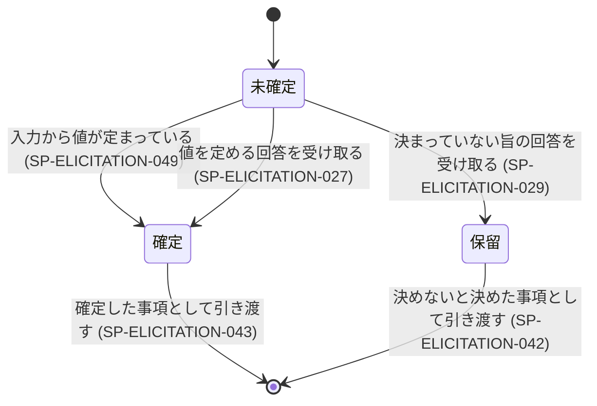

## 表記規約

本文書の仕様項目は次の語尾で区分する。必須・推奨・許容の 3 区分の語尾は、JIS Z 8301 が定める shall / should / may の日本語対応に従う。禁止の区分の語尾は、その 3 対応の範囲外であり、本文書が定める。

（本文の全文は `docs/specifications/elicitation.md` に保存済み。以下はその内容と同一である。）

# 仕様書: 事前分析と依頼者への問いかけ

本文書は次の文書と同じ一式として生成される。相互に参照する記述は、この一式が揃っていることを前提とする。

- `docs/requirements/INDEX.md`
- `docs/requirements/requester.md`
- `docs/requirements/consumer.md`
- `docs/specifications/INDEX.md`
- `docs/specifications/flow.md`
- `docs/specifications/elicitation.md`（本文書）
- `docs/specifications/authoring.md`
- `docs/specifications/verification.md`

## 表記規約

本文書の仕様項目は次の語尾で区分する。必須・推奨・許容の 3 区分の語尾は、JIS Z 8301 が定める shall / should / may の日本語対応に従う。禁止の区分の語尾は、その 3 対応の範囲外であり、本文書が定める。

| 区分 | 語尾 | 対応する英語 |
|---|---|---|
| 必須 | 〜しなければならない | shall / MUST |
| 推奨 | 〜することが望ましい | should / SHOULD |
| 許容 | 〜してもよい | may / MAY |
| 禁止 | 〜してはならない | shall not / MUST NOT |

## 対象範囲

本文書は、要求文書と仕様書を生成する仕組み（以下「システム」）が、**文書を書き始める前に入力を読み解き、決まっていない事項を依頼者へ問い、受け取った回答を反映する**までの振る舞いを定める。扱うのは次の 6 つである。

| 扱う事項 | 節 |
|---|---|
| 観点について案件が該当するかの判定 | 機能仕様 §観点の判定 |
| 生成する文書の分割案の作り方 | 機能仕様 §分割案 |
| 同一性・対応づけ・回答の種別の判定を何に委ねるか | 機能仕様 §判定の委ね方 |
| 問いの作り方と、問わない事項の絞り込み | 機能仕様 §質問の生成と絞り込み |
| 受け取った回答の反映と、決まっていない旨の回答の扱い | 機能仕様 §回答の反映 |
| 事前分析と問いかけの根拠として読み取ってよい入力の範囲 | 機能仕様 §根拠として読み取る範囲 |

本文書は、外から観測できる振る舞いだけを規定する。分析や問いの生成を何個の処理単位に割るか、それをどう分担させるかは規定しない。

### 本文書が扱わない範囲

| 扱わないもの | どこが扱うか |
|---|---|
| 問いを出す時点・中断点の設置・回答を待つ間の実行の継続 | `docs/specifications/flow.md` |
| 未確定事項の区分の付け替えと、完成の判定 | `docs/specifications/flow.md` |
| 聞き返しの周回の上限 | `docs/specifications/flow.md` |
| 生成文書の章立て・要求文の書式・未確定事項の表記 | `docs/specifications/authoring.md` |
| 生成物の検査と改稿 | `docs/specifications/verification.md` |

## 用語定義

| 語 | 定義 |
|---|---|
| システム | 要求文書と仕様書を生成する仕組み全体 |
| 実行主体 | システムの振る舞いを実行する AI |
| 依頼者 | システムに文書の生成を頼む人間 |
| 依頼文 | 依頼者が最初に渡した依頼の文 |
| 事項 | 文書を書くために値が決まっている必要のある 1 件の論点。未確定・確定・保留のいずれかの状態を持つ（依頼文から事項を起こす規則と識別子の付け方は TBD-SELICITATION-012） |
| 論点 | 1 件の事項について何を決めるのかを述べた記述 |
| 観点 | 案件の性質を測るためにあらかじめ定めた切り口。**観点は事項ではなく、事項と同じ状態を持たない** |
| 分割案 | 生成する文書を何ファイルに分けるかの案 |
| 分割単位 | 分割案が定める 1 ファイル分の関心事と、それに与えた名前 |
| 関心事 | 読み手が 1 つの作業を行うときに、まとめて読む必要のある事柄の範囲 |
| 問い | 1 件の事項について依頼者へ示す質問の文 |
| 対応づけ | 受け取った回答が、ある事項の論点に対する内容であると判定すること。判定の対象は事項の論点であり、その事項の問いを依頼者へ示したかどうかは判定の材料としない |
| 値を定める回答 | 事項の論点に対して依頼者が示した、その事項を確定させる内容 |
| 決まっていない旨の回答 | 事項の論点に対して依頼者が示した、決まっていないという内容 |
| 入力から値が定まっている事項 | 依頼文または依頼者が所在を示した既存文書の記述だけで論点の値が定まる事項 |
| 保留 | 依頼者が決まっていない旨を答えた事項の状態。`docs/specifications/flow.md` が定める「決めないと決めた」の区分に対応する |
| 判定が付かない | 実行主体が、判定の対象について 1 つの結論を選べない状態 |
| 所在を示した既存文書 | 依頼者がファイルの位置を指し示した、実行の開始時点で存在する文書 |

## 外部インタフェース

| 境界 | やり取りするもの |
|---|---|
| 依頼者との対話 | 依頼文の受け取り、問いの提示、回答の受け取り、判定が付かないときの確認 |
| ファイルシステム | 依頼者が所在を示した既存文書の読み取り |
| 文書の作成への引き渡し | 観点の判定の一覧、分割案、確定した事項、保留となった事項 |

確定した事項には、依頼者の回答によって確定した事項と、入力から値が定まったことによって確定した事項（SP-ELICITATION-049）の双方が含まれる。

受け取った回答は次の 3 つに区別する。3 つのいずれに当たるかは、機能仕様 §判定の委ね方が定める規則で判定する。

| 回答の種別 | 扱い |
|---|---|
| 値を定める回答 | 事項を確定させる（SP-ELICITATION-027） |
| 決まっていない旨の回答 | 事項を保留とする（SP-ELICITATION-029） |
| どの事項の論点にも対応づけられない回答 | 値として確定させない（SP-ELICITATION-037。それ以降の扱いは TBD-SELICITATION-003） |

## 機能仕様

### 観点の判定

システムが判定の対象とする観点の集合の値は SP-ELICITATION-002 が正である。**本文書は、個々の案件についてその観点をどう判定したかの結果を持たない。** 案件ごとの判定結果を生成文書のどこへ置くかは `docs/specifications/authoring.md` の SP-AUTHORING-014（各要求文書はその文書の関心事に関わる観点だけを持つ）が定める。

#### SP-ELICITATION-001 事前分析の実施
依頼文を受け取ったとき、システムは案件があらかじめ定めた観点に該当するかを判定しなければならない。
（実現する要求: PR-CONSUMER-009）

#### SP-ELICITATION-002 判定の対象とする観点
システムは、次の 10 件の観点を判定の対象とし、案件によらずこの 10 件に固定しなければならない。

| 番号 | 観点 |
|---|---|
| 1 | 人の生命・身体・健康への影響 |
| 2 | 金銭・資産の移動 |
| 3 | 個人情報・機微情報 |
| 4 | 法令・業界規制・契約上の義務 |
| 5 | 第三者監査・当局報告・社内統制 |
| 6 | 停止が許されない時間帯・可用性 |
| 7 | 外部システム・第三者への提供・連携 |
| 8 | 不可逆な操作 |
| 9 | 利用者の範囲 |
| 10 | データの保持期間・削除や開示の請求 |

この 10 件は判定の対象であり、非該当と判定した観点も判定の一覧に現れる。この一覧に外部規格の裏付けは無い。実務慣行と実測（実案件での判定可能性）に基づく。
（実現する要求: PR-CONSUMER-009）

#### SP-ELICITATION-003 判定の値の限定
システムは、各観点の判定を該当・非該当・不明のいずれか 1 つとしなければならない。
（実現する要求: PR-CONSUMER-009）

#### SP-ELICITATION-004 判定の根拠の併記
判定を示すとき、システムはその判定に至った入力の記述、または判定の材料が入力に無い旨のいずれかを根拠として併記しなければならない。
（実現する要求: PR-CONSUMER-018）

#### SP-ELICITATION-008 判定の引き渡し
システムは、観点の判定の一覧を文書の作成の入力として渡さなければならない。
（実現する要求: PR-CONSUMER-009）

#### SP-ELICITATION-009 判定できない観点の扱い
入力のどの記述からも判定できない観点を、システムは不明と判定しなければならない。
（実現する要求: PR-CONSUMER-009）

#### SP-ELICITATION-010 不明と判定した観点の非確定
システムは、不明と判定した観点を、該当または非該当が確定したものとして扱ってはならない（不明のまま残った観点のその後の扱いは TBD-SELICITATION-010）。
（実現する要求: PR-REQUESTER-009）

### 分割案

#### SP-ELICITATION-012 分割案の作成
システムは、生成する文書の分割案を作らなければならない（分割の軸をどう定めるか、および既存文書の分割単位の名前を引き継ぐかは TBD-SELICITATION-006）。
（実現する要求: PR-CONSUMER-021）

#### SP-ELICITATION-013 分割単位が扱う関心事の記述
分割案を作るとき、システムは分割単位ごとに、その単位が扱う関心事を記さなければならない。
（実現する要求: PR-CONSUMER-021）

#### SP-ELICITATION-014 分割単位の名前の重複の禁止
システムは、1 つの分割案の中で同一の名前を 2 つ以上の分割単位に与えてはならない。
（実現する要求: PR-CONSUMER-021）

#### SP-ELICITATION-015 同一の関心事の重複の禁止
システムは、同一の関心事を 2 つ以上の分割単位へ割り当ててはならない。どの分割単位にも割り当てられない関心事が残ってよいかは TBD-SELICITATION-016 が扱う。
（実現する要求: PR-CONSUMER-025）

#### SP-ELICITATION-048 分割案の引き渡し
システムは、分割案を文書の作成の入力として渡さなければならない。
（実現する要求: PR-CONSUMER-021）

### 判定の委ね方

本節は、字句の一致では定義しない判定を扱う。対象は次の 5 つである。

| 判定の対象 | 何を決める判定か | 用いる仕様項目 |
|---|---|---|
| 論点の同一 | 2 つの論点が同じ論点を指すか | SP-ELICITATION-024 |
| 関心事の同一 | 2 つの関心事が同一の対象を指すか | SP-ELICITATION-015 |
| 論点の中身の変化 | 既に回答を得た事項の論点の中身が変わったか | SP-ELICITATION-025 |
| 回答と論点の対応づけ | 受け取った回答が、どの事項の論点に対する内容であるか | SP-ELICITATION-037 |
| 回答の種別 | 受け取った回答が 3 つの種別のいずれに当たるか | SP-ELICITATION-027・SP-ELICITATION-029・SP-ELICITATION-037 |

判定が付かないときにどちらへ倒すかは、対象ごとに向きが異なる。向きは SP-ELICITATION-045 の表が定める。

#### SP-ELICITATION-044 判定を実行主体の言語理解に委ねること
システムは、上の表に挙げた 5 つの判定を、あらかじめ定めた語句との一致ではなく実行主体の言語理解によって行わなければならない。
（実現する要求: PR-REQUESTER-007・PR-REQUESTER-029）

#### SP-ELICITATION-045 判定が付かないときに倒してはならない側
判定が付かないとき、システムは次の表の右の欄に挙げた扱いを採ってはならない。

| 判定の対象 | 採ってはならない扱い |
|---|---|
| 論点の同一 | 同じ論点とみなして問いを作らないこと |
| 関心事の同一 | 同一の関心事とみなして 1 つの分割単位へまとめること |
| 論点の中身の変化 | 変わっていないとみなして事項を未確定へ起こし直さないこと |
| 回答と論点の対応づけ | いずれかの事項の論点に対応づけて、その事項の値を定めまたは差し替えること |
| 回答の種別 | 3 つの種別のいずれかへ当てはめて事項を確定または保留とすること |

（実現する要求: PR-REQUESTER-007・PR-REQUESTER-029）

#### SP-ELICITATION-046 判定が付かないときの依頼者への確認
判定が付かないとき、システムはその判定の対象を依頼者へ示して確認を求めなければならない（確認への回答をどう扱うかは TBD-SELICITATION-017）。
（実現する要求: PR-REQUESTER-007）

### 質問の生成と絞り込み

#### SP-ELICITATION-017 着手を止める事項の問いかけ
未確定の事項が文書の作成に着手できない原因である間、システムはその事項について問いを作らなければならない（問いを繰り返す周回の上限は `docs/specifications/flow.md` が定める）。
（実現する要求: PR-REQUESTER-005）

#### SP-ELICITATION-018 確定した事項を問わないこと
事項の値が入力から定まっている間、システムはその事項の問いを作ってはならない。
（実現する要求: PR-REQUESTER-007）

#### SP-ELICITATION-020 問いと事項の結び付け
問いを作るとき、システムはその問いを、対応する事項の識別子と結び付けなければならない（事項の識別子の形式と採番の単位は TBD-SELICITATION-012、1 つの問いに複数の論点を含めてよいかは TBD-SELICITATION-007、問いの文に用いてよい語の範囲は TBD-SELICITATION-008）。
（実現する要求: PR-REQUESTER-005）

#### SP-ELICITATION-024 回答済みの論点の再質問の禁止
依頼者が既に回答した論点について、その論点の中身が変わっていない間、システムは同じ論点の問いを再び作ってはならない。
（実現する要求: PR-REQUESTER-007）

#### SP-ELICITATION-025 論点が変わったときの再質問
既に回答を得た事項の論点の中身が変わったとき、システムはその事項を未確定の事項として起こし直さなければならない（起こし直した事項が元の識別子を引き継ぐかは TBD-SELICITATION-012）。
（実現する要求: PR-REQUESTER-007）

#### SP-ELICITATION-026 保留となった事項の再質問の禁止
保留となった事項について、システムは同じ論点の問いを再び作ってはならない。
（実現する要求: PR-REQUESTER-008）

### 回答の反映

#### SP-ELICITATION-049 入力から値が定まっている事項の確定
依頼文または依頼者が所在を示した既存文書の記述だけで事項の論点の値が定まっているとき、システムはその事項を確定した事項としなければならない（確定した事項の値と異なる回答を依頼者から受け取ったときの扱いは TBD-SELICITATION-019）。
（実現する要求: PR-REQUESTER-020）

#### SP-ELICITATION-027 値を定める回答の反映
未確定の事項の論点に対応づけられる値を定める回答を受け取ったとき、システムはその事項を確定した事項としなければならない。
（実現する要求: PR-REQUESTER-005）

#### SP-ELICITATION-043 確定した事項の引き渡し
システムは、確定した事項を文書の作成へ引き渡さなければならない。
（実現する要求: PR-REQUESTER-005）

#### SP-ELICITATION-029 決まっていない旨の回答の反映
未確定の事項の論点に対応づけられる決まっていない旨の回答を受け取ったとき、システムはその事項を保留としなければならない。
（実現する要求: PR-REQUESTER-029）

#### SP-ELICITATION-031 入力にも回答にも根拠が無い事項を推測で埋めないこと
依頼文と依頼者が所在を示した既存文書のいずれからも値が定まらず、かつ依頼者から回答を得ていない事項について、システムはその事項を確定した事項として扱ってはならない。
（実現する要求: PR-REQUESTER-009）

#### SP-ELICITATION-040 保留であることの記録
事項を保留としたとき、システムはその事項が保留であることを記録しなければならない。
（実現する要求: PR-REQUESTER-029）

#### SP-ELICITATION-041 保留となった事項の非着手不能扱い
保留となった事項を、システムは文書の作成に着手できない原因として扱ってはならない。
（実現する要求: PR-REQUESTER-029）

#### SP-ELICITATION-042 保留となった事項の引き渡し
システムは、保留となった事項を、決めないと決めた事項として文書の作成へ引き渡さなければならない。
（実現する要求: PR-REQUESTER-029）

### 根拠として読み取る範囲

事前分析と問いかけの間に根拠として読み取ってよい入力の範囲は、`docs/specifications/flow.md` の SP-FLOW-011（根拠として扱う入力を依頼文・依頼者の回答・所在を示された既存文書の 3 つに限ること）・SP-FLOW-012（対象リポジトリの実装を読み取らないこと）・SP-FLOW-013（所在を示された既存文書を読み取ること）・SP-FLOW-040（所在を示されていない文書を走査で探し出して読み取らないこと）が定める全体の規則を、そのまま適用する。**本文書はこの規則を独自に定め直さない。** 依頼者がファイルではなくディレクトリを所在として示したときの扱いは TBD-SELICITATION-015 が扱う。

読み取れなかったときの振る舞いだけは事前分析に固有であり、SP-ELICITATION-039 が定める。

## エラー処理と異常系

本章は、事前分析と問いかけに固有の異常だけを扱う。実行の打ち切り・実行基盤の不足・依頼者が応答しないまま時間が経過したときの扱いは `docs/specifications/flow.md` が持つ。

#### SP-ELICITATION-036 着手を止める事項が 1 件も無いとき
着手を止める未確定の事項が 0 件である間、システムは問いを作ってはならない。
（実現する要求: PR-REQUESTER-005）

#### SP-ELICITATION-037 どの論点にも対応づけられない回答を受け取ったとき
どの事項の論点にも対応づけられない回答を受け取ったとき、システムはその回答の内容を事項の値として確定させてはならない（この回答の扱いは TBD-SELICITATION-003）。
（実現する要求: PR-REQUESTER-009）

#### SP-ELICITATION-038 分割単位の名前が衝突したとき
分割単位の名前が衝突したとき、システムは衝突した名前を依頼者へ示さなければならない（名前を示したあとに分割案をどうするかは TBD-SELICITATION-018）。
（実現する要求: PR-CONSUMER-021）

#### SP-ELICITATION-039 所在を示された文書を読み取れないとき
依頼者が所在を示した文書を読み取れないならば、システムは読み取れなかった文書の所在を依頼者へ示さなければならない。
（実現する要求: PR-REQUESTER-022）

| 事象 | 種別 | 振る舞い | 仕様項目 |
|---|---|---|---|
| 着手を止める未確定の事項が 1 件も無い | 正常系エッジ | 問いを作らない | SP-ELICITATION-036 |
| どの事項の論点にも対応づけられない回答を受け取る | 準正常系 | 値として確定させない。以降の扱いは未定 | SP-ELICITATION-037（TBD-SELICITATION-003） |
| 保留となった事項の論点に対応づけられる回答を受け取る | 準正常系 | 未定 | TBD-SELICITATION-003 |
| 確定した事項の論点に対応づけられ、内容の異なる回答を受け取る | 準正常系 | 未定 | TBD-SELICITATION-019 |
| 回答の種別または対応づけの判定が付かない | 準正常系 | 確定にも保留にもせず、依頼者へ確認を求める | SP-ELICITATION-045・SP-ELICITATION-046 |
| 論点または関心事の同一の判定が付かない | 準正常系 | 同一とみなさず、依頼者へ確認を求める | SP-ELICITATION-045・SP-ELICITATION-046 |
| 判定が付かないことの確認へ依頼者が回答する | 準正常系 | 未定 | TBD-SELICITATION-017 |
| 分割単位の名前が衝突する | 準正常系 | 衝突した名前を依頼者へ示す。示したあとの扱いは未定 | SP-ELICITATION-038（TBD-SELICITATION-018） |
| 所在を示された文書を読み取れない | 異常系 | 読み取れなかった文書の所在を依頼者へ示す | SP-ELICITATION-039 |
| 入力のどの記述からも観点を判定できない | 準正常系 | 不明と判定し、確定したものとして扱わない | SP-ELICITATION-009・SP-ELICITATION-010 |

## 状態とイベント

### 状態遷移図

対象は**事項 1 件の状態**である。実行全体の状態は `docs/specifications/flow.md` が持つ。

### 状態 × イベント表

行は、上の図が持つ状態の集合と、下に列挙したイベントの集合の直積から起こす。主フローの遷移は図が持つため、この表には載せない。

> 対象とするイベント: E1 その事項の論点に対応づけられる値を定める回答を受け取る / E2 その事項の論点に対応づけられる決まっていない旨の回答を受け取る / E3 事項の論点の中身が変わる / E4 どの事項の論点にも対応づけられない回答を受け取る / E5 確定した内容と異なる回答を受け取る / E6 受け取った回答の種別または対応づけの判定が付かない / E7 判定が付かないことの確認へ依頼者が回答する

**イベントの集合は閉じていない。** 依頼者が応答しないこと・実行基盤の異常は `docs/specifications/flow.md` の軸に載る。

| 現在の状態 | 発生しうるイベント | 種別 | 次の状態 | 定義済みか |
|---|---|---|---|---|
| 未確定 | E3 | 準正常系 | 未確定 | ✅ SP-ELICITATION-025 |
| 未確定 | E4 | 準正常系 | 未確定 | ❌ 未定義（TBD-SELICITATION-003） |
| 未確定 | E5 | — | — | 発生しない（根拠: 未確定の事項は確定した内容を持たない） |
| 未確定 | E6 | 準正常系 | 未確定 | ✅ SP-ELICITATION-045・SP-ELICITATION-046 |
| 未確定 | E7 | 準正常系 | 未確定 | ❌ 未定義（TBD-SELICITATION-017） |
| 確定 | E1 | 準正常系 | 未確定（TBD-SELICITATION-019） | ❌ 未定義（TBD-SELICITATION-019） |
| 確定 | E2 | 準正常系 | 保留 | ✅ SP-ELICITATION-029 |
| 確定 | E3 | 準正常系 | 未確定 | ✅ SP-ELICITATION-025 |
| 確定 | E4 | 準正常系 | 確定 | ❌ 未定義（TBD-SELICITATION-003） |
| 確定 | E5 | 準正常系 | 未確定（TBD-SELICITATION-019） | ❌ 未定義（TBD-SELICITATION-019） |
| 確定 | E6 | 準正常系 | 確定 | ✅ SP-ELICITATION-045・SP-ELICITATION-046 |
| 確定 | E7 | 準正常系 | 確定 | ❌ 未定義（TBD-SELICITATION-017） |
| 保留 | E1 | 準正常系 | 保留 | ❌ 未定義（TBD-SELICITATION-003。保留の事項は問いを再び作らないが、その論点に対応づけられる回答は届きうる） |
| 保留 | E2 | 準正常系 | 保留 | ❌ 未定義（TBD-SELICITATION-003。同上） |
| 保留 | E3 | 準正常系 | 未確定 | ✅ SP-ELICITATION-025 |
| 保留 | E4 | 準正常系 | 保留 | ❌ 未定義（TBD-SELICITATION-003） |
| 保留 | E5 | — | — | 発生しない（根拠: 保留の事項は確定した内容を持たない） |
| 保留 | E6 | 準正常系 | 保留 | ✅ SP-ELICITATION-045・SP-ELICITATION-046 |
| 保留 | E7 | 準正常系 | 保留 | ❌ 未定義（TBD-SELICITATION-017） |

## 検証方法

各仕様項目をどう確かめるかは、トレーサビリティ表の検証方法の欄が正である。本章は、そこで用いる 3 つの手段の意味を固定する。

| 手段 | 何を測るか |
|---|---|
| 静的検査 | 生成された判定の一覧・分割案・問いの集合を機械的に走査し、規則に反する件数を測る |
| 状態遷移試験 | 事項に回答を与え、遷移した後の状態と記録の内容を確かめる |
| 入力差し替え試験 | 入力を差し替えて実行し、読み取った文書の集合・依頼者への提示の有無・引き渡された内容を確かめる |

**未確定事項が残る仕様項目は、その未確定事項が決まるまで検証を設計できない。** 該当する項目のステータスは `未着手` のままとする。

## トレーサビリティ表

本表は、本文書がカバーする要求の分だけを持つ。

| 要求 ID | 仕様項目 ID | 検証方法 | ステータス |
|---|---|---|---|
| PR-CONSUMER-009 | SP-ELICITATION-001 | 入力差し替え試験（依頼文を与え、観点の判定が生成されることを確かめる） | 未着手 |
| PR-CONSUMER-009 | SP-ELICITATION-002 | 静的検査（10 件の観点のうち、判定の一覧に現れない観点の件数を測る） | 未着手 |
| PR-CONSUMER-009 | SP-ELICITATION-003 | 静的検査（3 つの値のいずれでもない判定の件数を測る） | 未着手 |
| PR-CONSUMER-018 | SP-ELICITATION-004 | 静的検査（判定に至った入力の記述と、材料が入力に無い旨の、いずれも欠く判定の件数を測る） | 未着手 |
| PR-CONSUMER-009 | SP-ELICITATION-008 | 入力差し替え試験（文書の作成へ渡された入力に判定の一覧が含まれることを確かめる） | 未着手 |
| PR-CONSUMER-009 | SP-ELICITATION-009 | 入力差し替え試験（判定の材料を欠く依頼文を与え、判定が不明になることを確かめる） | 未着手 |
| PR-REQUESTER-009 | SP-ELICITATION-010 | 静的検査（不明と判定された観点が該当または非該当として引き渡された件数を測る） | 未着手 |
| PR-CONSUMER-021 | SP-ELICITATION-012 | 入力差し替え試験（依頼文を与え、分割案が生成されることを確かめる） | 未着手 |
| PR-CONSUMER-021 | SP-ELICITATION-013 | 静的検査（関心事の記述を欠く分割単位の件数を測る） | 未着手 |
| PR-CONSUMER-021 | SP-ELICITATION-014 | 静的検査（分割案の中で重複する分割単位の名前の件数を測る） | 未着手 |
| PR-CONSUMER-025 | SP-ELICITATION-015 | 静的検査（2 つ以上の分割単位へ割り当てられた関心事の件数を測る） | 未着手 |
| PR-CONSUMER-021 | SP-ELICITATION-048 | 入力差し替え試験（文書の作成へ渡された入力に分割案が含まれることを確かめる） | 未着手 |
| PR-REQUESTER-007 | SP-ELICITATION-044 | 入力差し替え試験（字句が異なり同じ対象を指す 2 つの論点を与え、同じ論点と判定されることを確かめる） | 未着手 |
| PR-REQUESTER-029 | SP-ELICITATION-044 | 入力差し替え試験（決まっていない旨を字句の定型に依らずに述べた回答を与え、その種別と判定されることを確かめる） | 未着手 |
| PR-REQUESTER-007 | SP-ELICITATION-045 | 入力差し替え試験（判定の付かない入力を与え、表の右の欄の扱いが採られないことを確かめる） | 未着手 |
| PR-REQUESTER-029 | SP-ELICITATION-045 | 入力差し替え試験（種別の判定が付かない回答を与え、事項が確定にも保留にも移らないことを確かめる） | 未着手 |
| PR-REQUESTER-007 | SP-ELICITATION-046 | 入力差し替え試験（判定の付かない入力を与え、依頼者への確認が返ることを確かめる） | 未着手 |
| PR-REQUESTER-005 | SP-ELICITATION-017 | 入力差し替え試験（着手を止める事項を含む入力を与え、その事項の問いが作られることを確かめる） | 未着手 |
| PR-REQUESTER-007 | SP-ELICITATION-018 | 静的検査（入力から値が定まっている事項について作られた問いの件数を測る） | 未着手 |
| PR-REQUESTER-005 | SP-ELICITATION-020 | 静的検査（対応する事項の識別子を持たない問いの件数を測る） | 未着手 |
| PR-REQUESTER-007 | SP-ELICITATION-024 | 状態遷移試験（回答済みの事項に対して問いが再び作られないことを確かめる） | 未着手 |
| PR-REQUESTER-007 | SP-ELICITATION-025 | 状態遷移試験（論点の中身を変えた入力を与え、事項が未確定へ戻ることを確かめる） | 未着手 |
| PR-REQUESTER-008 | SP-ELICITATION-026 | 状態遷移試験（保留となった事項に対して問いが再び作られないことを確かめる） | 未着手 |
| PR-REQUESTER-020 | SP-ELICITATION-049 | 状態遷移試験（依頼文だけで値が定まる事項を与え、問いを経ずに確定へ移ることを確かめる） | 未着手 |
| PR-REQUESTER-005 | SP-ELICITATION-027 | 状態遷移試験（値を定める回答を与え、事項が確定へ移ることを確かめる） | 未着手 |
| PR-REQUESTER-005 | SP-ELICITATION-043 | 入力差し替え試験（文書の作成へ渡された入力に、確定した事項が含まれることを確かめる） | 未着手 |
| PR-REQUESTER-029 | SP-ELICITATION-029 | 状態遷移試験（決まっていない旨の回答を与え、事項が保留へ移ることを確かめる） | 未着手 |
| PR-REQUESTER-009 | SP-ELICITATION-031 | 静的検査（入力からも値が定まらず回答も得ていない事項のうち、確定として扱われた件数を測る） | 未着手 |
| PR-REQUESTER-029 | SP-ELICITATION-040 | 状態遷移試験（保留とした事項の記録に保留である旨が現れることを確かめる） | 未着手 |
| PR-REQUESTER-029 | SP-ELICITATION-041 | 静的検査（保留の事項のうち着手できない原因として扱われた件数を測る） | 未着手 |
| PR-REQUESTER-029 | SP-ELICITATION-042 | 入力差し替え試験（文書の作成へ渡された入力に、保留の事項が決めないと決めた事項として含まれることを確かめる） | 未着手 |
| PR-REQUESTER-005 | SP-ELICITATION-036 | 入力差し替え試験（着手を止める事項を含まない入力を与え、問いが 0 件であることを確かめる） | 未着手 |
| PR-REQUESTER-009 | SP-ELICITATION-037 | 状態遷移試験（どの事項の論点にも対応づけられない回答を与え、事項が確定へ移らないことを確かめる） | 未着手 |
| PR-CONSUMER-021 | SP-ELICITATION-038 | 入力差し替え試験（名前が衝突する分割案を作らせ、依頼者への提示の有無を確かめる） | 未着手 |
| PR-REQUESTER-022 | SP-ELICITATION-039 | 入力差し替え試験（読み取れない所在を示し、提示文にその所在が含まれることを確かめる） | 未着手 |

## 未確定事項（TBD 一覧）

### 着手不能（これが決まるまで実装・QA に入れない）

| ID | 内容 | 誰が決めるか | いつまでに |
|---|---|---|---|
| TBD-SELICITATION-003 | 問いを出していない事項の論点に対応づけられる回答を受け取ったときの扱い、およびどの事項の論点にも対応づけられない回答を受け取ったときの、確定させないこと以外の扱い（SP-ELICITATION-037 に関係する） |  |  |
| TBD-SELICITATION-005 | 観点の判定と分割案について、依頼者の承認を要するか（SP-ELICITATION-008・SP-ELICITATION-012 に関係する） |  |  |
| TBD-SELICITATION-006 | 分割案の分割の軸をどう定めるか。依頼者が既存文書の所在を示したときに、その既存文書が用いている分割単位の名前を引き継ぐか分割し直すかを含む（SP-ELICITATION-012 に関係する） |  |  |
| TBD-SELICITATION-012 | 依頼文から事項を起こす規則と、事項の識別子の付け方。SP-ELICITATION-025 で起こし直した事項が元の識別子を引き継ぐかを含む（SP-ELICITATION-020・SP-ELICITATION-025 に関係する） |  |  |
| TBD-SELICITATION-014 | 該当と判定した観点から、この案件で要求を書くべき事柄のまとまりを導くかどうか、および導く場合のその規則（SP-ELICITATION-001 に関係する） |  |  |
| TBD-SELICITATION-015 | 依頼者がファイルではなくディレクトリを所在として示したときの扱い（機能仕様 §根拠として読み取る範囲に関係する） |  |  |
| TBD-SELICITATION-017 | 判定が付かないことの確認に対して依頼者が返した回答の扱い（確認の対象であった判定を直ちに定めるのか、通常の回答と同じ判定の経路に載せるのか、なお判定が付かないときに再び確認を求めるのか）が決まっていない（SP-ELICITATION-046 に関係する） |  |  |
| TBD-SELICITATION-018 | 分割単位の名前の衝突を依頼者へ示したあとに、分割案をどう扱うかが決まっていない（SP-ELICITATION-038・SP-ELICITATION-048 に関係する） |  |  |
| TBD-SELICITATION-019 | 確定した事項の論点に対応づけられ、その事項の確定した値と異なる回答を依頼者から受け取ったときに、どちらの値を採るかが決まっていない（SP-ELICITATION-027・SP-ELICITATION-049 に関係する。この論点を扱う要求が要求文書に無いため、要求の側で先に決める必要がある） |  |  |

### 進行可能（決まった時点で追記する）

| ID | 内容 | 誰が決めるか | いつまでに |
|---|---|---|---|
| TBD-SELICITATION-007 | 1 つの問いに 2 つ以上の論点を含めてよいか（SP-ELICITATION-020 に関係する） |  |  |
| TBD-SELICITATION-008 | 問いの文に用いてよい語の範囲を制限するか（SP-ELICITATION-020 に関係する） |  |  |
| TBD-SELICITATION-010 | 最後まで不明のまま残った観点の扱い。回答によって観点の判定を更新するかを含む（SP-ELICITATION-010 に関係する） |  |  |
| TBD-SELICITATION-016 | どの分割単位にも割り当てられない関心事が残ってよいか（SP-ELICITATION-015 に関係する） |  |  |