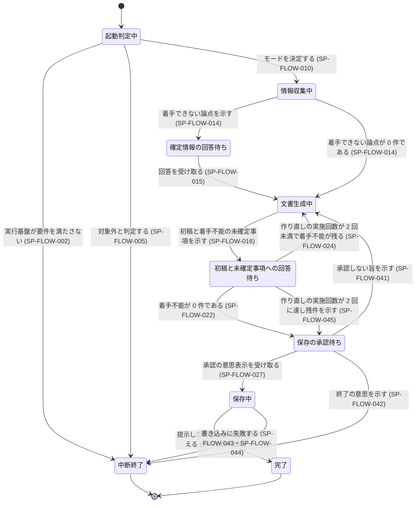

# 仕様書: 全体の制御

## 表記規約

本文書の仕様項目は次の語尾で区分する。

| 区分 | 語尾 | 対応する英語 |
|---|---|---|
| 必須 | 〜しなければならない | shall / MUST |
| 推奨 | 〜することが望ましい | should / SHOULD |
| 許容 | 〜してもよい | may / MAY |
| 禁止 | 〜してはならない | shall not / MUST NOT |

本文書は次の文書と同じ一式として生成される。相互に参照する記述は、この一式が揃っていることを
前提とする。

- `docs/requirements/INDEX.md`
- `docs/requirements/requester.md`
- `docs/requirements/consumer.md`
- `docs/specifications/INDEX.md`
- `docs/specifications/flow.md`（本文書）
- `docs/specifications/elicitation.md`
- `docs/specifications/authoring.md`
- `docs/specifications/verification.md`

## 対象範囲

本文書は、要求文書と仕様書を生成する仕組み（以下「システム」）の**全体の制御**を定める。
実行のモードの決定、依頼者を待つ中断点の位置と順序の制約、未確定事項の区分と区分の付け替え、
周回の継続と終了、完成の判定、保存の実行、中断点を跨ぐ情報の引き継ぎ、実行基盤の制約と異常時の
振る舞いを扱う。

本文書は、**外から観測できる振る舞いだけを規定する。** 内部の処理を何個の単位に割るか、
その単位をどう分担させるかは規定しない。実装を差し替えても本文書が成り立つ形にしている。

### 判定を実行主体に委ねる箇所

本文書には、2 つの記述が同じ対象を指すか、応答がどの類の回答に当たるかといった、字句の一致では
決まらない判定が現れる。**これらの判定は機械的な字句の規則で定義せず、実行主体の言語理解に
委ねる。** 該当する仕様項目は、判定に迷ったならば安全側（同一・該当とみなさず依頼者へ確認する
側）へ倒す規則だけを必須として定める。該当する項目は SP-FLOW-002・SP-FLOW-004・SP-FLOW-017・
SP-FLOW-027・SP-FLOW-037・SP-FLOW-042 である。

### 示すことと尋ねることの区別

本文書は、未確定事項の**内容を依頼者へ示すこと**（SP-FLOW-016）と、**その論点への回答を改めて
求めること**（SP-FLOW-017・SP-FLOW-018 が禁じる対象）を別の行為として扱う。依頼者が既に回答した
論点は、問いの内容が変わらない限り再び尋ねない。一方で、回答を得てもなお着手不能のまま残った
未確定事項は、残っている事実と内容を毎回示す。**この 2 つは両立し、優先関係を必要としない。**
（根拠: `docs/requirements/requester.md` の PR-REQUESTER-007 が禁じるのは「再度尋ねる」ことで
あり、PR-REQUESTER-015 が求めるのは「内容を示す」ことである）

### 本文書が実現する要求

- `docs/requirements/requester.md`: PR-REQUESTER-001・PR-REQUESTER-003・PR-REQUESTER-005・
  PR-REQUESTER-007・PR-REQUESTER-008・PR-REQUESTER-010・PR-REQUESTER-011・PR-REQUESTER-012・
  PR-REQUESTER-013・PR-REQUESTER-014・PR-REQUESTER-015・PR-REQUESTER-017・PR-REQUESTER-018・
  PR-REQUESTER-020・PR-REQUESTER-021・PR-REQUESTER-022・PR-REQUESTER-023・PR-REQUESTER-024・
  PR-REQUESTER-025・PR-REQUESTER-026・PR-REQUESTER-029・PR-REQUESTER-031・PR-REQUESTER-032・
  PR-REQUESTER-033・PR-REQUESTER-034・PR-REQUESTER-035・PR-REQUESTER-036・PR-REQUESTER-037・
  PR-REQUESTER-038・PR-REQUESTER-039・PR-REQUESTER-040・PR-REQUESTER-041
- `docs/requirements/consumer.md`: **PR-CONSUMER-007 のみ**

`consumer.md` の残る要求を本文書は実現しない。生成される文書そのものの書式・章立て・記述水準は
`docs/specifications/authoring.md` が、検査と改稿は `docs/specifications/verification.md` が、
問いの生成と絞り込みは `docs/specifications/elicitation.md` が担う。
**これは検討したうえでの分担であって、記載漏れではない。**

`docs/requirements/requester.md` の PR-REQUESTER-009 は本文書の担当ではない。記述の規律として
`docs/specifications/authoring.md` が扱う。

### 本文書が扱わない範囲

| 扱わないもの | どこが扱うか |
|---|---|
| 問いの中身・語り口・絞り込みの基準 | `docs/specifications/elicitation.md` |
| 生成される文書の章立て・要求文の書式・ID 体系・分量 | `docs/specifications/authoring.md` |
| 生成文書の保存先のパスの決め方 | `docs/specifications/authoring.md`（SP-AUTHORING-060） |
| 引き渡す文書における未確定事項の表記 | `docs/specifications/authoring.md` |
| 生成物の監査・構造検査・改稿の判断 | `docs/specifications/verification.md` |
| 検査の結果が定めた形式に合わないときの、その検査の再実施と、その再実施の回数の上限 | `docs/specifications/verification.md`（SP-VERIFICATION-039） |
| 対象外と判定した依頼に対して依頼者へ何を返すか | `docs/requirements/requester.md`（TBD-RREQUESTER-012） |
| 着手不能から外した未確定事項を依頼者へ示すかどうか | `docs/requirements/requester.md`（TBD-RREQUESTER-013） |
| 中間の生成物を置くフォルダの名前となる案件名の決まり方 | `docs/requirements/requester.md`（TBD-RREQUESTER-016） |

## 用語定義

| 語 | 定義 |
|---|---|
| システム | 要求文書と仕様書を生成する仕組み全体 |
| 依頼者 | システムに文書の生成を頼む人間 |
| 実行主体 | システムの判定を実行する主体。字句の一致では決まらない判定を言語理解によって行う |
| 後続作業者 | 生成された文書を入力として実装またはテスト設計を行う者 |
| 実行基盤 | システムが動作する土台。動的な Workflow の実行と、内部の処理単位の呼び出しを提供する |
| 内部の処理単位 | システムが自身の内部で呼び出す処理のまとまり。`docs/requirements/requester.md` が「下位 agent」と呼ぶものに当たる |
| 作成する文書の種別 | 1 回の実行で作る文書が、要求文書・仕様書・その両方のいずれであるか |
| 所在を示した既存文書 | 依頼者がファイルの位置を指し示した、実行の開始時点で存在する文書 |
| モード | 1 回の実行が何をするかの区分。新規作成・既存文書のレビューまたは改訂・要求文書からの仕様展開の 3 つ |
| 中断点 | システムが処理を止めて依頼者の応答を待つ地点 |
| 確定情報を尋ねる中断点 | 文書の作成に着手できない論点を依頼者へ示して回答を待つ中断点 |
| 初稿と未確定事項を示す中断点 | 生成した文書と、着手不能に区分した未確定事項を依頼者へ示して回答を待つ中断点 |
| 保存の承認を求める中断点 | 書き込む先と書き込む内容を依頼者へ示して承認を待つ中断点 |
| 示す | 依頼者へ内容を提示すること。回答を求めることを含まない |
| 尋ねる | 依頼者へ問いを提示して回答を求めること |
| 文書の作成に着手できない論点 | 依頼者の回答が無いために文書の作成に着手できない論点。状態 × イベント表の E7 が指すものはこれである。**起票済みの未確定事項に付ける区分である着手不能とは別の概念であり、両者の件数は一致しない** |
| 未確定事項 | 決まっていないために文書に書けない論点。`TBD-<領域>-<連番>` の識別子を持つ |
| 着手不能 | 未確定事項の区分の 1 つ。これが決まらないと後続作業者が実装またはテスト設計に入れないもの |
| 進行可能 | 未確定事項の区分の 1 つ。決まっていなくても後続作業者が着手できるもの |
| 決めないと決めた | 未確定事項の区分の 1 つ。依頼者が中断点で決まっていない旨を答えた論点。**起票の時点でこの区分を付けることはなく、SP-FLOW-037 による区分の付け替えだけがこの区分へ入る経路である** |
| 提示済み | 未確定事項が、中断点で依頼者へ一度示された状態 |
| 中間の生成物 | 保存の承認を経ていない、実行の途中で作られた文書と検査の結果 |
| 周回 | 初稿と未確定事項を示す中断点から文書の作り直しを経て同じ中断点へ戻る 1 巡 |
| 作り直しの実施回数 | 周回を数える値。**初稿を初めて提示した時点では 0 回であり、文書の作り直しを行うたびに 1 を加える。** 本文書が上限として定める 2 回は、この値に対する上限である |

## 順序をどう定めるか

本文書は工程の並びを固定の段取りとして書かない。段取りを書くと、内部の割り方を変えたときに
文書が成り立たなくなる。代わりに、**観測できる地点の間に成り立つ順序の制約**として書く。
制約は SP-FLOW-014・SP-FLOW-015・SP-FLOW-024・SP-FLOW-025・SP-FLOW-026・SP-FLOW-028・
SP-FLOW-029・SP-FLOW-036 が定める。

起動時の 2 つの非着手の判定（SP-FLOW-002・SP-FLOW-005）を評価する順序は、上の制約に含めて
いない。**この順序は決まっていない**（TBD-SFLOW-016）。

## 外部インタフェース

| 境界 | 何をやり取りするか |
|---|---|
| 依頼者との対話 | 依頼文の受け取り、問いの提示、回答の受け取り、未確定事項の提示、保存先と保存内容の提示、承認の受け取り |
| ファイルシステム | 生成した文書の書き込み、所在を示された既存文書の読み取り、中間の生成物の書き込み |
| 実行基盤 | 動的な Workflow の実行、内部の処理単位の呼び出しと結果の受け取り |

上の 3 つ以外に依存する外部システムがあるかどうかは決まっていない
（`docs/requirements/requester.md` の TBD-RREQUESTER-014）。**この表は、外部との通信が
3 つに閉じていることの申告ではない。**

## 機能仕様

### 起動時の判定

#### SP-FLOW-002 実行基盤の充足の確認と、満たさないときの非着手
起動したとき、システムは実行基盤が動的な Workflow の実行と内部の処理単位の呼び出しの双方を
提供しているかを確認し、いずれかを提供していないと判定したならば文書の作成に入ってはならない
（この確認の判定は実行主体の言語理解によって行い、判定に迷ったならば要件を満たすとみなしては
ならず、依頼者へ確認しなければならない。この判定を対象外の判定と評価する順序は
TBD-SFLOW-016）。
（実現する要求: PR-REQUESTER-023・PR-REQUESTER-041）

#### SP-FLOW-003 実行基盤が要件を満たさないときの提示
実行基盤が動的な Workflow の実行または内部の処理単位の呼び出しを提供していないならば、
システムは実行できない旨を依頼者へ示さなければならない（示す内容の内訳は TBD-SFLOW-019）。
（実現する要求: PR-REQUESTER-024）

#### SP-FLOW-004 対象外の依頼の判定
依頼文を受け取ったとき、システムは依頼が対象外として定めた 4 種の依頼（既存コードの挙動説明・
文書を伴わない実装または修正・規格への適合性評価・生成文書に基づく実装）に当たるかを、実行主体
の言語理解によって判定しなければならない。判定に迷ったならば、システムはその依頼を対象外と
みなしてはならず、依頼者へ確認しなければならない。
（実現する要求: PR-REQUESTER-001・PR-REQUESTER-037・PR-REQUESTER-040）

#### SP-FLOW-005 対象外と判定したときの非着手
依頼が対象外に当たると判定したならば、システムは文書の作成に入ってはならない（この判定を
実行基盤の判定と評価する順序は TBD-SFLOW-016、依頼者へ何を返すかは TBD-RREQUESTER-012）。
（実現する要求: PR-REQUESTER-001）

#### SP-FLOW-007 作成する文書の種別の決定
依頼文を受け取ったとき、システムは作成する文書の種別を次の表に従って決定しなければならない。

| 依頼文に現れる語 | 作成する文書の種別 |
|---|---|
| PRD / 要件定義 / 要件 / 要求 | 要求文書 |
| 仕様書 / spec / specification / 設計書 | 仕様書 |
| いずれの語も現れない、または双方の語が現れる | 要求文書と仕様書の両方 |

この表は `docs/requirements/requester.md` の PR-REQUESTER-003 が定める対応と同一であり、
実行のたびに対応する語を足してはならない。**依頼文に対応する語が 1 つも現れないことは
非着手の理由にならない。** その場合は両方を作成する。
（実現する要求: PR-REQUESTER-003・PR-REQUESTER-038）

#### SP-FLOW-010 モードの決定
依頼文を受け取ったとき、システムは実行のモードを次の表に従って決定しなければならない。

| 依頼者が所在を示した既存文書 | モード |
|---|---|
| 1 件も無い | 新規作成 |
| 1 件以上ある | 未定（TBD-SFLOW-010） |

既存文書が 1 件以上あるときにモードを 3 つのどれに定めるか、モードごとに何が変わるか、および
その既存文書の種別を判定する必要があるかは決まっていない（TBD-SFLOW-010）。**表の 2 行目を
推測で埋めていない。**
（実現する要求: PR-REQUESTER-033）

### 根拠として扱う入力の範囲

#### SP-FLOW-011 根拠として扱う入力の範囲
文書を作成する間、システムが要求の根拠として内部の処理単位へ渡す入力は、依頼文・依頼者の回答・
依頼者が所在を示した既存文書の 3 つに限らなければならない。
（実現する要求: PR-REQUESTER-020・PR-REQUESTER-035）

#### SP-FLOW-012 対象リポジトリの実装の非読み取り
文書を作成する間、システムは対象リポジトリの実装を読み取ってはならない。**本項目が禁じるのは
読み取る行為そのものであり、読み取った内容を根拠にするかどうかを問わない**（根拠にすることの
禁止は SP-FLOW-011 が別に定める）。
（実現する要求: PR-REQUESTER-021）

#### SP-FLOW-013 所在を示された既存文書の読み取り
依頼者が既存文書の所在を示したとき、システムはその文書を読み取らなければならない。
（実現する要求: PR-REQUESTER-022）

#### SP-FLOW-040 所在を示されていない文書の非検出
文書を作成する間、システムは所在を示されていない文書を、ディレクトリの走査によって探し出して
読み取ってはならない。
（実現する要求: PR-REQUESTER-032・PR-REQUESTER-035）

### 中断点と順序の制約

#### SP-FLOW-014 確定情報を尋ねる中断点の設置
文書の作成に着手できない論点が 1 件以上ある間、システムは確定情報を尋ねる中断点を設けなければ
ならない。
（実現する要求: PR-REQUESTER-005）

#### SP-FLOW-015 回答を受け取る前に文書の生成へ入らないこと
確定情報を尋ねる中断点で依頼者の回答を受け取っていない間、システムは文書の生成に入っては
ならない。
（実現する要求: PR-REQUESTER-005）

#### SP-FLOW-016 着手不能の未確定事項の提示
初稿と未確定事項を示す中断点において、システムは着手不能に区分した未確定事項の全件を
依頼者へ示さなければならない。**回答を得てもなお着手不能のまま残った未確定事項も、この全件に
含まれる。** 示すことは回答を求めることを含まないため、本項目は SP-FLOW-017 および
SP-FLOW-018 が定める再質問の禁止と両立する（進行可能および決めないと決めたに区分した
未確定事項をこの中断点で示すかどうかは TBD-SFLOW-024）。
（実現する要求: PR-REQUESTER-015）

#### SP-FLOW-017 回答済みの論点への再質問の禁止
依頼者が既に回答した論点について問いの内容が変わっていない間、システムはその論点への回答を
中断点で改めて求めてはならない。問いの内容が変わったかどうかは実行主体の言語理解によって判定
し、判定に迷ったならば、システムは同一の問いとみなしてはならず、依頼者へ確認しなければ
ならない。
（実現する要求: PR-REQUESTER-007）

#### SP-FLOW-018 決めないと決めたに区分した論点への再質問の禁止
論点の区分が決めないと決めたである間、システムはその論点に関する同じ問いへの回答を中断点で
改めて求めてはならない。
（実現する要求: PR-REQUESTER-008）

#### SP-FLOW-019 提示済みの記録
中断点で未確定事項を依頼者へ示したとき、システムはその未確定事項の識別子と示した問いの内容を
提示済みとして記録しなければならない。
（実現する要求: PR-REQUESTER-007）

#### SP-FLOW-020 中断点を跨いで引き継ぐ情報
中断点を跨いで実行を継続する間、システムは依頼者へ示した問い・受け取った回答・未確定事項の
一覧とその区分・提示済みの記録を引き継がなければならない。
（実現する要求: PR-REQUESTER-007）

### 未確定事項の区分・周回・完成判定

周回は、初稿と未確定事項を示す中断点で着手不能に区分した未確定事項が 0 件になった時点で終わる
（SP-FLOW-022）。中断点で示した着手不能の未確定事項に依頼者が決まっていない旨を答えると、その
未確定事項は SP-FLOW-037 によって決めないと決めたへ付け替えられ、着手不能の件数から外れる。

周回の上限は作り直しの実施回数に対する 2 回であり（SP-FLOW-024）、着手不能が 0 件にならないまま
上限に達したときは、残る着手不能の全件を依頼者へ示したうえで実行を完成と判定する
（SP-FLOW-045）。したがって**初稿と未確定事項を示す中断点への再到達は、依頼者が回答を続ける
限り 2 回を超えて起きない。** ただし SP-FLOW-041 による保存の承認拒否からの作り直しは別の
経路であり、それを作り直しの実施回数に数えるかは決まっていない（TBD-SFLOW-022）。

依頼者の応答が決まっていない旨の回答に当たるかの判定は実行主体の言語理解に委ねる
（SP-FLOW-037）。この判定は SP-FLOW-018・SP-FLOW-037 の起動条件であり、上限に達する前に
着手不能の件数を減らす唯一の経路である。

#### SP-FLOW-021 未確定事項への区分の付与
未確定事項を起票したとき、システムは着手不能と進行可能のいずれか 1 つに区分しなければならない。
（実現する要求: PR-CONSUMER-007）

#### SP-FLOW-037 決まっていない旨の回答を受けた未確定事項の区分の付け替え
着手不能に区分した未確定事項について依頼者が中断点で決まっていない旨を答えたとき、システムは
その未確定事項の区分を決めないと決めたへ付け替えなければならない。応答が決まっていない旨の
回答に当たるかは実行主体の言語理解によって判定し、判定に迷ったならば、システムはその応答を
決まっていない旨の回答とみなしてはならず、依頼者へ確認しなければならない（付け替えたことを
依頼者へ示すかどうかは TBD-RREQUESTER-013）。
（実現する要求: PR-REQUESTER-029）

#### SP-FLOW-022 完成の判定
初稿と未確定事項を示す中断点において、着手不能に区分した未確定事項が 0 件であるならば、
システムは、決めないと決めたに区分した未確定事項の件数と進行可能に区分した未確定事項の件数に
かかわらず、実行を完成と判定しなければならない。
（実現する要求: PR-REQUESTER-014・PR-CONSUMER-007）

#### SP-FLOW-024 周回の継続と上限
作り直しの実施回数が 2 回未満である間に、着手不能に区分した未確定事項が 1 件以上あると
判定したとき、システムは依頼者の回答を反映した文書の作り直しを行い、作り直しの実施回数に
1 を加えなければならない。**作り直しの結果を依頼者へ示す中断点は SP-FLOW-016 が定めるもので
あり、作り直しの前に改めて中断することを本項目は求めない。** 上限の 2 回は依頼者が定めた値で
あり、実測で機能した値である。
（実現する要求: PR-REQUESTER-014・PR-CONSUMER-007）

#### SP-FLOW-045 上限に達したときの残件の明示と完成
作り直しの実施回数が 2 回に達しても着手不能に区分した未確定事項が 1 件以上残っているならば、
システムは残る着手不能の未確定事項の全件を依頼者へ示したうえで実行を完成と判定しなければ
ならない。
（実現する要求: PR-REQUESTER-014・PR-REQUESTER-015）

### 保存

#### SP-FLOW-025 保存先のパスの事前提示
保存を行う前に、システムは書き込む先のファイルのパスを依頼者へ示さなければならない（パスの
決め方は `docs/specifications/authoring.md` の SP-AUTHORING-060 が定める）。
（実現する要求: PR-REQUESTER-011）

#### SP-FLOW-026 保存する内容の事前提示
保存を行う前に、システムは書き込む内容を依頼者へ示さなければならない。
（実現する要求: PR-REQUESTER-012）

#### SP-FLOW-027 承認の意思表示の判定
保存の承認を求める中断点で依頼者の応答を受け取ったとき、システムは承認の意思を示す応答か
どうかを、定型の語句との一致ではなく実行主体の言語理解によって判定しなければならない。判定に
迷ったならば、システムはその応答を承認とみなしてはならず、依頼者へ確認しなければならない。
（実現する要求: PR-REQUESTER-013・PR-REQUESTER-037・PR-REQUESTER-040）

#### SP-FLOW-028 承認を得るまで保存しないこと
承認の意思を示す応答を受け取っていない間、システムは文書をファイルとして保存してはならない。
（実現する要求: PR-REQUESTER-010）

#### SP-FLOW-041 承認しない旨を示されたときの作り直しへの復帰
依頼者が保存の承認を求める中断点で承認しない旨を示したとき、システムはその理由を依頼者へ
尋ねたうえで文書の作り直しへ戻らなければならない（この作り直しを作り直しの実施回数に
数えるかは TBD-SFLOW-022）。
（実現する要求: PR-REQUESTER-010）

#### SP-FLOW-042 終了の意思を示されたときの終了
確定情報を尋ねる中断点・初稿と未確定事項を示す中断点・保存の承認を求める中断点のいずれかで
依頼者が実行を終了する意思を示したならば、システムは実行を終了しなければならない（応答が
終了の意思を示すものかは実行主体の言語理解によって判定し、判定に迷ったならば終了の意思と
みなしてはならず、依頼者へ確認しなければならない）。
（実現する要求: PR-REQUESTER-010）

#### SP-FLOW-029 同名の既存ファイルの検出
書き込む先のファイルについて依頼者が所在を示していない間に保存の承認を求めるとき、システムは
書き込む先と同じパスのファイルが既に存在するかを確認しなければならない。
（実現する要求: PR-REQUESTER-010）

#### SP-FLOW-030 同名の既存ファイルがあるときの非保存と差分の提示
書き込む先と同じパスのファイルが既に存在すると判定したならば、システムは保存を行っては
ならず、既存の内容と書き込む内容との差分を依頼者へ示して指示を求めなければならない（依頼者が
示しうる指示の集合と、指示を受けたあとにシステムが行うことは TBD-SFLOW-021）。
（実現する要求: PR-REQUESTER-036・PR-REQUESTER-039）

#### SP-FLOW-031 改訂としての上書きの明示
モードが既存文書のレビューまたは改訂である間に保存の承認を求めるとき、システムは上書きで
あることを依頼者へ示さなければならない。
（実現する要求: PR-REQUESTER-017）

#### SP-FLOW-032 中間の生成物を対象リポジトリの外に置くこと
実行の途中で中間の生成物を作るとき、システムはそれを対象リポジトリの外に置かなければならない
（実行の終了後に残すか消すかは TBD-SFLOW-018）。
（実現する要求: PR-REQUESTER-018）

#### SP-FLOW-039 中間の生成物の置き場
実行の途中で中間の生成物を作るとき、システムはそれを依頼者のホームディレクトリの配下に設けた
作業用のディレクトリの中の、案件名を名前とするフォルダへ置かなければならない（作業用の
ディレクトリの名前と位置は TBD-SFLOW-012、案件名が何によって決まるかは
`docs/requirements/requester.md` の TBD-RREQUESTER-016）。
（実現する要求: PR-REQUESTER-031）

#### SP-FLOW-036 提示した内容の書き込み
承認の意思を示す応答を受け取ったとき、システムは SP-FLOW-025 で示したパスへ SP-FLOW-026 で
示した内容を書き込まなければならない。
（実現する要求: PR-REQUESTER-011・PR-REQUESTER-012）

#### SP-FLOW-043 書き込みに失敗したときの既書き込みファイルの保持
保存の書き込みに失敗したとき、システムは既に書き込みを終えたファイルを削除してはならない。
（実現する要求: PR-REQUESTER-025）

#### SP-FLOW-044 書き込みに失敗したときの到達点の報告
保存の書き込みに失敗したとき、システムはどのファイルまで書き込みを終えたかを依頼者へ示さな
ければならない。
（実現する要求: PR-REQUESTER-026）

### 中断

検査を担う内部の処理単位が定めた形式に合わない結果を返したときの再実施と、その再実施を
やり直す回数の上限は `docs/specifications/verification.md` が定める。**その再実施の回数は
SP-FLOW-047 の上限に数えない。** 2 つの上限は独立に数える。

#### SP-FLOW-046 応答を待つ時間の上限
内部の処理単位を呼び出したとき、システムは応答を待つ時間が 900 秒を超えた時点でその呼び出しを
打ち切らなければならない（経過時間が 900 秒以内である間は打ち切ってはならない。900 秒は本仕様が
置く既定値であり、依頼者の回答による決定ではない。実測の最長処理である約 6 分の 2 倍強を根拠と
するが、現行の実装にこの打ち切りは存在しない — 実装時に新設する項目である。この打ち切りに
SP-FLOW-047 のやり直しを適用するかは TBD-SFLOW-023）。
（実現する要求: PR-REQUESTER-034）

#### SP-FLOW-047 やり直す回数の上限
内部の処理単位が規定の形式に合わない結果を返したとき、システムは同じ呼び出しのやり直しを
1 回を超えて行ってはならない（やり直した回数が 1 回以内である間はやり直してよい。1 回は現行の
実装が既に採る値であり、実測で機能した値である。依頼者の回答による決定ではない。SP-FLOW-046 による打ち切りをこのやり直しの起動条件に
含めるかは TBD-SFLOW-023）。
（実現する要求: PR-REQUESTER-034）

#### SP-FLOW-033 結果を得られないときの実行の終了
内部の処理単位から規定の形式の結果を得られない状態が SP-FLOW-046 または SP-FLOW-047 が定める
上限を超えたならば、システムは文書の作成を完了せずに実行を終了しなければならない。
（実現する要求: PR-REQUESTER-025・PR-REQUESTER-034）

#### SP-FLOW-034 未完成の文書の非保存
文書の作成を完了できなかったならば、システムは作成の途中の文書をファイルとして保存しては
ならない。**本項目が対象とするのは承認を得る前の作成途中の文書であり、承認を得たあとに
書き込みが失敗した場合の既書き込みファイルの扱いは SP-FLOW-043 が定める。** 両者は重なら
ない。
（実現する要求: PR-REQUESTER-025）

#### SP-FLOW-035 中断した段階の提示
文書の作成を完了できなかったならば、システムはどの中断点または処理の段階で実行が止まったかを
依頼者へ示さなければならない（このとき示す内容の全体は TBD-RREQUESTER-015）。
（実現する要求: PR-REQUESTER-026）

## 状態とイベント

### 遷移集合の正

**本文書の遷移集合の正は、下の状態遷移図と状態 × イベント表を合わせたものである。** 図は
主フローと起動時の非着手だけを描き、異常系と準正常系の遷移は表が持つ。到達性と終端性の主張は、
図と表を合わせた全遷移に対して成り立つ。**図だけを実装の入力にすると、E4 による中断終了への
遷移が落ちる。**

### 状態遷移図

図と表を合わせた全遷移について、次の 2 点が成り立つ。

- 到達できない状態は無い。全ての状態に入る矢印がある。
- 出口の無い状態は無い。`完了` と `中断終了` は終端であり、`[*]` へ抜ける矢印を持つ。

`初稿と未確定事項への回答待ち` から `保存の承認待ち` への 2 本の矢印は、着手不能が 0 件で
あることと、作り直しの実施回数が上限に達したこととで分岐する。**上限に達したことはイベントでは
なく、作り直しの実施回数という決定的な値に対する条件である。** そのためイベントの軸には
加えない。

### 状態 × イベント表

行は下記 2 軸の直積から起こす。**終端状態（`完了` / `中断終了`）はイベントを受け取らないため
軸から除く。** 主フローの遷移は上の図が持つので、この表には載せない。

> 対象の状態: 起動判定中 / 情報収集中 / 確定情報の回答待ち / 文書生成中 /
> 初稿と未確定事項への回答待ち / 保存の承認待ち / 保存中

> 対象のイベント: E1 依頼者が着手不能に区分した未確定事項に決まっていない旨を答える /
> E2 依頼者が承認しない旨を示す / E3 依頼者が応答しないまま時間が経過する / E4 内部の処理単位
> から規定の形式の結果を得られない / E5 書き込む先と同じパスのファイルが既に存在する /
> E6 保存の書き込みに失敗する / E7 文書の作成に着手できない論点が 1 件も無い /
> E8 依頼者が実行を終了する意思を示す

**E7 は用語定義の「文書の作成に着手できない論点」の件数に関するイベントであり、
SP-FLOW-022 が判定する「着手不能に区分した未確定事項」の件数とは別である。** 前者は情報収集中に
判定され（SP-FLOW-014）、後者は初稿と未確定事項を示す中断点で判定される（SP-FLOW-022）。

イベントの集合は閉じていない。外部の障害・権限の変化は他にも想定できる。網羅の主張は、
ここに列挙した軸に対してのみ成り立つ。

| 現在の状態 | イベント | 種別 | 次の状態 | 定義済みか |
|---|---|---|---|---|
| 起動判定中 | E1 | — | — | 発生しない（根拠: この状態では未確定事項を起票していない） |
| 起動判定中 | E2 | — | — | 発生しない（根拠: この状態では保存の承認を求めていない） |
| 起動判定中 | E3 | — | — | 発生しない（根拠: この状態では依頼者の応答を待たない） |
| 起動判定中 | E4 | 異常系 | 中断終了 | ✅ SP-FLOW-033・SP-FLOW-035 |
| 起動判定中 | E5 | — | — | 発生しない（根拠: この状態では保存を行わない） |
| 起動判定中 | E6 | — | — | 発生しない（根拠: この状態では書き込みを行わない） |
| 起動判定中 | E7 | — | — | 発生しない（根拠: 論点の洗い出しは情報収集中に行う） |
| 起動判定中 | E8 | — | — | 発生しない（根拠: この状態では依頼者の応答を待たない） |
| 情報収集中 | E1 | — | — | 発生しない（根拠: この状態では依頼者へ問いを示していない） |
| 情報収集中 | E2 | — | — | 発生しない（根拠: この状態では保存の承認を求めていない） |
| 情報収集中 | E3 | — | — | 発生しない（根拠: この状態では依頼者の応答を待たない） |
| 情報収集中 | E4 | 異常系 | 中断終了 | ✅ SP-FLOW-033・SP-FLOW-035 |
| 情報収集中 | E5 | — | — | 発生しない（根拠: この状態では保存を行わない） |
| 情報収集中 | E6 | — | — | 発生しない（根拠: この状態では書き込みを行わない） |
| 情報収集中 | E7 | 正常系エッジ | 文書生成中 | ✅ SP-FLOW-014（中断点を設けずに文書の生成へ入る） |
| 情報収集中 | E8 | — | — | 発生しない（根拠: この状態では依頼者の応答を待たない） |
| 確定情報の回答待ち | E1 | 準正常系 | 文書生成中 | ✅ SP-FLOW-018・SP-FLOW-037（同じ問いへの回答を再び求めず、区分を決めないと決めたへ付け替える） |
| 確定情報の回答待ち | E2 | — | — | 発生しない（根拠: この状態では保存の承認を求めていない） |
| 確定情報の回答待ち | E3 | 異常系 | — | ❌ 未定義（TBD-SFLOW-008） |
| 確定情報の回答待ち | E4 | 異常系 | 中断終了 | ✅ SP-FLOW-033・SP-FLOW-035 |
| 確定情報の回答待ち | E5 | — | — | 発生しない（根拠: この状態では保存を行わない） |
| 確定情報の回答待ち | E6 | — | — | 発生しない（根拠: この状態では書き込みを行わない） |
| 確定情報の回答待ち | E7 | — | — | 発生しない（根拠: 論点が 1 件以上あることがこの状態に入る条件である） |
| 確定情報の回答待ち | E8 | 準正常系 | 中断終了 | ✅ SP-FLOW-042（終了の意思と判定できないときは依頼者へ確認する） |
| 文書生成中 | E1 | — | — | 発生しない（根拠: この状態では依頼者へ問いを示していない） |
| 文書生成中 | E2 | — | — | 発生しない（根拠: この状態では保存の承認を求めていない） |
| 文書生成中 | E3 | — | — | 発生しない（根拠: この状態では依頼者の応答を待たない） |
| 文書生成中 | E4 | 異常系 | 中断終了 | ✅ SP-FLOW-033・SP-FLOW-034・SP-FLOW-035 |
| 文書生成中 | E5 | — | — | 発生しない（根拠: この状態では保存を行わない） |
| 文書生成中 | E6 | — | — | 発生しない（根拠: この状態では書き込みを行わない） |
| 文書生成中 | E7 | — | — | 発生しない（根拠: 論点の有無の判定は情報収集中に行う） |
| 文書生成中 | E8 | — | — | 発生しない（根拠: この状態では依頼者の応答を待たない） |
| 初稿と未確定事項への回答待ち | E1 | 準正常系 | 文書生成中 | ✅ SP-FLOW-018・SP-FLOW-037（区分を決めないと決めたへ付け替え、着手不能から外して作り直しへ移る） |
| 初稿と未確定事項への回答待ち | E2 | — | — | 発生しない（根拠: この状態では保存の承認を求めていない） |
| 初稿と未確定事項への回答待ち | E3 | 異常系 | — | ❌ 未定義（TBD-SFLOW-008） |
| 初稿と未確定事項への回答待ち | E4 | 異常系 | 中断終了 | ✅ SP-FLOW-033・SP-FLOW-034・SP-FLOW-035 |
| 初稿と未確定事項への回答待ち | E5 | — | — | 発生しない（根拠: この状態では保存を行わない） |
| 初稿と未確定事項への回答待ち | E6 | — | — | 発生しない（根拠: この状態では書き込みを行わない） |
| 初稿と未確定事項への回答待ち | E7 | — | — | 発生しない（根拠: 文書の作成に着手できない論点の有無は情報収集中に判定する。この状態で判定するのは着手不能に区分した未確定事項の件数と作り直しの実施回数であり、その遷移は状態遷移図が持つ） |
| 初稿と未確定事項への回答待ち | E8 | 準正常系 | 中断終了 | ✅ SP-FLOW-042（終了の意思と判定できないときは依頼者へ確認する） |
| 保存の承認待ち | E1 | — | — | 発生しない（根拠: この状態では未確定事項を提示していない） |
| 保存の承認待ち | E2 | 準正常系 | 文書生成中 | ✅ SP-FLOW-041（理由を尋ねて作り直しへ戻る。依頼者が終了の意思を示したときは SP-FLOW-042 により中断終了へ移る） |
| 保存の承認待ち | E3 | 異常系 | — | ❌ 未定義（TBD-SFLOW-008） |
| 保存の承認待ち | E4 | 異常系 | 中断終了 | ✅ SP-FLOW-033・SP-FLOW-034・SP-FLOW-035 |
| 保存の承認待ち | E5 | 準正常系 | 保存の承認待ち | ✅ SP-FLOW-029・SP-FLOW-030（保存を行わず、差分を示して指示を求める。指示を受けたあとの遷移は TBD-SFLOW-021） |
| 保存の承認待ち | E6 | — | — | 発生しない（根拠: 書き込みは保存中に行う） |
| 保存の承認待ち | E7 | — | — | 発生しない（根拠: 論点の有無の判定は情報収集中に行う） |
| 保存の承認待ち | E8 | 準正常系 | 中断終了 | ✅ SP-FLOW-042（状態遷移図の同名の遷移と同一である） |
| 保存中 | E1 | — | — | 発生しない（根拠: この状態では依頼者へ問いを示していない） |
| 保存中 | E2 | — | — | 発生しない（根拠: 承認はこの状態に入る前に得ている） |
| 保存中 | E3 | — | — | 発生しない（根拠: この状態では依頼者の応答を待たない） |
| 保存中 | E4 | — | — | 発生しない（根拠: この状態では内部の処理単位を呼び出さない） |
| 保存中 | E5 | — | — | 発生しない（根拠: 同名の確認は承認を求める前に行う。SP-FLOW-029） |
| 保存中 | E6 | 異常系 | 中断終了 | ✅ SP-FLOW-043・SP-FLOW-044（既に書き込んだファイルを消さず、どこまで書けたかを示す） |
| 保存中 | E7 | — | — | 発生しない（根拠: 論点の有無の判定は情報収集中に行う） |
| 保存中 | E8 | — | — | 発生しない（根拠: この状態では依頼者の応答を待たない） |

## エラー処理と異常系

本文書は、複数の機能に共通する異常系を集約する。文書の書式・検査に固有の異常系は
`docs/specifications/authoring.md` および `docs/specifications/verification.md` が持つ。

| 事象 | 振る舞い | 次に取れる行動 | 仕様項目 |
|---|---|---|---|
| 実行基盤が動的な Workflow の実行または内部の処理単位の呼び出しを提供していない | 文書の作成に入らず、実行できない旨を示して終了する | 依頼者が対応する実行基盤で起動し直す | SP-FLOW-002・SP-FLOW-003 |
| 依頼が対象外に当たる | 文書の作成に入らない（依頼者へ何を返すかは TBD-RREQUESTER-012） | — | SP-FLOW-005 |
| 内部の処理単位から規定の形式の結果を得られない状態が定めた上限を超える | 文書の作成を完了せず、途中の文書を保存せずに、止まった段階を示して終了する | 依頼者が実行し直す | SP-FLOW-033・SP-FLOW-034・SP-FLOW-035・SP-FLOW-046・SP-FLOW-047 |
| 書き込む先と同じパスのファイルが既に存在する | 保存を行わず、既存の内容との差分を示して指示を求める（指示を受けたあとの振る舞いは TBD-SFLOW-021） | 依頼者が指示を与える | SP-FLOW-029・SP-FLOW-030 |
| 依頼者が着手不能に区分した未確定事項に決まっていない旨を答える | 同じ問いへの回答を再び求めず、その未確定事項の区分を決めないと決めたへ付け替えて文書の作り直しへ移る | —（後から反映する経路の有無は TBD-SFLOW-020） | SP-FLOW-018・SP-FLOW-037・SP-FLOW-024 |
| 依頼者が承認しない旨を示す | 保存を行わず、理由を尋ねて文書の作り直しへ戻る（この作り直しを作り直しの実施回数に数えるかは TBD-SFLOW-022） | 依頼者が終了の意思を示せば実行を終える | SP-FLOW-028・SP-FLOW-041・SP-FLOW-042 |
| 保存の書き込みに失敗する | 既に書き込んだファイルを消さず、どこまで書き込めたかを示して終了する | 依頼者が書き込み先の状態を確かめる | SP-FLOW-043・SP-FLOW-044 |
| 作り直しの実施回数が 2 回に達しても着手不能が残る | 残る着手不能の全件を示したうえで完成と判定する | 依頼者が次の実行で決める | SP-FLOW-045 |
| 内部の処理単位が 900 秒以内に応答しない | 呼び出しを打ち切る（打ち切りにやり直しを適用するかは TBD-SFLOW-023） | 依頼者が実行し直す | SP-FLOW-046・SP-FLOW-033 |
| 依頼者が中断点で応答しないまま時間が経過する | 未定 | — | TBD-SFLOW-008 |

**未定と書いた 1 行を推測で埋めていない。** 埋めると、依頼文と依頼者の回答に根拠を持たない
振る舞いが仕様として固定される。

## 検証方法

各仕様項目の検証方法はトレーサビリティ表の「検証方法」列が持つ。本章は、その列で用いる語の
意味を固定する。**下の 3 つは、本文書が用いる検証の手段の全てであると申告するものではない。**

| 語 | 本文書での意味 |
|---|---|
| 単体テスト | 1 つの判定（対象外の判定・種別の決定・モードの決定・承認の判定・区分の付与と付け替え）の入出力を確かめる |
| 結合テスト | 中断点をまたぐ引き継ぎ、保存を行う前と行った後の状態、実行基盤が欠けたときの振る舞いを確かめる |
| シナリオテスト | 起動から完了または中断終了までの 1 回の実行を通して観測する |

**未確定事項が残る仕様項目は、その未確定事項が決まるまで検証を設計できない。** 該当する項目は
トレーサビリティ表のステータスを `未着手` のままとする。

## トレーサビリティ表

| 要求 ID | 仕様項目 ID | 検証方法 | ステータス |
|---|---|---|---|
| PR-REQUESTER-023 | SP-FLOW-002 | 結合テスト（内部の処理単位の呼び出しを提供しない実行基盤で起動し、確認が行われることを観測する） | 未着手 |
| PR-REQUESTER-041 | SP-FLOW-002 | 結合テスト（要件を満たさない実行基盤で起動し、文書が 1 つも生成されないことを観測する） | 未着手 |
| PR-REQUESTER-024 | SP-FLOW-003 | 結合テスト（要件を満たさない実行基盤で起動し、提示文に実行できない旨が含まれることを照合する） | 未着手 |
| PR-REQUESTER-001 | SP-FLOW-004 | 単体テスト（対象外の 4 種の依頼文・対象内の依頼文を与え、判定結果を照合する） | 未着手 |
| PR-REQUESTER-037 | SP-FLOW-004 | 単体テスト（判定に迷う依頼文を与え、対象外の結論が定められないことを照合する） | 未着手 |
| PR-REQUESTER-040 | SP-FLOW-004 | 単体テスト（判定に迷う依頼文を与え、依頼者への確認が行われることを照合する） | 未着手 |
| PR-REQUESTER-001 | SP-FLOW-005 | 結合テスト（対象外の依頼文で起動し、文書が 1 つも生成されないことを観測する） | 未着手 |
| PR-REQUESTER-003 | SP-FLOW-007 | 単体テスト（表の 3 行それぞれに当たる依頼文を与え、決定された種別を照合する） | 未着手 |
| PR-REQUESTER-038 | SP-FLOW-007 | 単体テスト（表に無い語だけを含む依頼文を与え、種別の判定にその語が用いられないことを照合する） | 未着手 |
| PR-REQUESTER-033 | SP-FLOW-010 | 単体テスト（表 1 行目に当たる入力（既存文書 0 件）を与え、新規作成が決定されることを照合する。表 2 行目は TBD-SFLOW-010 が決まるまで検証を設計できない） | 未着手 |
| PR-REQUESTER-020 | SP-FLOW-011 | 結合テスト（内部の処理単位へ渡された入力を採取し、依頼文・回答・所在を示された既存文書以外が含まれないことを照合する） | 未着手 |
| PR-REQUESTER-035 | SP-FLOW-011 | 結合テスト（所在を示していない文書の内容が、内部の処理単位へ渡された入力に含まれないことを照合する） | 未着手 |
| PR-REQUESTER-021 | SP-FLOW-012 | 結合テスト（対象リポジトリのファイル読み取りを記録し、実装ファイルの読み取りが 0 件であることを照合する） | 未着手 |
| PR-REQUESTER-022 | SP-FLOW-013 | 結合テスト（既存文書の所在を示して起動し、その文書が読み取られることを観測する） | 未着手 |
| PR-REQUESTER-032 | SP-FLOW-040 | 結合テスト（所在を示していない文書を同じディレクトリに置いて起動し、ディレクトリの走査が行われないことを観測する） | 未着手 |
| PR-REQUESTER-035 | SP-FLOW-040 | 結合テスト（所在を示していない文書を同じディレクトリに置いて起動し、その文書の読み取りが 0 件であることを照合する） | 未着手 |
| PR-REQUESTER-005 | SP-FLOW-014 | シナリオテスト（着手できない論点を含む依頼文で起動し、中断点で実行が止まることを観測する） | 未着手 |
| PR-REQUESTER-005 | SP-FLOW-015 | シナリオテスト（中断点で回答を与えずに待機し、文書の生成が始まらないことを観測する） | 未着手 |
| PR-REQUESTER-015 | SP-FLOW-016 | 結合テスト（回答を得てもなお着手不能である未確定事項を含む集合と、中断点で提示された集合を照合する） | 未着手 |
| PR-REQUESTER-007 | SP-FLOW-017 | シナリオテスト（回答済みで問いの内容が変わっていない論点について、回答を求める問いが次の中断点に含まれないことを照合する） | 未着手 |
| PR-REQUESTER-008 | SP-FLOW-018 | シナリオテスト（決めないと決めたに区分した論点への問いが次の中断点に含まれないことを照合する） | 未着手 |
| PR-REQUESTER-007 | SP-FLOW-019 | 単体テスト（提示後の記録に、識別子と提示した問いの内容が含まれることを照合する） | 未着手 |
| PR-REQUESTER-007 | SP-FLOW-020 | 結合テスト（中断点を跨いだときに、問い・回答・未確定事項の一覧と区分・提示済みの記録が保たれることを照合する） | 未着手 |
| PR-CONSUMER-007 | SP-FLOW-021 | 単体テスト（起票された未確定事項の全件に着手不能または進行可能の区分が付くことを照合する） | 未着手 |
| PR-REQUESTER-029 | SP-FLOW-037 | 単体テスト（着手不能の未確定事項に決まっていない旨の回答を与え、区分が決めないと決めたへ変わることを照合する） | 未着手 |
| PR-REQUESTER-014 | SP-FLOW-022 | シナリオテスト（中断点に達した時点で着手不能が 0 件である実行が完成と判定されることを観測する） | 未着手 |
| PR-CONSUMER-007 | SP-FLOW-022 | シナリオテスト（完成と判定された実行の生成物に着手不能の未確定事項が 0 件であることを照合する） | 未着手 |
| PR-REQUESTER-014 | SP-FLOW-024 | シナリオテスト（着手不能が 1 件以上ある実行で作り直しが 2 回まで行われ、3 回目が行われないことを計数する） | 未着手 |
| PR-CONSUMER-007 | SP-FLOW-024 | シナリオテスト（作り直しの実施回数が 2 回未満で着手不能が 1 件以上ある実行が、完成と判定されず保存も行われないことを観測する） | 未着手 |
| PR-REQUESTER-014 | SP-FLOW-045 | シナリオテスト（作り直しの実施回数が 2 回に達しても着手不能が残る実行が完成と判定されることを観測する） | 未着手 |
| PR-REQUESTER-015 | SP-FLOW-045 | 結合テスト（上限に達した時点で残る着手不能の集合と、依頼者へ示された集合を照合する） | 未着手 |
| PR-REQUESTER-011 | SP-FLOW-025 | 結合テスト（保存前の提示文に、書き込む先の全パスが含まれることを照合する） | 未着手 |
| PR-REQUESTER-012 | SP-FLOW-026 | 結合テスト（保存前の提示内容と、実際に書き込まれた内容を照合する） | 未着手 |
| PR-REQUESTER-013 | SP-FLOW-027 | 単体テスト（承認を示す応答・示さない応答を定型の語句によらず与え、判定結果を照合する） | 未着手 |
| PR-REQUESTER-037 | SP-FLOW-027 | 単体テスト（判定に迷う応答を与え、承認と結論づけられないことを照合する） | 未着手 |
| PR-REQUESTER-040 | SP-FLOW-027 | 単体テスト（判定に迷う応答を与え、依頼者への確認が行われることを照合する） | 未着手 |
| PR-REQUESTER-010 | SP-FLOW-028 | シナリオテスト（承認を与えずに待機し、ファイルが 1 つも書き込まれないことを観測する） | 未着手 |
| PR-REQUESTER-010 | SP-FLOW-041 | シナリオテスト（承認しない旨を与え、理由を尋ねる問いが提示され文書の作り直しが始まることを観測する） | 未着手 |
| PR-REQUESTER-010 | SP-FLOW-042 | シナリオテスト（3 つの中断点それぞれで終了の意思を与え、いずれも文書の作り直しが始まらずに実行が終わることを観測する） | 未着手 |
| PR-REQUESTER-010 | SP-FLOW-029 | 結合テスト（所在を示していない書き込み先に同名のファイルを置いて実行し、存在の確認が行われることを観測する） | 未着手 |
| PR-REQUESTER-036 | SP-FLOW-030 | 結合テスト（同名のファイルを置いた状態で実行し、そのファイルの内容が変わらないことを照合する） | 未着手 |
| PR-REQUESTER-039 | SP-FLOW-030 | 結合テスト（同名のファイルを置いた状態で実行し、提示文に既存の内容との差分が含まれることを照合する） | 未着手 |
| PR-REQUESTER-017 | SP-FLOW-031 | 結合テスト（レビューまたは改訂のモードで、保存前の提示文に上書きであることが含まれることを照合する） | 未着手 |
| PR-REQUESTER-018 | SP-FLOW-032 | 結合テスト（実行の途中で対象リポジトリ内に新規ファイルが作られないことを照合する） | 未着手 |
| PR-REQUESTER-031 | SP-FLOW-039 | 結合テスト（実行の途中で作られたファイルのパスが、ホームディレクトリ配下の作業用ディレクトリの案件名フォルダに収まることを照合する） | 未着手 |
| PR-REQUESTER-011 | SP-FLOW-036 | 結合テスト（保存後のファイルのパスが、保存前に示したパスと一致することを照合する） | 未着手 |
| PR-REQUESTER-012 | SP-FLOW-036 | 結合テスト（保存後のファイルの内容が、保存前に示した内容と一致することを照合する） | 未着手 |
| PR-REQUESTER-025 | SP-FLOW-043 | 結合テスト（書き込みの途中で失敗する状況を作り、失敗前に書き込まれたファイルが残っていることを照合する） | 未着手 |
| PR-REQUESTER-026 | SP-FLOW-044 | 結合テスト（書き込みの途中で失敗する状況を作り、提示文に書き込みを終えたファイルの一覧が含まれることを照合する） | 未着手 |
| PR-REQUESTER-034 | SP-FLOW-046 | 結合テスト（900 秒以内に応答する呼び出しと 900 秒を超えて応答しない呼び出しを与え、打ち切りの有無を照合する） | 未着手 |
| PR-REQUESTER-034 | SP-FLOW-047 | 結合テスト（規定の形式に反する結果を返し続ける状況を作り、同じ呼び出しのやり直しが 1 回を超えないことを計数する） | 未着手 |
| PR-REQUESTER-025 | SP-FLOW-033 | 結合テスト（規定の形式に反する結果を返す状況を作り、実行が完了せずに終了することを観測する） | 未着手 |
| PR-REQUESTER-034 | SP-FLOW-033 | 結合テスト（応答しない内部の処理単位を置き、定めた上限を超えた時点で実行が継続していないことを照合する） | 未着手 |
| PR-REQUESTER-025 | SP-FLOW-034 | 結合テスト（中断で終了した実行の後に、対象リポジトリへ文書が書き込まれていないことを照合する） | 未着手 |
| PR-REQUESTER-026 | SP-FLOW-035 | 結合テスト（中断で終了した実行の提示文に、止まった段階の名称が含まれることを照合する） | 未着手 |

## 未確定事項（TBD 一覧）

本文書の関心事に属する未確定事項だけを置く。要求文書側で起票済みの論点
（TBD-RREQUESTER-012・TBD-RREQUESTER-013・TBD-RREQUESTER-014・TBD-RREQUESTER-015・
TBD-RREQUESTER-016）は、ここで振り直さず、該当する仕様項目から参照する。

### 着手不能（これが決まるまで実装・QA に入れない）

| ID | 内容 | 誰が決めるか | いつまでに |
|---|---|---|---|
| TBD-SFLOW-010 | 所在を示された既存文書が 1 件以上あるときのモード、モードごとに変わる振る舞い、およびその既存文書の種別を判定する必要があるかが決まっていない（SP-FLOW-010 に関係する） |  |  |
| TBD-SFLOW-012 | 中間の生成物を置く作業用のディレクトリ（案件名フォルダの親）の名前と位置が決まっていない（SP-FLOW-039 に関係する） |  |  |
| TBD-SFLOW-016 | 起動時の 2 つの非着手の判定（実行基盤の不足・対象外の依頼）を評価する順序と、両方が同時に成立したときに依頼者へ示す内容が決まっていない（SP-FLOW-002・SP-FLOW-005 に関係する） |  |  |
| TBD-SFLOW-018 | 中間の生成物を実行の終了後に残すか消すかが決まっていない（SP-FLOW-032・SP-FLOW-039 に関係する） |  |  |
| TBD-SFLOW-019 | 実行基盤が要件を満たさないと判定したときに依頼者へ示す内容の内訳が決まっていない（SP-FLOW-003 に関係する） |  |  |
| TBD-SFLOW-020 | 決めないと決めたへ付け替えた未確定事項について、後から依頼者が決めた内容を反映する経路を設けるかが決まっていない（SP-FLOW-037 に関係する。後続作業者がその事項に突き当たったときの扱いは `docs/requirements/consumer.md` の TBD-RCONSUMER-005 が扱う） |  |  |
| TBD-SFLOW-021 | 書き込む先と同じパスのファイルが既に存在するときに依頼者が示しうる指示の集合と、それぞれの指示を受けたあとにシステムが行うことが決まっていない（SP-FLOW-030 に関係する） |  |  |
| TBD-SFLOW-022 | 保存の承認を拒否されたことによる文書の作り直しを、作り直しの実施回数に数えるかが決まっていない（SP-FLOW-041・SP-FLOW-024 に関係する） |  |  |
| TBD-SFLOW-023 | 応答を待つ時間の上限による打ち切りを、やり直しの起動条件に含めるかが決まっていない（SP-FLOW-046・SP-FLOW-047 に関係する） |  |  |
| TBD-SFLOW-024 | 初稿と未確定事項を示す中断点において、進行可能に区分した未確定事項と決めないと決めたに区分した未確定事項を依頼者へ示すかどうかが決まっていない（SP-FLOW-016 に関係する） |  |  |

### 進行可能（決まった時点で追記する）

| ID | 内容 | 誰が決めるか | いつまでに |
|---|---|---|---|
| TBD-SFLOW-008 | 依頼者が中断点で応答しないまま時間が経過したときの振る舞いが決まっていない |  |  |
