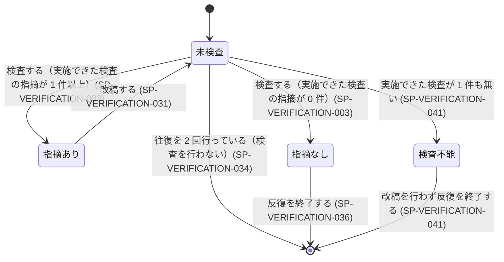

# 仕様書: 生成物の検査と改稿

本文書は次の文書と同じ一式として生成される。相互に参照する記述は、この一式が揃っていることを
前提とする。

- `docs/requirements/INDEX.md`
- `docs/requirements/requester.md`
- `docs/requirements/consumer.md`
- `docs/specifications/INDEX.md`
- `docs/specifications/flow.md`
- `docs/specifications/elicitation.md`
- `docs/specifications/authoring.md`
- `docs/specifications/verification.md`（本文書）

## 表記規約

本文書の仕様項目は次の語尾で区分する。必須・推奨・許容の 3 区分の語尾は、JIS Z 8301 が定める
shall / should / may の日本語対応に従う。禁止の区分の語尾はその 3 対応の範囲外であり、本文書が
定める。全て大文字で書いた MUST / SHOULD / MAY / MUST NOT は RFC 2119 および RFC 8174 が
定める語であり、JIS Z 8301 の対応とは別の典拠に基づく。

| 区分 | 語尾 | 対応する英語 |
|---|---|---|
| 必須 | 〜しなければならない | shall / MUST |
| 推奨 | 〜することが望ましい | should / SHOULD |
| 許容 | 〜してもよい | may / MAY |
| 禁止 | 〜してはならない | shall not / MUST NOT |

## 対象範囲

本仕様書は、生成された文書一式に対する**検査**と、その結果を受けた**改稿**の振る舞いを定める。
実現する要求は `docs/requirements/requester.md` と `docs/requirements/consumer.md` にあり、
対応はトレーサビリティ表が持つ。

本仕様書が定めるのは、外から観測できる振る舞いだけである。検査を担う処理の本数、検査の観点の
本数、処理の分担は定めない。

### 他の仕様書との境界

**「ループ」と呼ばれるものが 2 つある。取り違えると、どちらの文書が正か決まらなくなる。**

| どちらの文書か | 何を扱うか |
|---|---|
| 本仕様書 | 検査と改稿を繰り返す内側の反復。1 つの稿が検査を通るまでの往復 |
| `docs/specifications/flow.md` | 人間ゲートを挟む外側の周回、完成判定、保存の実行、工程間の受け渡し |

| 事項 | 正となる文書 |
|---|---|
| 検査の実施と、指摘の生成 | 本仕様書 |
| 改稿の実施と、その反復 | 本仕様書 |
| 検査に固有の異常系（検査対象が 0 件、検査結果の形式違反、反復の上限到達） | 本仕様書 |
| 検査の対象となる記述規約（語尾の集合、曖昧語の集合、識別子の体系、状態 × イベント表の書式） | `docs/specifications/authoring.md` |
| 根拠として書いてよい出所の定義 | `docs/specifications/authoring.md`（SP-AUTHORING-030） |
| 生成文書に記載する検証方法の内容（満たしたと判定する手段と、そこで測る対象） | `docs/specifications/authoring.md` |
| 検査記録を引き渡す文書へどう書き出すか | 未定（TBD-SVERIFICATION-013） |
| 照合元の入力を工程間で受け渡すこと | `docs/specifications/flow.md` |
| 未確定事項の着手可否の判定と、依頼者へ提示したかどうかの追跡 | `docs/specifications/flow.md` |
| 反復を終えた稿を受け取ったあとの実行の継続・中断・完了 | `docs/specifications/flow.md` |
| 複数の工程に共通する異常系（応答が得られない、実行基盤が要件を満たさない、依頼者による中断） | `docs/specifications/flow.md` |
| 依頼者への質問の生成と絞り込み | `docs/specifications/elicitation.md` |
| 検査が同一性を判定できなかったときに依頼者へ確認を求めること（求める判断は本仕様書、確認の提示と応答の受け取りは工程側） | 本仕様書（SP-VERIFICATION-045）と `docs/specifications/flow.md` |

### 本仕様書が扱わないもの

| 扱わないもの | 根拠 |
|---|---|
| 生成文書に実在の人物を特定する表記が含まれるかどうかの検出 | 回答「個人情報は検出しない。常に役割名へ置き換える」 |
| 対象リポジトリの実装との照合 | 回答 Q9「文書生成時に対象リポジトリのコードを読まない」 |
| 生成文書に基づく実装の検査 | 回答 Q5〜Q9「生成した文書に基づく実装そのものは行わない」 |

## 用語定義

| 語 | 定義 |
|---|---|
| 稿 | 検査の対象となる、ある時点の生成文書一式 |
| 照合元の入力 | 検査と改稿に稿とともに渡される、根拠の照合に用いる入力。その中身は `docs/specifications/authoring.md` の SP-AUTHORING-030 が定める 3 つの出所（依頼文・依頼者の回答・依頼者が所在を示した既存文書）である（実行の途中で作られた中間の生成物をこの入力に含めるかどうかは TBD-SVERIFICATION-017） |
| 検査 | 稿と照合元の入力を受け取り、定めた 1 つの観点に照らして指摘を返す処理 |
| 指摘 | 検査が返す、稿の 1 箇所に対する欠陥の申告 |
| 検査記録 | 検査ごとに残す記録（保持する項目の集合・保持先・検査を識別するキーは TBD-SVERIFICATION-010、検査の回ごとの記録の残し方は TBD-SVERIFICATION-016） |
| 残った指摘 | 反復の回数が上限に達した時点で記録の対象となる指摘。その範囲は SP-VERIFICATION-035 が定める |
| 未実施 | 検査を開始できなかったか、結果を得られなかったこと。指摘 0 件とは別の状態 |
| 検査不能 | 稿に対して実施できた検査が 1 件も無い状態 |
| 改稿 | 指摘を入力として稿を書き換え、次の稿を作ること |
| 反復 | 検査と改稿を繰り返す往復。検査 1 回と改稿 1 回の組を 1 往復と数える |
| 実行可能性 | 引き渡された文書だけを読んで、後続作業者が実装に着手できる性質 |
| 記述規約 | 要求文と仕様項目の書き方を定めた規則。定義は `docs/specifications/authoring.md` が持つ |
| 構造検査 | 識別子の集合どうしの差分から欠陥を検出する検査 |
| 照合の相手 | 構造検査において識別子を突き合わせる相手方の種別の文書。要求文書に対しては仕様書、仕様書に対しては要求文書 |
| 文書間検査 | 文書一式を横断して、記述の矛盾・用語の揺れ・二重記述を検出する検査 |
| 網羅検査 | 状態の集合とイベントの集合の直積のうち、振る舞いが未定義である組み合わせを検出する検査 |
| 実行主体 | 本仕様が定める振る舞いを実際に行う主体。言語を解して判断できる |

## 機能仕様

### 検査の実行と記録

実施できない検査が 1 件あることは反復の打ち切りにならず（SP-VERIFICATION-002）、稿の検査状態が
検査不能になるのは、実施できた検査が 1 件も無いときに限る（SP-VERIFICATION-041）。したがって、
一部の検査を実施できなかった稿も引き渡される。本節は、実施した検査と実施していない検査の区別を
検査記録として保持するところまでを定める。引き渡す文書にその区別を載せるかどうかは
`docs/requirements/consumer.md` の TBD-RCONSUMER-007 が扱い、載せる場合の書き出しの形式は
TBD-SVERIFICATION-013 が扱う。

#### SP-VERIFICATION-001 検査の対象
システムは、稿に含まれる全ての文書を検査の対象としなければならない。

#### SP-VERIFICATION-042 照合元の入力の引き渡し
検査を実施するとき、システムは稿とともに照合元の入力を検査へ渡さなければならない。

#### SP-VERIFICATION-002 検査ごとの独立した実施
1 つの検査が結果を返さなかったならば、システムは他の検査を実施しなければならない。

#### SP-VERIFICATION-003 検査記録の生成
検査を実施したとき、システムは検査ごとに検査記録を生成しなければならない（検査記録が保持する
項目の集合・保持先・検査を識別するキーは TBD-SVERIFICATION-010、2 回目の検査の記録を 1 回目の
記録とどう併存させるかは TBD-SVERIFICATION-016）。

#### SP-VERIFICATION-004 未実施と指摘 0 件の区別
検査記録において、システムは未実施の検査を指摘 0 件の検査と同じ値で表してはならない。

#### SP-VERIFICATION-005 検査記録の引き渡し
反復を終了したとき、システムは検査記録を引き渡す文書へ書き出すための入力として渡さなければ
ならない（引き渡す記録が全ての回の分であるか最後に実施した回の分であるかは
TBD-SVERIFICATION-016、書き出しの形式は TBD-SVERIFICATION-013、書き出す対象の範囲は
`docs/requirements/consumer.md` の TBD-RCONSUMER-007）。

#### SP-VERIFICATION-006 指摘に含める情報
指摘を返すとき、システムは次の 4 つを指摘に含めなければならない。

| 項目 | 中身 |
|---|---|
| 対象の文書 | どの文書に対する指摘か |
| 場所 | 章名または項目の識別子 |
| 原文 | 問題のある箇所の引用 |
| 直し方 | どこをどう書き換えるか。書き換える箇所を、文書名と、章名または項目の識別子で示す（対象の文書と異なる文書を示してもよい） |

### 同一性の判定

同一性の判定を必要とする検査が複数あるため、判定の規則は本節に 1 つだけ置く。各検査は本節を
参照する。本節の判定を用いる検査は SP-VERIFICATION-010・SP-VERIFICATION-024・
SP-VERIFICATION-025・SP-VERIFICATION-026 である。

#### SP-VERIFICATION-043 判定できなかったときに同一とみなさないこと
2 つの記述・語・論点が同一の対象を指すかどうかを実行主体の言語理解によって判定できなかった
ならば、システムはその 2 つを同一とみなしてはならない。
（根拠: 回答（人間ゲート②）B「実行主体の言語理解に委ね、判定に迷う場合は同一・該当とみなさず、
依頼者に確認する」）

#### SP-VERIFICATION-045 判定できなかったときの依頼者への確認
2 つの記述・語・論点が同一の対象を指すかどうかを実行主体の言語理解によって判定できなかった
ならば、システムはその 2 つを依頼者へ示して確認を求めなければならない（確認を求めた検査が
その回に何を返すか、および確認の応答を待つ間の反復の扱いは TBD-SVERIFICATION-012）。
（根拠: 回答（人間ゲート②）B「判定に迷う場合は…依頼者に確認する」）

### 実行可能性の判定

#### SP-VERIFICATION-007 実行可能性の判定の実施
稿を検査するとき、システムは、引き渡された文書だけを読んで後続作業者が実装に着手できるか
どうかを判定しなければならない（着手できると判定する条件は `docs/requirements/consumer.md`
の PR-CONSUMER-002 から PR-CONSUMER-008 までの充足）。

#### SP-VERIFICATION-009 着手できない箇所の起票の指摘
実行可能性の判定で着手できないと判定したならば、システムは、直し方が未確定事項（TBD 一覧）の
章を指す指摘を返さなければならない（TBD 一覧への追記は改稿が行う。着手可否の区分と依頼者への
提示は `docs/specifications/flow.md`）。

#### SP-VERIFICATION-010 起票済みの論点を指摘しない
稿に未確定事項として既に起票されている論点（依頼者が決めないと決めた事項を含む）である間、
システムは実行可能性の指摘を返してはならない（同じ論点であると判定できなかったときの扱いは
SP-VERIFICATION-043・SP-VERIFICATION-045）。

#### SP-VERIFICATION-011 文書外の知識に依存した記述の検出
稿の記述が、文書一式の外にある知識を読み手が補うことを前提としているならば、システムは
その記述を指摘しなければならない（そう判定する境界は TBD-RCONSUMER-008）。

#### SP-VERIFICATION-012 未決の選択肢の検出
稿が、後続作業者が自ら選ぶことを前提とした未決の選択肢を残しているならば、システムは
その箇所を指摘しなければならない。

### 記述規約の検査

検査に用いる語の集合と語尾の集合は `docs/specifications/authoring.md` が定める。本節は、
その集合を用いて何を検出するかだけを定める。

#### SP-VERIFICATION-013 測定できない語の検出
稿の要求文または仕様項目が、量・時期・水準を測定可能な形で示さない語を含んでいるならば、
システムはその語を指摘しなければならない。

#### SP-VERIFICATION-014 語尾の検査
稿の要求文または仕様項目が、義務の強さを示す 4 つの語尾のいずれでも終わっていないならば、
システムはその項目を指摘しなければならない。

#### SP-VERIFICATION-015 複合要求の検出
稿の要求文または仕様項目が 2 つ以上の動作を含んでいるならば、システムはその項目を指摘
しなければならない。

#### SP-VERIFICATION-016 根拠の併記の検査
稿の要求文に、照合元の入力のいずれのどこから導かれたかの併記が無いならば、システムは
その要求文を指摘しなければならない。

### 構造の検査

#### SP-VERIFICATION-017 識別子の重複の検出
同一の識別子が文書一式の 2 箇所以上で定義されているならば、システムはその識別子を指摘
しなければならない。

#### SP-VERIFICATION-018 実現する仕様項目が無い要求の検出
要求の識別子がどのトレーサビリティ表にも現れないならば、システムはその要求を指摘しなければ
ならない。

#### SP-VERIFICATION-019 根拠となる要求が無い仕様項目の検出
仕様項目の識別子がどのトレーサビリティ表にも現れないならば、システムはその仕様項目を指摘
しなければならない。

#### SP-VERIFICATION-020 検証方法が無い要求の検出
トレーサビリティ表の行に検証方法の記載が無いならば、システムはその行を指摘しなければならない。

#### SP-VERIFICATION-021 表が参照する識別子が実在しないことの検出
トレーサビリティ表が参照する識別子が文書一式のどこにも定義されていないならば、システムは
その識別子を指摘しなければならない。

#### SP-VERIFICATION-022 本文が参照する識別子が実在しないことの検出
本文が参照する識別子が文書一式のどこにも定義されていないならば、システムはその識別子を
指摘しなければならない。

#### SP-VERIFICATION-023 照合の相手を欠くときの申告
検査の対象に照合の相手が含まれていないならば、システムは SP-VERIFICATION-018・
SP-VERIFICATION-019・SP-VERIFICATION-021 の 3 つの検査を未実施として検査記録に記さなければ
ならない（検査を識別するキーは TBD-SVERIFICATION-010）。

### 文書間の検査

#### SP-VERIFICATION-024 相反する記述の検出
同一の事項について相反する記述が文書一式の中にあるならば、システムはその 2 箇所を指摘
しなければならない（同一の事項であると判定できなかったときの扱いは SP-VERIFICATION-043・
SP-VERIFICATION-045）。

#### SP-VERIFICATION-025 用語の揺れの検出
同一の対象を指す語が文書一式の中で 2 つ以上あるならば、システムはその語を指摘しなければ
ならない（同一の対象を指すと判定できなかったときの扱いは SP-VERIFICATION-043・
SP-VERIFICATION-045）。

#### SP-VERIFICATION-026 二重に置かれた記述の検出
同一の事項について正となる記述が文書一式の 2 箇所以上に置かれているならば、システムは
その 2 箇所を指摘しなければならない（同一の事項であると判定できなかったときの扱いは
SP-VERIFICATION-043・SP-VERIFICATION-045）。

### 網羅の検査

#### SP-VERIFICATION-027 未定義の組み合わせの検出
稿が状態を持つ対象を扱う場合、システムは、状態の集合とイベントの集合の直積のうち
振る舞いが未定義である組み合わせを指摘しなければならない（未定義でないと判定する条件は
TBD-RCONSUMER-003）。

### 根拠の検査

#### SP-VERIFICATION-028 入力に根拠が無い断定の検出
稿の記述が、照合元の入力のいずれにも根拠を持たない断定であるならば、システムはその記述を
指摘しなければならない。

#### SP-VERIFICATION-029 未回答の事項を埋めた記述の検出
稿が、依頼者が回答していない事項を推測で埋めた記述を含んでいるならば、システムはその記述を
指摘しなければならない。

### 改稿の反復

反復の上限は 2 往復であり、1 往復は検査 1 回と改稿 1 回の組を指す。したがって上限に達したときの
終了点は 2 回目の改稿を終えた時点であり、引き渡す稿は検査を受けていない。SP-VERIFICATION-033
が再検査を求めるのは上限に達していない間だけである。**上限に達した時点で記録の対象となるのは
2 回目の検査が返した指摘であり、2 回目の改稿がそれを書き換えたかどうかを検査によって確かめる
機会は無い。**

#### SP-VERIFICATION-031 直し方が示す文書の改稿
指摘の直し方が文書を示しているならば、システムはその文書に対して、その指摘を解消する改稿を
行わなければならない（改稿を必須とする指摘の区分は TBD-SVERIFICATION-007、2 件以上の指摘が
同一の箇所に対して両立しない書き換えを求めたときの扱いは TBD-SVERIFICATION-014）。

#### SP-VERIFICATION-032 直し方が示す箇所以外の維持
改稿を行っている間、システムは、指摘の直し方が示す書き換えの箇所を除いて、稿の記述を
変更してはならない。

#### SP-VERIFICATION-033 上限に達していない間の改稿後の再検査
検査と改稿の往復の回数が 2 回に達していない間に改稿を行ったとき、システムは改稿後の稿に
対して検査を再び実施しなければならない（再び実施する検査の範囲は TBD-SVERIFICATION-003）。

#### SP-VERIFICATION-034 反復の上限に達したときの終了
検査と改稿の往復を 2 回行ったならば、システムは検査を行わずに反復を終了しなければならない
（1 往復は検査 1 回と改稿 1 回の組を指し、2 回目の改稿を終えた時点で終了する）。
（根拠: 回答（人間ゲート②）E「検査と改稿の反復の上限: 2 往復」。この値は実測で機能した値である）

#### SP-VERIFICATION-035 上限に達したときの申告
反復の回数が上限に達したならば、システムは 2 回目の検査が返した指摘を残った指摘として記録
しなければならない（そのうち 2 回目の改稿によって書き換えられた箇所に対する指摘を記録から
除くかどうか、および除く場合にその判定をどの手段で行うかは TBD-SVERIFICATION-015。記録の
保持先と項目の集合は TBD-SVERIFICATION-010）。

#### SP-VERIFICATION-036 反復の終了
実施した全ての検査の指摘の件数が 0 件になったとき、システムは反復を終了しなければならない。

#### SP-VERIFICATION-037 創作による解消の禁止
指摘を解消している間、システムは、照合元の入力のいずれにも根拠が無い記述を書いてはならない。

## エラー処理と異常系

本章が扱うのは検査に固有の異常だけである。複数の工程に共通する異常（応答が得られない、
実行基盤が要件を満たさない、依頼者による中断）は `docs/specifications/flow.md` が扱う。

#### SP-VERIFICATION-038 検査対象が 0 件のとき
検査の対象となる文書が 1 件も無いならば、システムは検査を実施してはならない。

#### SP-VERIFICATION-039 検査結果が定めた形式に合わないとき
検査の結果が定めた形式に合わないならば、システムはその検査の呼び出しを 1 回だけやり直さな
ければならない（検査 1 回の結果が満たすべき形式は TBD-SVERIFICATION-009）。
（根拠: 回答（人間ゲート②）E「形式に反する結果へのやり直し回数の上限: 1 回」。この値は
実測で機能した値である）

#### SP-VERIFICATION-044 やり直しても形式に合わないとき
SP-VERIFICATION-039 が定めるやり直しの結果も定めた形式に合わないならば、システムはその検査を
未実施として検査記録に記さなければならない。

#### SP-VERIFICATION-041 検査を 1 件も実施できなかったときの終了
実施できた検査が 1 件も無いならば、システムは改稿を行わずに反復を終了しなければならない
（実施できた検査の件数を数える分母となる検査の集合は TBD-SVERIFICATION-010）。

## 状態とイベント

### 状態遷移図

対象は**稿 1 つの検査状態**である。工程全体の状態は `docs/specifications/flow.md` が持つ。

### 状態 × イベント表

行は、上の図が持つ状態の集合と、下に列挙したイベントの集合の直積から起こす。主フローの遷移は
図が持つため、この表には載せない。

> 対象イベント: 検査対象の文書が 0 件である / 一部の検査だけを実施できない / 実施できた検査が
> 1 件も無い / 検査結果が定めた形式に合わない / 反復の回数が上限に達する / 改稿後に指摘の件数が
> 増える / 同じ指摘が解消されないまま再び返る / 同一の対象を指すかどうかを判定できない /
> 2 件以上の指摘が同一の箇所に対して両立しない書き換えを求める

**イベントの集合は閉じていない。** 上の 9 つは検査に固有のものであり、依頼者による中断と
実行基盤の異常は `docs/specifications/flow.md` の軸に載る。

| 現在の状態 | 発生しうるイベント | 種別 | 次の状態 | 定義済みか |
|---|---|---|---|---|
| 未検査 | 検査対象の文書が 0 件である | 異常系 | 検査不能 | ✅ SP-VERIFICATION-038（実施の禁止）・SP-VERIFICATION-041（反復の終了） |
| 未検査 | 一部の検査だけを実施できない | 準正常系 | 指摘あり または 指摘なし（実施できた検査の指摘の件数による） | ✅ SP-VERIFICATION-002（他の検査の実施）・SP-VERIFICATION-003（検査記録の生成）・SP-VERIFICATION-004（未実施と指摘 0 件の区別） |
| 未検査 | 実施できた検査が 1 件も無い | 異常系 | 検査不能 | ✅ SP-VERIFICATION-041 |
| 未検査 | 検査結果が定めた形式に合わない | 準正常系 | 未検査 | ✅ SP-VERIFICATION-039（やり直し）・SP-VERIFICATION-044（未実施としての記録） |
| 未検査 | 反復の回数が上限に達する | 準正常系 | 終了 | ✅ SP-VERIFICATION-034（2 回目の改稿を終えた稿がこの状態にあり、検査を行わず終了する）・SP-VERIFICATION-035 |
| 未検査 | 改稿後に指摘の件数が増える | — | 発生しない（根拠: 検査を実施する前に指摘の件数は定まらない） | — |
| 未検査 | 同じ指摘が解消されないまま再び返る | — | 発生しない（根拠: 検査を実施する前に指摘は返らない） | — |
| 未検査 | 同一の対象を指すかどうかを判定できない | 準正常系 | 未確定（TBD-SVERIFICATION-012） | ❌ 未定義（TBD-SVERIFICATION-012） |
| 未検査 | 2 件以上の指摘が同一の箇所に対して両立しない書き換えを求める | — | 発生しない（根拠: この状態では指摘が返っていない） | — |
| 指摘あり | 検査対象の文書が 0 件である | — | 発生しない（根拠: 指摘の対象となる文書が 1 件以上存在する） | — |
| 指摘あり | 一部の検査だけを実施できない | — | 発生しない（根拠: 検査は完了している） | — |
| 指摘あり | 実施できた検査が 1 件も無い | — | 発生しない（根拠: 指摘を返した検査が 1 件以上実施されている） | — |
| 指摘あり | 検査結果が定めた形式に合わない | — | 発生しない（根拠: 検査は完了している） | — |
| 指摘あり | 反復の回数が上限に達する | 準正常系 | 未検査 | ✅ SP-VERIFICATION-031（改稿を行う）・SP-VERIFICATION-034（その改稿の後に検査を行わず終了する）・SP-VERIFICATION-035（残った指摘の記録） |
| 指摘あり | 改稿後に指摘の件数が増える | 準正常系 | 未検査 | ✅ SP-VERIFICATION-033 |
| 指摘あり | 同じ指摘が解消されないまま再び返る | 準正常系 | 未確定（TBD-SVERIFICATION-006） | ❌ 未定義（TBD-SVERIFICATION-006） |
| 指摘あり | 同一の対象を指すかどうかを判定できない | — | 発生しない（根拠: 検査は完了している） | — |
| 指摘あり | 2 件以上の指摘が同一の箇所に対して両立しない書き換えを求める | 準正常系 | 未確定（TBD-SVERIFICATION-014） | ❌ 未定義（TBD-SVERIFICATION-014） |
| 指摘なし | 検査対象の文書が 0 件である | — | 発生しない（根拠: 検査対象が 0 件のとき検査を実施しない） | — |
| 指摘なし | 一部の検査だけを実施できない | — | 発生しない（根拠: 検査は完了している） | — |
| 指摘なし | 実施できた検査が 1 件も無い | — | 発生しない（根拠: 指摘 0 件を返した検査が 1 件以上実施されている） | — |
| 指摘なし | 検査結果が定めた形式に合わない | — | 発生しない（根拠: 検査は完了している） | — |
| 指摘なし | 反復の回数が上限に達する | 正常系エッジ | 終了 | ✅ SP-VERIFICATION-036 |
| 指摘なし | 改稿後に指摘の件数が増える | — | 発生しない（根拠: 指摘が 0 件のとき改稿を行わない） | — |
| 指摘なし | 同じ指摘が解消されないまま再び返る | — | 発生しない（根拠: 指摘が 0 件のとき返る指摘が無い） | — |
| 指摘なし | 同一の対象を指すかどうかを判定できない | — | 発生しない（根拠: 検査は完了している） | — |
| 指摘なし | 2 件以上の指摘が同一の箇所に対して両立しない書き換えを求める | — | 発生しない（根拠: 指摘が 0 件のとき競合する指摘が無い） | — |
| 検査不能 | 検査対象の文書が 0 件である | — | 発生しない（根拠: 反復を終了している） | — |
| 検査不能 | 一部の検査だけを実施できない | — | 発生しない（根拠: 反復を終了している） | — |
| 検査不能 | 実施できた検査が 1 件も無い | — | 発生しない（根拠: 反復を終了している） | — |
| 検査不能 | 検査結果が定めた形式に合わない | — | 発生しない（根拠: 結果を得られていない） | — |
| 検査不能 | 反復の回数が上限に達する | — | 発生しない（根拠: 反復を継続しない） | — |
| 検査不能 | 改稿後に指摘の件数が増える | — | 発生しない（根拠: 改稿を行わない） | — |
| 検査不能 | 同じ指摘が解消されないまま再び返る | — | 発生しない（根拠: 指摘が返っていない） | — |
| 検査不能 | 同一の対象を指すかどうかを判定できない | — | 発生しない（根拠: 検査を実施できていない） | — |
| 検査不能 | 2 件以上の指摘が同一の箇所に対して両立しない書き換えを求める | — | 発生しない（根拠: 指摘が返っていない） | — |

## 検証方法

各仕様項目をどう確かめるかは、下のトレーサビリティ表の検証方法列が正である。本章はそこで
用いるテスト種別の意味を固定する。

| テスト種別 | 何を確かめるか |
|---|---|
| 単体テスト | 1 つの検査に、欠陥を 1 件だけ含む入力を与え、指摘の件数と指摘の内容を確かめる |
| 結合テスト | 検査から改稿を経て再検査に至る往復を通し、状態の遷移と検査記録の内容を確かめる |
| 構造検査の自己適用 | 生成された文書一式そのものを識別子の集合として突き合わせ、差分の件数を確かめる |

指摘 0 件を返した検査と、実施できなかった検査を、同じ入力で区別できることを確かめる試験を
必ず含める（SP-VERIFICATION-004）。

## トレーサビリティ表

本表は、本仕様書がカバーする要求の分だけを持つ。

| 要求 ID | 仕様項目 ID | 検証方法 | ステータス |
|---|---|---|---|
| PR-CONSUMER-001 | SP-VERIFICATION-001 | 結合テスト（2 文書を含む稿を入力し、両方が検査の対象になることを確認） | 未着手 |
| PR-REQUESTER-020 | SP-VERIFICATION-042 | 結合テスト（検査へ渡された入力を採取し、照合元の入力が含まれ、かつ 3 つの出所以外が含まれないことを確認） | 未着手 |
| PR-CONSUMER-013 | SP-VERIFICATION-002 | 単体テスト（1 つの検査を結果なしにし、他の検査の記録が残ることを確認） | 未着手 |
| PR-CONSUMER-013 | SP-VERIFICATION-003 | 単体テスト（検査ごとに検査記録が生成されることを確認） | 未着手 |
| PR-CONSUMER-013 | SP-VERIFICATION-004 | 単体テスト（未実施の検査と指摘 0 件の検査を入力し、記録の値が異なることを確認） | 未着手 |
| PR-CONSUMER-013 | SP-VERIFICATION-005 | 結合テスト（反復の終了時に検査記録が書き出しの入力として渡ることを確認） | 未着手 |
| PR-CONSUMER-001 | SP-VERIFICATION-006 | 単体テスト（指摘に対象文書・場所・原文・直し方の 4 項目が含まれることを確認） | 未着手 |
| PR-CONSUMER-019 | SP-VERIFICATION-043 | 単体テスト（同一かどうかを判定できない 2 つの語を入力し、同一と扱われないことを確認） | 未着手 |
| PR-CONSUMER-019 | SP-VERIFICATION-045 | 単体テスト（同一かどうかを判定できない 2 つの語を入力し、依頼者への確認が発生することを確認） | 未着手 |
| PR-CONSUMER-022 | SP-VERIFICATION-043 | 単体テスト（相反するかどうかを判定できない 2 つの記述を入力し、同一の事項と扱われないことを確認） | 未着手 |
| PR-CONSUMER-022 | SP-VERIFICATION-045 | 単体テスト（相反するかどうかを判定できない 2 つの記述を入力し、依頼者への確認が発生することを確認） | 未着手 |
| PR-CONSUMER-025 | SP-VERIFICATION-043 | 単体テスト（二重記述かどうかを判定できない 2 箇所を入力し、同一の事項と扱われないことを確認） | 未着手 |
| PR-CONSUMER-025 | SP-VERIFICATION-045 | 単体テスト（二重記述かどうかを判定できない 2 箇所を入力し、依頼者への確認が発生することを確認） | 未着手 |
| PR-CONSUMER-001 | SP-VERIFICATION-007 | 単体テスト（着手できない記述を含む稿を入力し、判定結果が返ることを確認） | 未着手 |
| PR-CONSUMER-001 | SP-VERIFICATION-009 | 結合テスト（着手できないと判定した箇所について、直し方が TBD 一覧の章を指す指摘が返ることを確認） | 未着手 |
| PR-CONSUMER-001 | SP-VERIFICATION-010 | 単体テスト（未確定事項として起票済みの論点を含む稿を入力し、指摘が 0 件であることを確認） | 未着手 |
| PR-CONSUMER-032 | SP-VERIFICATION-010 | 単体テスト（依頼者が決めないと決めた事項を含む稿を入力し、実行可能性の指摘が 0 件であることを確認） | 未着手 |
| PR-CONSUMER-026 | SP-VERIFICATION-011 | 単体テスト（文書外の知識を前提とする記述を 1 件含む稿を入力し、指摘が 1 件返ることを確認） | 未着手 |
| PR-CONSUMER-012 | SP-VERIFICATION-012 | 単体テスト（未決の選択肢を 1 件含む稿を入力し、指摘が 1 件返ることを確認） | 未着手 |
| PR-CONSUMER-002 | SP-VERIFICATION-013 | 単体テスト（測定できない語を 1 件含む要求文を入力し、指摘が 1 件返ることを確認） | 未着手 |
| PR-CONSUMER-003 | SP-VERIFICATION-014 | 単体テスト（平叙終止の要求文を 1 件入力し、指摘が 1 件返ることを確認） | 未着手 |
| PR-CONSUMER-004 | SP-VERIFICATION-015 | 単体テスト（動作を 2 つ含む要求文を入力し、指摘が 1 件返ることを確認） | 未着手 |
| PR-CONSUMER-018 | SP-VERIFICATION-016 | 単体テスト（根拠の併記が無い要求文を入力し、指摘が 1 件返ることを確認） | 未着手 |
| PR-CONSUMER-023 | SP-VERIFICATION-017 | 構造検査の自己適用（同一識別子を 2 文書に置き、指摘が 1 件返ることを確認） | 未着手 |
| PR-CONSUMER-005 | SP-VERIFICATION-018 | 構造検査の自己適用（表に現れない要求 ID を 1 件置き、指摘が 1 件返ることを確認） | 未着手 |
| PR-CONSUMER-005 | SP-VERIFICATION-019 | 構造検査の自己適用（表に現れない仕様項目 ID を 1 件置き、指摘が 1 件返ることを確認） | 未着手 |
| PR-CONSUMER-006 | SP-VERIFICATION-020 | 構造検査の自己適用（検証方法が空の行を 1 件置き、指摘が 1 件返ることを確認） | 未着手 |
| PR-CONSUMER-024 | SP-VERIFICATION-021 | 構造検査の自己適用（実在しない ID を表に 1 件置き、指摘が 1 件返ることを確認） | 未着手 |
| PR-CONSUMER-024 | SP-VERIFICATION-022 | 構造検査の自己適用（実在しない ID を本文に 1 件置き、指摘が 1 件返ることを確認） | 未着手 |
| PR-CONSUMER-013 | SP-VERIFICATION-023 | 構造検査の自己適用（片方の種別の文書だけを入力し、3 つの検査が未実施として記録されることを確認） | 未着手 |
| PR-CONSUMER-022 | SP-VERIFICATION-024 | 単体テスト（相反する記述を 2 文書に置き、指摘が 1 件返ることを確認） | 未着手 |
| PR-CONSUMER-019 | SP-VERIFICATION-025 | 単体テスト（同一対象を指す語を 2 つ置き、指摘が 1 件返ることを確認） | 未着手 |
| PR-CONSUMER-025 | SP-VERIFICATION-026 | 単体テスト（同一事項の記述を 2 文書に置き、指摘が 1 件返ることを確認） | 未着手 |
| PR-CONSUMER-008 | SP-VERIFICATION-027 | 単体テスト（状態 × イベント表から 1 行を欠いた稿を入力し、指摘が 1 件返ることを確認） | 未着手 |
| PR-REQUESTER-020 | SP-VERIFICATION-028 | 単体テスト（照合元の入力に根拠が無い断定を 1 件含む稿を入力し、指摘が 1 件返ることを確認） | 未着手 |
| PR-REQUESTER-009 | SP-VERIFICATION-029 | 単体テスト（未回答の事項を埋めた記述を 1 件含む稿を入力し、指摘が 1 件返ることを確認） | 未着手 |
| PR-CONSUMER-001 | SP-VERIFICATION-031 | 結合テスト（直し方が対象の文書と異なる文書を指す指摘を与え、その示された文書が改稿されることを確認） | 未着手 |
| PR-CONSUMER-001 | SP-VERIFICATION-032 | 結合テスト（改稿の実施前と実施後を比較し、直し方が示す箇所の外が一致することを確認） | 未着手 |
| PR-CONSUMER-001 | SP-VERIFICATION-033 | 結合テスト（往復が 1 回の時点で改稿を行い、検査が再び実施されることを確認） | 未着手 |
| PR-REQUESTER-034 | SP-VERIFICATION-034 | 結合テスト（指摘が解消されない稿を入力し、検査が 2 回・改稿が 2 回で止まることを計数） | 未着手 |
| PR-CONSUMER-013 | SP-VERIFICATION-035 | 結合テスト（上限に達したときの記録の指摘の集合と、2 回目の検査が返した指摘の集合を突き合わせて一致を確認） | 未着手 |
| PR-CONSUMER-001 | SP-VERIFICATION-036 | 結合テスト（指摘が 0 件になった時点で反復が終わることを確認） | 未着手 |
| PR-REQUESTER-009 | SP-VERIFICATION-037 | 結合テスト（根拠の無い指摘を与え、改稿後の稿に新しい断定が増えないことを確認） | 未着手 |
| PR-CONSUMER-013 | SP-VERIFICATION-038 | 単体テスト（文書 0 件を入力し、検査が実施されないことを確認） | 未着手 |
| PR-REQUESTER-034 | SP-VERIFICATION-039 | 単体テスト（形式に合わない結果を与え、呼び出しのやり直しが 1 回だけ行われることを確認） | 未着手 |
| PR-CONSUMER-013 | SP-VERIFICATION-044 | 単体テスト（形式に合わない結果を 2 回続けて与え、その検査が未実施として記録されることを確認） | 未着手 |
| PR-CONSUMER-013 | SP-VERIFICATION-041 | 結合テスト（全ての検査を実施できない状況を作り、改稿が行われずに反復が終わることを確認） | 未着手 |

## 未確定事項（TBD 一覧）

### 着手不能（これが決まるまで実装・QA に入れない）

| ID | 内容 | 誰が決めるか | いつまでに |
|---|---|---|---|
| TBD-SVERIFICATION-006 | 同じ指摘が解消されないまま再び返ったときの振る舞いと、そのときの遷移先の状態が決まっていない。同じ指摘であると判定する条件も決まっていない |  |  |
| TBD-SVERIFICATION-007 | 指摘の重大度の区分と、どの区分の指摘が改稿を必須にするかが決まっていない（SP-VERIFICATION-031 に関係する） |  |  |
| TBD-SVERIFICATION-009 | 検査 1 回の結果が満たすべき形式が決まっていない（SP-VERIFICATION-039 に関係する） |  |  |
| TBD-SVERIFICATION-010 | 検査記録および残った指摘の保持先、検査記録が保持する項目の集合、検査を識別するキー、および実施できた検査の件数を数える分母となる検査の集合が決まっていない（SP-VERIFICATION-003・SP-VERIFICATION-023・SP-VERIFICATION-035・SP-VERIFICATION-041 に関係する） |  |  |
| TBD-SVERIFICATION-012 | 同一性を判定できずに依頼者へ確認を求めたとき、その検査がその回に何を返すか、応答を待つ間に反復を止めるか、確認を挟んだ回を往復の回数に数えるかが決まっていない（SP-VERIFICATION-045 に関係する） |  |  |
| TBD-SVERIFICATION-013 | 検査記録を引き渡す文書へ書き出す形式（置き場となる章、検査ごとの行の列構成、未実施を指摘 0 件と区別して表す値）が決まっていない（SP-VERIFICATION-005 に関係する。書き出す対象の範囲は `docs/requirements/consumer.md` の TBD-RCONSUMER-007 が扱う） |  |  |
| TBD-SVERIFICATION-016 | 2 回目の検査の検査記録を 1 回目の記録とどう併存させるか、および反復の終了時に引き渡す検査記録が全ての回の分であるか最後に実施した回の分であるかが決まっていない（SP-VERIFICATION-003・SP-VERIFICATION-005 に関係する） |  |  |

### 進行可能（決まった時点で追記する）

| ID | 内容 | 誰が決めるか | いつまでに |
|---|---|---|---|
| TBD-SVERIFICATION-003 | 改稿後に再び実施する検査の範囲が決まっていない。この範囲をどう定めても引き渡す稿が満たす性質は変わらず、変わるのは検査を実施する量だけである（SP-VERIFICATION-033 に関係する） |  |  |
| TBD-SVERIFICATION-014 | 2 件以上の指摘が同一の箇所に対して両立しない書き換えを求めたときの扱いが決まっていない（SP-VERIFICATION-031 に関係する） |  |  |
| TBD-SVERIFICATION-015 | 上限に達したときに記録する残った指摘から、2 回目の改稿によって書き換えられた箇所に対する指摘を除くかどうか、および除く場合にその判定をどの手段で行うかが決まっていない（SP-VERIFICATION-035 に関係する） |  |  |
| TBD-SVERIFICATION-017 | 実行の途中で作られた中間の生成物を照合元の入力に含めるかどうか、および含める場合にその範囲をどう定めるかが決まっていない（用語定義の「照合元の入力」の行と SP-VERIFICATION-042 に関係する） |  |  |
