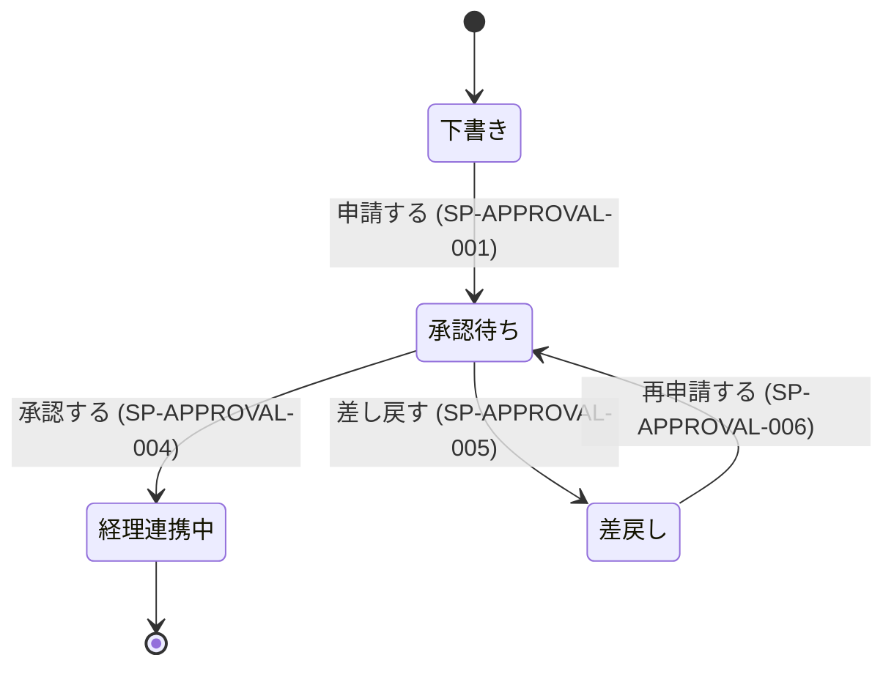

# 要求文書・仕様書の構成

**目次**: [1. 要求文書の章](#1-要求文書の章) · [2. 仕様書の常設章](#2-仕様書の常設章) · [2.5 異常系をどこに書くか](#25-異常系をどこに書くか) · [2.6 見出しのレベル](#26-見出しのレベル) · [2.7 表・図・散文の使い分け](#27-表図散文の使い分け) · [3. 「リスクと影響」章の書き方（構成上の要）](#3-リスクと影響章の書き方構成上の要) · [4. 変更履歴を書かない](#4-変更履歴を書かない) · [5. 分量の考え方](#5-分量の考え方) · [6. 状態遷移図と状態 × イベント表（状態を持つ機能があるときの条件付き常設章）](#6-状態遷移図と状態--イベント表状態を持つ機能があるときの条件付き常設章) · [7. 文書が分割されているとき](#7-文書が分割されているとき)

章立ては「規制対応のための儀式」ではない。**後から読む人・引き継ぐ人・テストを書く人が
必要とする最小集合**である。案件が小さくても章を削らない（中身が短くなるだけ）。

## 1. 要求文書の章

要求文書は**目的側**の文書である（何を・誰のために・なぜ作るか）。何を書く文書なのかは
`prd-and-spec.md` を正とする。

### 必須の章（行動するのに要る）

| 章 | 中身 | 落としやすい点 |
|---|---|---|
| 背景と課題 | なぜこれを作るのか。今どう困っているか | 「作る」ことが自己目的化していないか |
| 想定する利用者と利用場面 | 誰が、どんな状況で使うか | 「全社員」で済ませない。役割ごとに分ける |
| **どう使われるか** | 想定している使われ方と、典型的な利用の流れ | ここが無いと、要求が「何のためのものか」読み手に伝わらない |
| スコープとスコープ外 | 今回やること / **やらないこと** | スコープ外の明記が無い文書は、際限なく解釈が広がる |
| 前提と依存 | 成り立つために前提としていること、他システムへの依存 | 「〜が既にあること」を書かないと、無い環境で破綻する |
| 要求一覧 | ID 付きの要求文（`references/requirement-writing-rules.md`） | 説明文を混ぜない |

**この 6 章が揃えば次の工程は動き出せる。** 上 5 章は `prd-and-spec.md` §4 の必須内容項目に
1 対 1 で対応し、要求一覧はその器である。**何が必須の内容かは §4 が正**
であり、ここはその置き場を定める（両方に書くと片方だけ増えて、必須の定義が 2 つになる）。

**未確定事項の章と採らなかった案の章は置かない**（§4）。前者は返り値の `tbd_items` と
INDEX の「未解決」節が持ち、決まらないと決まった論点は保持規則として要求一覧の中に入る。
後者は経緯であり、保存時の commit / PR 本文に残す。

分量は案件で伸び縮みする。**短いことを不足と判定しない**（`prd-and-spec.md` §7）。

### 案件が要求したときだけ置く章

| 章 | 置く条件 |
|---|---|
| 非機能要求 | 性能・可用性・運用に関する要求が案件に存在するとき |
| リスクと影響（§3） | ドメイン分析で `該当` と判定された観点があるとき |
| 期待するアウトカム・KPI | 事業として投資判断や効果測定を要するとき |
| モニタリング | リリース後の継続的な観測が要るとき |
| 受け入れ条件 | 完成の判定に関係者間の合意が要るとき |
| 関係者一覧 | 同期すべき相手が複数いるとき |

**「規格に載っているから」「テンプレートにあるから」で置かない。** 案件の側に置く根拠が
無い章は、空欄になるか、埋めるための作文になる。どちらも読み手の時間を奪う。

**変更履歴の章は置かない**（下記 §4）。

## 2. 仕様書の常設章

仕様書は**手段側**の文書である（何が必要で、どう実現するか）。**実装が一意に決まる必要が
あるため、案件が小さくても目的側より詳しくなる**（`prd-and-spec.md` §7）。

### 必須の章

| 章 | 中身 |
|---|---|
| 対象範囲 | この仕様書が扱う範囲。要求文書のどの要求に対応するか |
| 用語定義 | 案件固有の語。読み手によって解釈が割れる語を先に固定する |
| 機能仕様 | ID 付き。**要求 ID との紐付けを必須とする**（他文書の要求を指してよい） |
| エラー処理と異常系 | 何が起きたとき、どう振る舞うか |
| 検証方法 | 各仕様項目をどう確かめるか |
| トレーサビリティ表 | `references/traceability.md` §2 |

### 案件が要求したときだけ置く章

| 章 | 置く条件 |
|---|---|
| 外部インタフェース | 画面・API・ファイル・他システムとの境界があるとき |
| 性能・容量 | 処理時間・同時実行数・データ量に制約があるとき |
| セキュリティ要求 | 認証・認可・秘匿・改ざん検知が要るとき |
| データ保持と証跡 | 保持期間・証跡の要求があるとき |
| 状態とイベント（§6） | 状態遷移を持つ機能があるとき |

## 2.5 異常系をどこに書くか

**独立した「異常系」文書を作らない。** 異常系だけを 1 ファイルに集めると、正常系の隣から
離れてしまい、「この機能の異常時はどうなるか」を追うのに毎回 2 ファイルを行き来することになる。

置き場は**どこまで共通か**で決まる。

| 異常系の性質 | 置き場 |
|---|---|
| **その機能にしか生じない**（空入力・この画面固有の入力エラー・保存時の同名衝突） | その機能を扱う文書 |
| **複数の機能に共通する**（外部呼び出しの失敗・タイムアウト・権限不足・途中終了） | 共通の文書 1 箇所にまとめる |

共通の異常系を各機能に書くと同じ記述が n 箇所に並び、片方だけ直る事故が起きる。逆に機能固有の
異常系を共通文書へ追い出すと、その機能を実装する読み手が自分に関係する異常系を見つけられない。

**共通文書をどれにするかは案件で決まる**（実行基盤・共通処理・エラーハンドリングなど、その案件で
共通機構を扱う文書）。分割案の段階でどこに集約するかを決めておく。

## 2.6 見出しのレベル

**要求文・仕様項目の見出しレベルを、文書間で揃える。**

| 階層 | 用途 |
|---|---|
| `#` | 文書タイトル（1 文書に 1 つ） |
| `##` | 章（背景と課題・要求一覧・リスクと影響 など） |
| `###` | 章の中の区分（要求一覧の中の「起動と対象判定」など）。区分が不要なら使わない |
| `####` | **個別の要求文・仕様項目**（`PR-XXX-001` / `SP-XXX-001`） |

**個別項目は必ず `####` に置く。** ここが文書ごとに `###` と `####` で揺れると、読み手が
「章の中の区分」と「個別項目」を階層で見分けられなくなり、目次を機械生成したときにも構造が
崩れる。区分を設けない文書でも項目は `####` のままにする（`###` に繰り上げない）。

## 2.7 表・図・散文の使い分け

**既定は表。** 軸を宣言して直積から行を起こせば、検討していない組み合わせが**行の欠落**として
機械的に見つかる。散文は「検討したが該当しなかった」と「検討していない」を区別できない。

**表にすれば自動で網羅になるわけではない。** 思いついた組み合わせを書き並べた表は行の羅列で
あり、書かなかった行は見えない。網羅を担保するのは表という形式ではなく、**軸の宣言**である（§6）。

図を使うのは、**表で表せないものがあるときだけ**である。

| 表したいもの | 書き方 |
|---|---|
| 組み合わせの網羅（状態 × イベント、操作 × 権限） | **表** |
| 状態の集合と主フローの遷移（どの状態からどこへ行けるか） | **図**（状態遷移図。§6） |
| 個々の振る舞い・条件 | **要求文・仕様項目**（1 項目ずつの散文） |
| 複数の系をまたぐ時系列（どちらが先か・どこで待つか） | **図**（シーケンス図） |
| 分岐と合流が入り組んだ流れ | **図**（フローチャート） |

**同じ内容を表と図の両方に置かない。** 二重管理になり、片方だけ直る事故が起きる。どちらが正か
決まらない状態は、書いていないより悪い。

### 表と図は出せる欠陥が違う

**図は「描かれていない遷移」を見せられない。** 描き忘れても図としては完成して見えるので、
網羅の担保は表がやる。図が出せるのは、表が出せない別の欠陥である。

| 何を出すか | 表 | 図 |
|---|---|---|
| 未定義の組み合わせ | ✅ 空セルとして出る | ❌ 描き忘れが見えない |
| 到達できない状態 | ❌ 出ない | ✅ 入る矢印が無い |
| 出口の無い状態（そこで詰む） | ❌ 出ない | ✅ 出る矢印が無い |

**この 2 つは片方だけでは足りない。** 両方置く場合も内容は重ならない（§6 の分担を正とする）。

### 図は Mermaid で書く

生成物は repo 内の Markdown であり、読み手は次工程の実装者（人間とは限らない）である。
**Mermaid だけが、本文に埋め込めて・テキストの差分で追え・レンダリングにも載る。** 画像ファイルや
外部ツール（Figma / Miro / draw.io など）へのリンクは文書と別に更新されるため、必ず drift する。

**図を描くのは、上の表で「図」に当たるものが実在するときだけ**である（状態を持つ機能なら
実在する — §6）。図は本文と別に保守が要るので、表や仕様項目に落ちるものを図にすると、
同じ内容を 2 箇所直すことになる。

## 3. 「リスクと影響」章の書き方（構成上の要）

`references/domain-analysis.md` の 10 観点の判定結果をここに落とす。

```markdown
## リスクと影響

| ID | 観点 | 判定 | 根拠 |
|---|---|---|---|
| RK-001 | 生命・身体・健康への影響 | 該当なし | 対象が社内の経費処理に閉じ、人身影響を示す記述が入力に無い |
| RK-002 | 金銭・資産の移動 | 該当 | 依頼文「経費精算」「経理に回る」 |
| RK-003 | 個人情報の取扱い | 未判定 | 領収書画像への第三者情報の写り込みの有無が未確認（TBD-002） |
```

**該当しない観点は「該当なし」と根拠付きで明記する。空欄にして飛ばさない。**

この章の目的は、リスクを列挙することではなく、**「検討した結果、該当しない」と「検討していない」を
読み手が区別できる状態を作ること**である。空欄はどちらとも読めてしまう。

判定は 3 種類。

| 判定 | 意味 |
|---|---|
| 該当 | 入力に根拠があり、この観点が関係する |
| 該当なし | 入力に根拠があり、この観点が関係しない |
| 未判定 | 判断材料が無い。**推測で「該当なし」にしない** |

**非該当が対象の性質から自明な案件では、表を圧縮してよい。** 対象が稼働システムでない
（文書規範・規約・テンプレートなど）案件では、物理・金銭・個人データ系の観点が定義上
成立しない。その場合、該当・未判定の観点だけを行として残し、非該当の観点は表の下に
「残る N 観点（生命・金銭・…）は、対象が〜であるため定義上該当しない」と 1 文で集約して
よい。集約しても「検討した事実」は保たれる — 観点名を列挙し理由を 1 つ添えることが条件で、
黙って行を落とすことは引き続き禁止である。

「未判定」を残すのは負けではない。判断材料が無いのに「該当なし」と書くほうが有害である。

## 4. 本文に書くのは規範だけ

納品文書に置いてよいのは次の 4 つだけである。

| 置いてよいもの | 例 |
|---|---|
| 規範文 | 「利用者を多要素認証で認証しなければならない」 |
| ID と見出し | `PR-AUTH-001` / 章見出し |
| 上位文書・姉妹文書への参照 | 「本書は `docs/requirements/auth.md` の PR-AUTH-001 を実現する」 |
| 自明でない規則に添える 1 文の理由 | 「（同一 ID で二度発行すると、後続の突合が壊れるため）」 |

**置かないもの**: 根拠句・出所表記・決定ログ・変更履歴・検討の経緯・採らなかった案・
未確定事項の章。前 6 つは構造検査（`ST-NON-NORMATIVE-`）が機械で拾う。

理由は読み手である。**この文書を読むのは、これから作る人（と AI）であり、彼らが要るのは
従うべき規範だけである。** 経緯と根拠を本文に混ぜると、規範がその中に薄まり、どれに従えば
よいかが読み取れなくなる。

**どこにも残らなくなるわけではない。**

| 残すもの | 残る場所 |
|---|---|
| 項目 ID → 根拠 | writer が返す `trace` → Workflow の返り値 `audit_trail` |
| 決定ログ・裁定の記録 | 同上（`audit_trail.decisions` / `auto_resolved` / `measured`） |
| 採らなかった案・検討の経緯 | **保存時の git commit メッセージと PR 本文** |
| 決まらないままの論点 | 本文の保持規則（下記）と、返り値の `work_items` |

### 決まっていないことは保持規則として書く

未確定を隠さない規律は変わらない。変わるのは書き方である。「〜は未定である」とだけ書かれた
項目を渡された次工程は、勝手に決めるか止まるかしかない。そこで**裁定が下るまで何をしては
ならないかを規範文として**書く。

- 悪い: 「上限金額は未定（TBD-BILL-002）」
- 良い: 「上限金額の裁定が下るまで、金額を伴う自動処理を新しい画面へ拡大してはならない。」

裁定そのものは作業項目（返り値の `work_items`）として文書の外へ出し、司令塔が Issue 化する。

### 変更履歴を書かない

**生成する文書に変更履歴の章を置かない。** 版・日付・変更者・承認者・変更内容のいずれも書かない。

理由は 2 つある。

1. **文書の改訂履歴はバージョン管理が持つ。** 誰がいつ何を変えたかは `git log` で辿れる。
   文書側に二重に持つと、必ず片方が古くなる。
2. **スキルの内部で起きた改稿は、そもそも履歴ではない。** 監査と改稿のラウンドは 1 回の実行の
   中の途中経過であり、利用者から見れば結果が 1 つ出ただけである。これを「版 R1.0 / R1.1 /
   R2.0 …」として記録すると、**途中経過が成果物に化ける**。ラウンドを重ねるほど章が膨らみ、
   1 セルに監査指摘の解消経緯が数百字並ぶ。

### 改稿の経緯を本文にも書かない

同じ理由で、**要求文・仕様項目の本文にも改稿の経緯を書かない。**

- 悪い: 「前稿はこの要求の根拠として回答 Q3 の文言を引いていたが、その文言は回答に存在しな
  かったため、実装の現状からの引用へ差し替えた（監査指摘 FB-001）」
- 良い: （差し替えた後の根拠だけを書く。差し替えたこと自体は書かない）

読み手が必要とするのは**今の内容**であって、そこへ至った経緯ではない。経緯を残すと、要求 1 件
あたりの分量が膨らみ、本当に読むべき記述が埋もれる。**前稿・版番号・監査指摘 ID を本文から
参照しない。**

### 承認を記録する必要がある案件

ドメイン分析で「第三者監査・当局報告・社内統制の対象」と判定された案件に限り、承認の記録欄を
置いてよい（状態 × イベント表と同じ条件付きの扱い）。その場合も置くのは承認の記録だけで、
変更内容の記述は書かない。

**この欄に記入される承認者名は、ユーザーが申告した文字列に過ぎない。** このスキルは承認者の
実在も、承認が実際に行われた事実も確認できない。記録欄は統制そのものではないという区別を、
利用者に誤解させないこと。

## 5. 分量の考え方

案件が小さければ各章は短くなる。それは正しい。

### 必須の章は、該当が無くても残す

**必須の章については、削ってよいのは分量であって章ではない。**

- 「外部インタフェースが無い」→ 章を消すのではなく「外部インタフェース: なし」と書く
- 「セキュリティ要求が特に無い」→ なぜ無いのか（社内限定・認証は既存基盤に委譲、等）を 1 行書く

章が無いことと、検討した結果「無し」だったことは、読み手にとって全く違う情報である。
必須の章が空欄なら、それは検討していないことを意味する。

### 条件付きの章は、条件を満たさなければ置かない

一方、**案件が要求したときだけ置く章（§1・§2 の後半の表）は、条件を満たさないなら
置かない。** 置かないことは欠落ではない。

この 2 つを混同して「全部の章を常に置く」にすると、案件に無関係な章が空欄で並ぶ。読み手は
どれが本当に検討された結果の「なし」で、どれが最初から関係ない章なのかを区別できなくなる。

**判定は「行動するのに要るか」で行う。** 規格やテンプレートに載っていることは、
その案件で要る根拠にならない（`prd-and-spec.md` §4）。

## 6. 状態遷移図と状態 × イベント表（状態を持つ機能があるときの条件付き常設章）

この「図＋直積表」の分担規律はスキル独自の設計判断である。外部規格に同じ命令は無く、
IEEE 1016 の State dynamics viewpoint と IEEE 830 §4.3.2 の completeness は方向が一致する
根拠に留まる（外部帰属で書かない）。

**扱う対象に状態遷移がある場合、仕様書に状態遷移図と状態 × イベント表を置く。** 状態を持たない
機能に求めると空の図表が並ぶだけなので、条件付きの常設章とする。

**2 つは分担が違い、片方では足りない**（§2.7）。図は状態の集合と主フローを持ち、表は主フロー
以外の組み合わせを持つ。内容は重ならないので二重管理にならない。

### まず状態遷移図を置く

**状態の集合と主フローの遷移を 1 つの図にする。** これが表の軸（行に並ぶ「現在の状態」）を
決める。軸が間違っていれば、表をいくら埋めても網羅にならない。



**各遷移に仕様項目 ID を書く。** 図を第二の正にしないためである。遷移の中身を定めるのは仕様項目
であり、図はそこへの索引にすぎない。表の「定義済みか」列と同じ役割で、**ID の無い矢印は未定義の
主フロー**として見える。

図で見るのは 2 つだけ。**どちらも表では出ない。**

- **到達できない状態**（入る矢印が無い）— 仕様に書いたが、そこへ行く方法が無い
- **出口の無い状態**（出る矢印が無い）— そこで詰む。終端なら `--> [*]` を明示する

### 次に状態 × イベント表を埋める

**行は、状態の集合とイベントの集合の直積から起こす。** 思いついた組み合わせを書き並べるのでは
ない。この表は格子ではなく行の羅列なので、**書かなかった行は空セルにならず、そもそも見えない**。
直積から起こして初めて、埋まっていない組み合わせが行として現れる。

そのため**イベントの集合を先に列挙し、表の直前に置く**。状態の集合は上の図から取る。

> 対象イベント: 申請する / 承認する / 差し戻す / 取り下げる / 承認者が離任する / 連携先が応答しない

**イベントの集合は閉じない。** 外部の障害・タイムアウト・権限の変化はいくらでも想定できるので、
「すべて列挙した」とは言えない。したがって網羅の主張は**列挙した軸に対してのみ**成り立つ。
軸を書き残せば、後から軸を足したときに何が増えたかが分かる。軸を書かなければ、**どこまでを
検討したのか**が文書に残らない。

```markdown
## 状態とイベント

| 現在の状態 | 発生しうるイベント | 種別 | 次の状態 | 定義済みか |
|---|---|---|---|---|
| 承認待ち | 承認者が自分自身の申請を承認する | 正常系エッジ | 経理連携中 | ✅ SP-APPROVAL-004 |
| 承認待ち | 申請者が取り下げる | 準正常系 | 取下げ済み | ❌ 未定義（TBD-SAPPROVAL-002） |
| 承認待ち | 承認者が離任している | 異常系 | — | ❌ 未定義（TBD-SAPPROVAL-003） |
| 経理連携中 | 連携先が応答しない | 異常系 | 連携失敗 | ✅ SP-APPROVAL-007 |
```

**主フローの遷移（「部長が承認する」→「経理連携中」のような通常の遷移）はこの表に載せない。
上の図が持つ。** 主フローは機能仕様が定めるものであり、表が扱うのは下記 3 種別だけである。
主フローを載せると表が機能仕様の写しになって二重管理になり、どちらが正かが決まらなくなる。

### なぜ表にするか

**表に書いていないイベントへの対応は「何をしても仕様違反にならない」と同義である。**

状態を持つ機能で実装がぶれる典型が「書かれていない組み合わせ」である。「承認待ちの申請が
取り下げられたらどうなるか」が表に無ければ、実装者は自分で決めるしかなく、**決め方は人に
よって変わる**。散文で書くと、どの組み合わせを検討したのか読み手には分からない。

これは「漏れなく・ダブりなく（MECE）」を頭の中でやる代わりに、**軸を宣言して直積から起こす
ことで機械的に作る**やり方である。漏れは直積のうち行になっていない組み合わせとして、重複は
同じ組み合わせの再掲として、突き合わせるだけで見つかる。

省略してよいのは「**そのイベントがその状態で発生することはありえない**」と確認した場合だけで、
その場合も行を消さず「発生しない（根拠: 〜）」と書く。検討して除外したことと、検討していない
ことを区別できる状態にする。

### 3 種別の定義

| 種別 | 定義 | 書き方 |
|---|---|---|
| **正常系エッジ** | 仕様どおり処理されるが境界値的（件数が極端に少ない/多い、必須項目のみ など） | 通常フローで処理できることを確認し、分量や出力への影響を書く |
| **準正常系** | 対処は定義されているが完全な正常系ではない（曖昧な入力、形式違い など） | 確認を求めて継続するか、補完して処理するかを明示する |
| **異常系** | 処理を継続できないか、明示的なエラー案内が要る（不整合、外部障害 など） | エラーの内容と次に取れる行動を具体的に書く |

**異常系だけでなく、正常系エッジと準正常系も洗い出す。** 異常系は意識されやすいが、
「件数が 0 件のとき」「必須項目だけが埋まっているとき」のような境界は落ちやすい。

### EARS との対応

表の各行は `requirement-writing-rules.md` §2.5 の EARS パターンに落ちる。

- 状態 → **While**（〜である間）
- イベント → **When**（〜したとき）
- 異常系 → **If ... then**（〜したならば）

表で網羅を確認し、要求文で 1 行ずつ書く、という分担にする。

## 7. 文書が分割されているとき

**分割された各文書が常設章を持つ。** 「この章は他のファイルにあるから省略」はしない —
1 ファイル読めば足りる状態を作るのが分割の目的なので、章を跨がせると目的に反する。

ただし小さい文書で該当が無い章は「該当なし（根拠: 〜）」と 1 行書いて残す。章ごと消さない。

**「リスクと影響」章は例外的に、各要求文書が自分の関心事に関わる観点だけを持つ。**
10 観点すべてを全文書に書かせると、同じ内容が n 箇所に並び、consistency 監査が毎回重複として
指摘する。全観点の一覧は `docs/requirements/INDEX.md` が持つ。

分割の指針と INDEX の構成は `document-splitting.md` を正とする。
